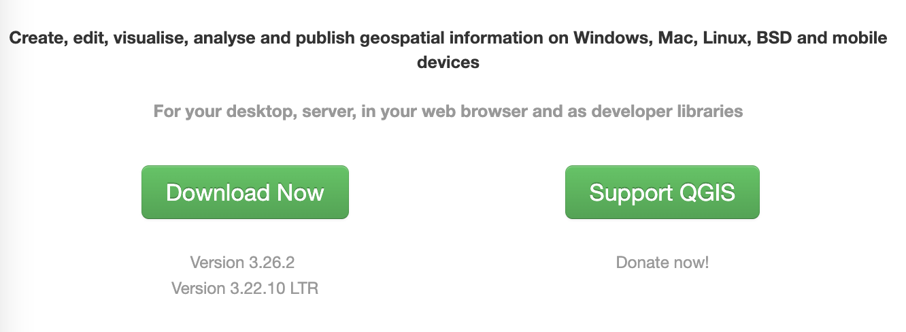
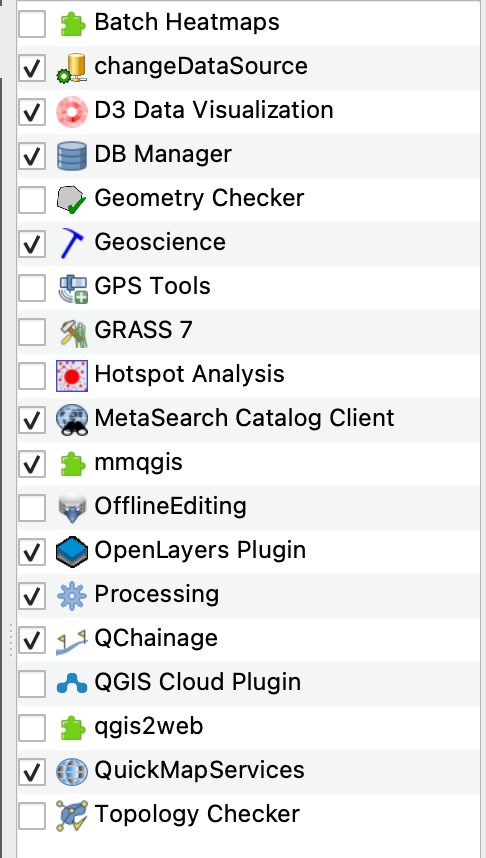
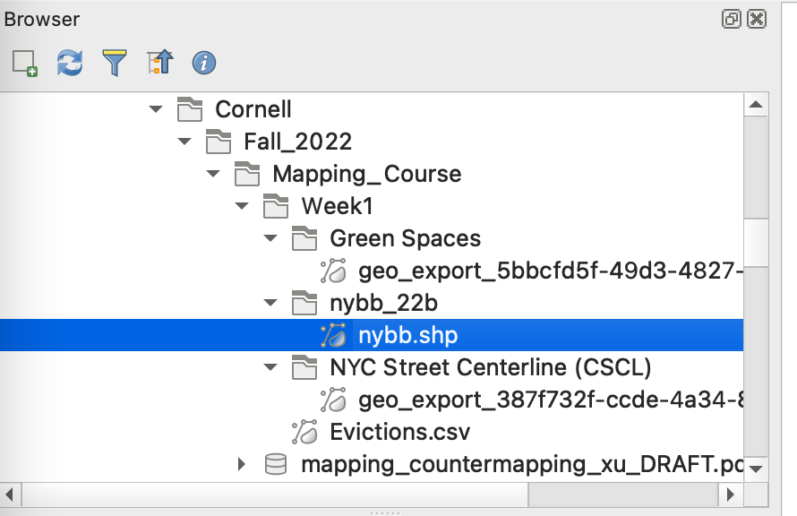
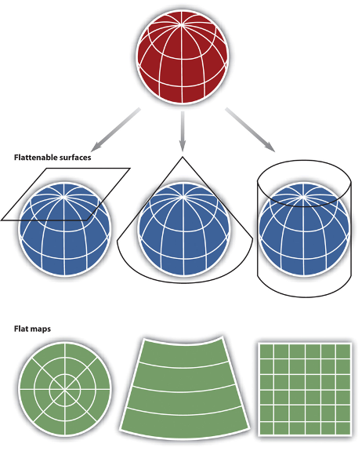
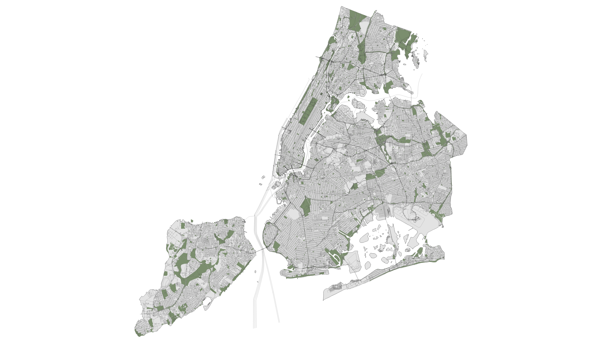
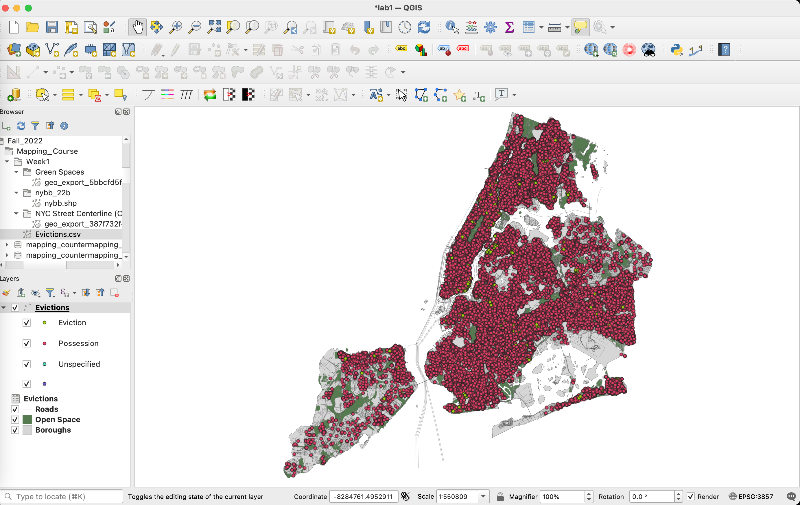
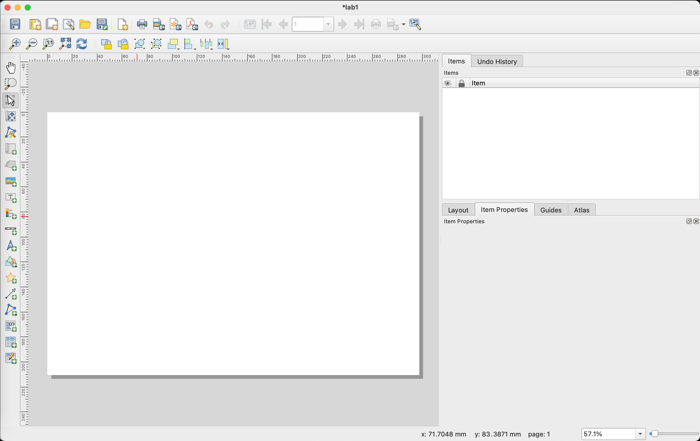
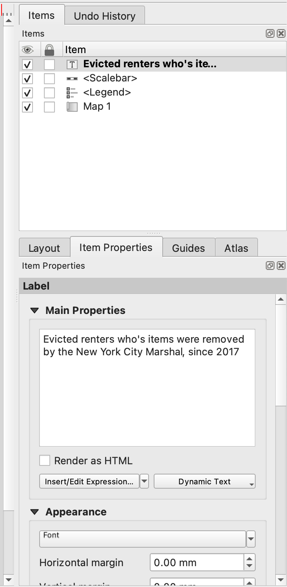

# Week 1 - Introduction to QGIS
**Today we will cover**
- How to install the QGIS software onto you computer.
- Downloading shapefile data
- How create a basic map from a shapefile dataset
- Geocoding a CSV with lat/long to a point shapefile.
- Other o

# 1. Lab Tutorial

## 1.1 Installing QGIS
QGIS is an open-source software (or OSS), which means that it's distributed with the source code (the underlying code that dictates how the software actually works). A wonderful aspect of open source is that it allows everyone who has access to the source code the ability to change or make additions to the source code and, by extension, to build tools and plug-ins for the software. OSS is also almost always free to use (though, of course, it's not free in the sense that it is often volunteers that create or contribute their spare time to OSS).

Navigate to [QGIS's download page](https://qgis.org/en/site/) and click on the green "Download Now" button.

This should take you to a page where you will be able to install QGIS for your operating system such as Windows, Mac, or Linux (let me know if you are using Linux!).

- If you have Windows: select the **latest release** of the QGIS Standalone Installer Version 3.6.
- If you have a Mac: select the **latest release** of the QGIS macOS Installer Version 3.26
- If you are running Linux: select the appropriate distribution you have.

Once you've downloaded your QGIS installer, you will need to install the software. The standard default install options should be fine.

## 1.2 Datasets for this lab
First, create a dedicated folder for this class. I would recommend you create a folder for each week's lab.  

Before we get started with QGIS, we are going to download the spatial datasets we'll be using for this lab. We will get into the different types of spatial datasets in a subsequent lab.

[New York City borough boundaries](https://www1.nyc.gov/site/planning/data-maps/open-data/districts-download-metadata.page). This will give us the shape the give boroughs in NYC. You'll want to **Download -> Borough Boundaries (Clipped to Shoreline)**. (Clipped to shoreline just means the boundaries don't also include waterbodies as part of the borough shape.)

[NYC Open Space data](https://data.cityofnewyork.us/Recreation/2014-Planimetric-Survey-Open-Space-Parks-/g84h-jbjm) This is a dataset of the open spaces in NYC. **Export -> Download -> Download Geospatial Data -> Shapefile**.

[NYC Street Centerline](https://data.cityofnewyork.us/City-Government/Roadbed/xgwd-7vhd). This is a dataset of all the entire NYC road network represented by a "centerlines", i.e. lines drawn through each of the road. Navigate to **Export -> Download -> Download Geospatial Data -> Shapefile**.

#### A brief note on metadata
The "metadata" for a dataset is what it sounds like - it's the data and information about the dataset. In NYC Street Centerline page, navigate to the **About** section. You'll see a lot of useful information there under **About This Dataset** such as how often this dataset is updated (weekly), which agency maintains this dataset (the Department of Information Technology & Telecommunications), etc.

Under **Attachments**, check out **Centerline.pdf**. You'll see very useful information such as a description of the fields in the data.

Well-maintained datasets typically have some type of information like this. Always check for the metadata!

[NYC Evictions data](https://data.cityofnewyork.us/City-Government/Evictions/6z8x-wfk4/data). This is a dataset of pending, scheduled and executed evictions in NYC between 2017 and the present. Select **Export -> Download -> CSV** . We will turn this CSV into a shapefile in QGIS.

Ok, great! You've done the hardest part, which is to gather all the data that we need.

## 1.3 Putting data on a map
For our first map, let's say we want to make a map of where the city's reported evictions (the ones that have required the intervention of New York City Marshals) are.

Let's open up QGIS. This might take a couple of seconds. *Note: If you're using a Mac, the first time you open the software, you will get a message Apple is not able to detect malware yet. Click "open".*

Your QGIS window should look like this:

First, we need to add in the plug-ins that are the set of (often essential) tools that make QGIS a great tool. (You'll only have to do it once!). On your menu bar, select **Plugins -> Manage and Install Plugins -> All** and find each of the plugins with the checked box here:

**For the OpenLayers plugin**, you will have to download the zip file for this plug in from [here](https://plugins.qgis.org/plugins/openlayers_plugin/). Save this in your downloads folder (you don't have to keep it permanently) and **Install from Zip**.

Alright, now click on the blank page icon on the top left-hand corner to start a new project.

Before we do anything, good practice is to save our project down. In your lab folder, save this project down as `Lab1` using the default `.QGZ` format.

Let's take a look at the general organization of your QGIS interface. The large right section is where your map will be. Your tools are at the top of the page. Your Browser and Layers sections are where you'll be managing your data.

In the Browser section, select navigate to where you have stored all the data we've just downloaded. For me, the file structure looks like this:

Now, click and drag all four of our datasets (parks, roads, borough boundaries, and evictions data) into the Layers section. When you drag in the borough layer `nybb`, just select the default projection and click OK.

---
#### A brief summary of projections and CRSs
Look on the bottom right-hand corder of your screen. You should see a little globe with a hat, after which you'll see `OGC:CRS84` or more often `EPSG:xxxx`. This is the current projection system that we are using.

Ok, briefly, very very briefly, what is a coordinate reference system (CRS)?

There are two different types of CRSs that together that tell us how the points in our dataset gets put on a flat 2-D map: The **geographic coordinate system** is the set of rules that locates latitude and longitude coordinates to a point the earth. Once we know that, we need the **projected coordinate system** (aka the "projection") that tells us how the surface of earth (and these points on it) "unrolls" into a 2-D surface.

As you can see from this image below, there are many ways to flatten the Earth's surface.

There are SO many different types of map projections [each with their own advantages and disadvantages](https://geoawesomeness.com/best-map-projection/). The most traditionally used for navigation is the Mercator projection (EPSG: 4326). More recently, because Google Maps uses Pseudo-Mercator (EPSG: 3857), that has also come more widely into use.

---
Ok, now click on the globe-hat. A window should pop up with many different possible projections to choose from. Today we are going to use `3857`. Search for this projection by the number and select the projection and click **Ok**.

Once you've put all your datasets in Layers, you should get a map that looks something like this:

The map renders your layers based on their top-to-bottom order in your Layers section. If you want your map to resemble mine, just order your layers in the same order as how you see mine.

Also, let's rename our layers so we don't have to remember what `geo_export_xxxx` corresponds to. Right click on the roads layer, select **Rename Layer** and call this layer "Roads". Do the same for your other visible layers. Call them `Boroughs` and `Open Space`. Don't worry this won't change the file name of your dataset, just their nicknames in your QGIS interface.

Great! Now we are able to see 3 out of the 4 datasets we have.

Before we look at the evictions data, let's style our roads, boroughs, and open space data a bit. Together, these datasets are going to be the "basemap".

---
### Basemaps
Basemaps are the contextual information that serves as the backdrop for the main datasets and things you want to highlight on your map. Because they are typically considered background information, we don't want it to compete too much with our main datasets.

Visually, this can mean that we want them to be more neutral, with muted colors. However, you can always decide that there are aspects of the basemap you want to highlight because they are in dialogue with your primary dataset. For instance, I might want to look at home values near parks, in which case, I might decide to highlight my open space layer in some way, say, by making them a bright color.

In a future lab, we'll learn how to import pre-made basemaps.

---
Alright, I'll walk you through how I typically style background information (i.e. basemap elements). First, let's work on the Boroughs layer. Right click on that layer in the **Layers** section. And select **Properties**. The paintbrush on the left of the Properties window should be selected. Select it if not.

You can see that a window opens up that will allow you to change many aspects of how your borough dataset looks Click on **Simple Fill**, which will allow us to customize our layer style. I am styling my Fill Color to be a light gray, changing the Stroke Color to be a dark gray, and reducing the Stroke Width to 0.15.

Now, style your roads and open space layers. Here is how my map looks after I've styled all three layers. I think this works, but you can choose something else.

## 1.4 Geocoding the evictions data
Now we need to think about our evictions dataset. You'll notice it's represented by an icon that looks like a spreadsheet, that's because it is one. Right click on the layer and select **Open Attribute Table**. What are the different columns we have here? We have the location and apartment of the eviction, the date, whether it was an ejectment or not, whether it was an eviction or legal possession (you might be wondering what these terms are, a good place to start is the metadata), but most importantly, we have a **Latitude** and **Longitude**, which means we can easily turn our data into a set of points.

Now, from your top toolbar, navigate to **Layer -> Add Layer -> Add Delimited Text Layer**, like so:

Under the **File Name**, click on the button with the three dots and locate your `Evictions.csv` dataset. It should look similar to this:

Under the File Format, the default is `CSV`, which is what our file format is. Great. Also notice in the Geometry Definition section the default is `Point Coordinates`, which is also what we need. AND also that the `X field` and `Y field` have automatically been selected for you. This is because QGIS will automatically look for the field names that it recognizes to be possible candidates for storing geometric information. *Keep in mind that X = longitude and Y= latitude. We typically tend to think of coordinates as lat/long, but GIS software reads points as long/lat.*

So all the defaults to add geometries are what we need. Just click **Add**. You should see something like this:

Now, let's color our data. Remember there was a column in this dataset called `Evictions/Legal Possession`? Let's color our points by that category. To do this, right click on **Properties** again and this time, instead of the `Simple Symbol` method of styling points, we are going to select `Categorized`. This means we want to color based on different categories.

The "Value" option allows us to categorize our points based on the values they have in the `Evictions/Legal Possession` category. Select that.

Now click **Classify** next to the plus and minus buttons. You'll see that `Eviction`, `Possession`, `Unspecified`, and all other points each get their own color. Click **Ok** to exit. This is what your map should look like after this:

Hm, ok, still not super clear since the points are very big and there are a lot of evictions categorized as Possession.

Let's try two things:
- First, let's make these points smaller and get rid of the border. Go back to your layer styling and select the **Symbol** button. This should take you to familiar territory. Try restyling on your own.
- Second, uncheck the box that says `Possession` in your Evictions layer. If do a google search for the difference between legal possession and eviction in NYC, we can see that legal possession is when a landlord keeps the renters' things while an eviction is when the Marshal takes the renters' things. This reveals some interesting questions for further exploration (this is not part of the assignment, just something to think about): Where are the Evictions (as opposed to Legal Possession) concentrated. Where are these areas? And why?

This is how my map looks:

## 1.5 Other supporting elements
Now, let's add a few more supporting elements so that the map makes sense to the reader.

First, let's label each of the boroughs. Right click on the boroughs layer and select the text/label icon on the left:

Select Single Labels, since we're not doing anything fancy or rule-based. Again, see that in **Value** you can select the column you want to use to make your names. Here, it selected `BoroName` for me, which is actually what I wanted. Click **Ok**. Now, the default text is going to be very small and not super clear. Try something that you think looks best.

On your map, click and drag your map so that it is on the right-hand side, you'll see why in a second:

Now, under **Project** in the top menu, select **New Print Layout** and call the new layout `Lab 1`. This should lead you to a new blank screen like this:

Select **Add Item -> Add Map**. Now click and drag from upper left corner to the lower right corner, so that your map fills the whole page. We've put the map on the right so that there's plenty of space on the right to add more information.

Now, **Add Legend**, and click and drag your legend to be position in the lower right area:

Under **Legend Items**, unselect Auto update, select all the lower layers here and select the **red minus button** to remove these from the Legend.

Also remove the `Possession`, `Unspecified`, and blank item with the select+minus sign. Actually, I'm not sure we really need a legend, but now you know how to make one.

Now, under **Add Items**, add a legend in the lower right area.

Finally, **Add Label** to add a title in the upper left area. You can change the text in the **Main Properties** section under the **Item Properties** tab after you select your label area.

Under **Appearance** You can also change the font so it's bigger.

I rearranged some of the items together and my final map looks like this:

Next, under the **Layout** in the menu bar on top, you can now export your map as a PNG, PDF, or SVG (if you want vectors for additional work in Illustrator).

For your lab submission, include an export of this map.

# 2. In-class Exercise
Ok, that was a lot! Let's try something simple. Say I want to focus my study on the Lower East Side in Manhattan. Using what you already, modify the map slightly to change the focus to this particular area. What else do you have to change about the map stylistically? What other types of datasets would you include if you wanted a more careful study of this these evictions?

For your lab submission, include an export of this map and a brief text on the map of what other types of information you would like to include.
