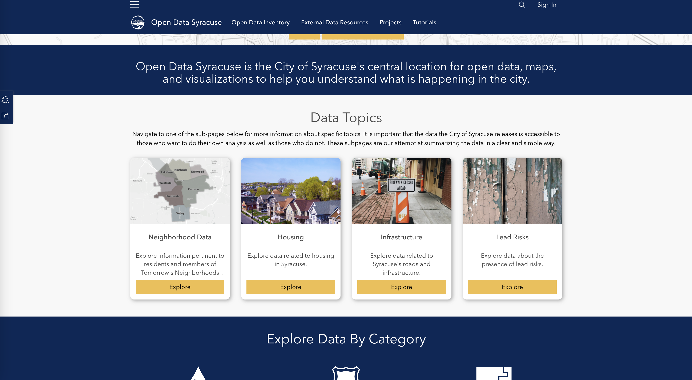
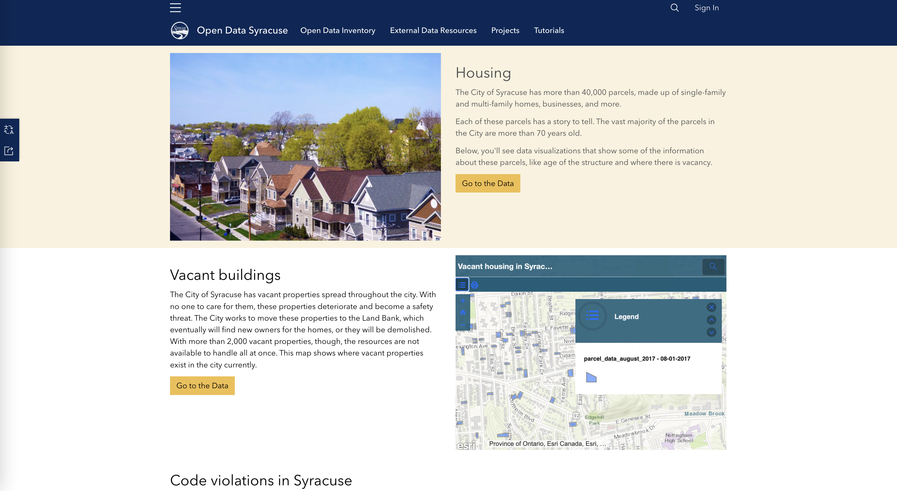
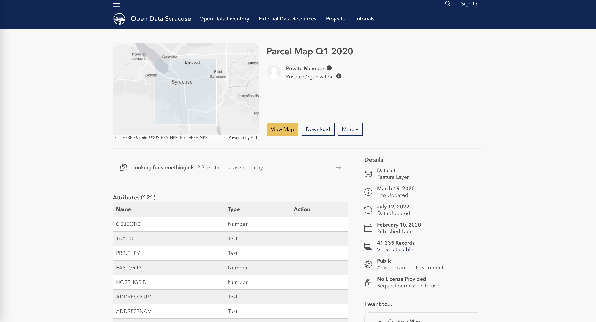
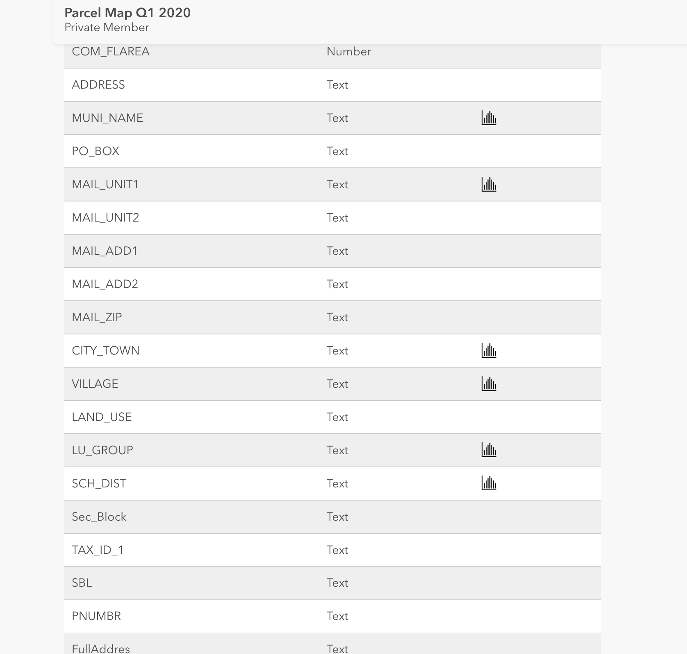
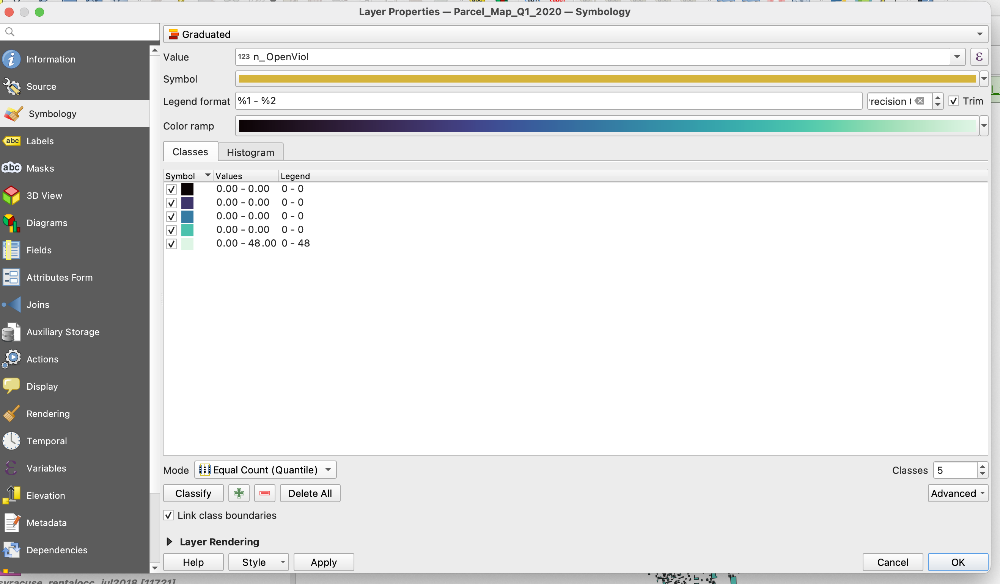
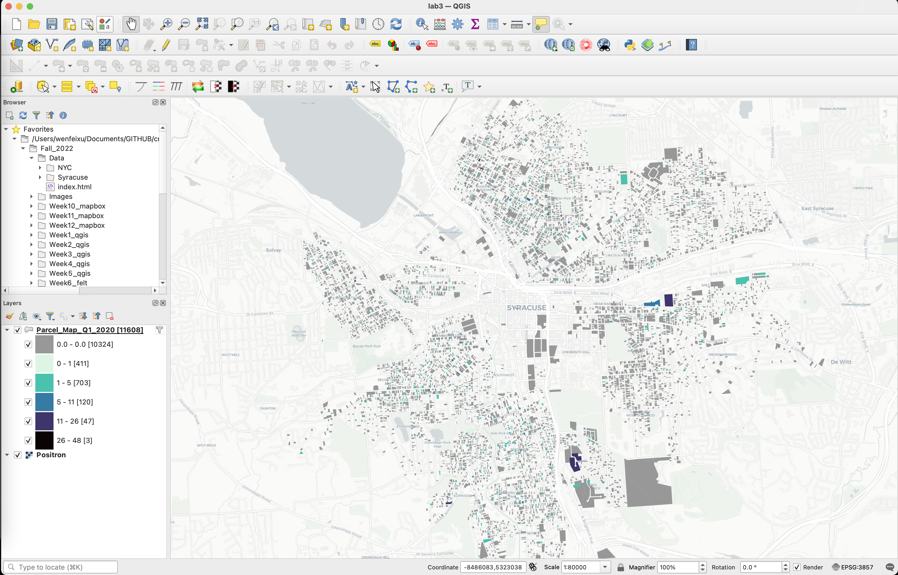
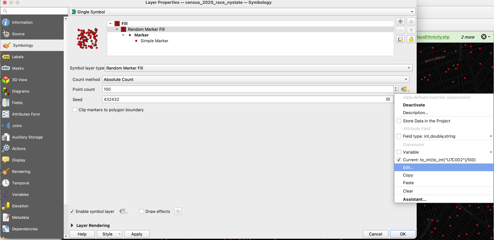

# Week 3 - Open Data and Map Types
**Today we will cover**
- What is "open data"?
- Guideline for exploratory visual inspection
- Map Types
- Case 1: Categorical Map using Syracuse Parcel Data
- Case 2: Dot Density Map

# 1. Lab Tutorial

Toda we're going to explore the open data in through three cases. The

## 1.1 Open data
"Open data" is a fairly new (since the 2000's) term that describes the product and process of creating an open access framework for all types of data, but especially data that is produced by government agencies. Open data proponents generally argue that it increases transparency in government operations, creates the possibility for other products and tools built off of open data, and provides the public easier access to information created using public resources that they should have the rights to. Fundamentally, this is based on the idea that information is a resource and a public resource if it is produced by public agencies.

The principles of open data stem from open source software, which is similarly based on the idea that sharing and reusing code enables more transparency and more democratic innovation.

In the United States, the [federal government adopted open data in 2009](https://obamawhitehouse.archives.gov/the-press-office/transparency-and-open-government) and many state and municipal government agencies have adopted (to different degrees) the data infrastructure and practices needed in sustaining the existence of open data.

What we, the public, get are the open data portals and dashboards that aim to facilitate the public's understanding of the data.

Here are some government data portals:
- [San Francisco](https://datasf.org/opendata/)
- [Los Angeles](https://lacontroller.org/controlpanel-la/)
- [Philadelphia](https://data.phila.gov/visualizations/payments-aggregate/)
- [Las Vegas](https://opendataportal-lasvegas.opendata.arcgis.com/)
- [Chicago](https://data.cityofchicago.org/)
- [Database of all(?) municipal data portals](https://data.opendatasoft.com/explore/dataset/open-data-sources%40public/table/?sort=code_en&refine.country=United+States&refine.thematic=Local+Government&location=2,37.57941,0&basemap=mapbox.streets)
- [U.S. gov open data](https://data.gov/)

Many open data policies in the US have now been around for almost 10 years by now and have established set standards for collection and publication based legislation regulating open data. For instance, for New York City's [Open Data Portal](https://opendata.cityofnewyork.us/), there are many pieces of legislation related open data:
- [Open Data Law](https://opendata.cityofnewyork.us/open-data-law/), local law 11 passed in 2012, which mandated that all public agency data by made available on an open data portal by 2018 (the portal was created much earlier than 2018 though).
- [Retention and Archiving:](http://legistar.council.nyc.gov/LegislationDetail.aspx?ID=2460376&GUID=7A7B4823-0691-4E45-9197-8971EEB45A82): Local Law 106 of 2015 mandates the preservation of the New York City historical record as represented by the City’s official data.
- [Data Dictionaries](http://legistar.council.nyc.gov/LegislationDetail.aspx?ID=2460429&GUID=206CD7AB-EC06-445F-9FE3-62D27F844AB6): Local Law 107 of 2015 requires every dataset on Open Data to have a plain language data dictionary.
- [Geospatial Standards](http://legistar.council.nyc.gov/LegislationDetail.aspx?ID=2460428&GUID=A23883BC-E875-44C9-B5C4-C475626044D0): Local Law 108 of 2015 requires that every dataset containing street addresses also contain coordinates and political boundaries. :fire::fire:
- [Public requests](https://opendata.cityofnewyork.us/open-data-law/#:~:text=and%20political%20boundaries.-,Public%20requests,-%3A%20Local%20Law%20109): Local Law 109 of 2015 guarantees timely and thorough responses to all public requests for new datasets on Open Data.
-[Timely updates](http://legistar.council.nyc.gov/LegislationDetail.aspx?ID=2460487&GUID=F2A0F488-9031-4210-A3B5-871BC5E26121&Options=ID%7CText%7C&Search=%22open+data%22):Local Law 110 of 2015 requires all data published on agency websites to be included and kept up-to-date on Open Data.
- [FOIL responses including data](https://legistar.council.nyc.gov/LegislationDetail.aspx?ID=2984659&GUID=6B734B2A-47FA-49C7-BE83-C7C640B098D2): Local Law 7 of 2016 and Local Law 244 of 2017 require agencies to review Freedom of Information Law (FOIL) requests containing data to determine whether they contained new public datasets that could be published on Open Data.
- [Examinations and Verifications](https://opendata.cityofnewyork.us/open-data-law/#:~:text=Examinations%20and%20Verifications): Local Law 8 of 2016 requires MODA to examine three mayoral agencies each year to verify that all public datasets have been disclosed.
- [Extending data publishing mandate](https://data.cityofnewyork.us/City-Government/Local-Law-251-of-2017-Published-Data-Asset-Invento/5tqd-u88y):Local law 251 passed in 2017, that requires each dataset on the portal to have information on:
  - Most recent update date;
  - URL;
  - Whether it complies with data retention standard (which mandates that row-level data be maintained on the dataset);
  - Whether it has a data dictionary;
  - Whether it meets the geocoding standard, does not meet the geocoding, or is ineligible for the geospatial standard;
  - Whether updates to the dataset are automated;
  - Whether updates to the dataset “feasibly can be automated”.

Keep in mind, though, that legislation has to be implemented after it's passed. Here's a nifty visualization from the [Data Compliance Dashboard](https://opendata.cityofnewyork.us/dataset-compliance-dashboard/) showing the extent to which data are meeting the requirements of the data publishing mandate.  We can see it doesn't reach 100% in any category.

 

Keep these graphics in mind when you're working with open data. In other words, despite the boon of open data resources we have at our disposal, their availability, frequency of updates, comprehensiveness, and more, should lead us to examine the data before we do anything with it.

## 1.2 A Guideline for Exploratory Visual Inspection with Open Data
With this in mind, we are going to do some exploratory visual inspection of Syracuse's parcel data. For those of you familiar with the concept of exploratory spatial data analysis (EDSA), which is a general term for the set of visualizations and statistical operations you try on a dataset when you first start working with an unfamiliar dataset, think of this as the initial pieces of EDSA. This process is exploratory in the sense that we're just trying to get a better understanding of the characteristics of the data - without being too targeted in our aims. (*Note: EDSA also involves some basic statistical descriptions like finding Moran's I correlations between different variables, looking at the distribution of our numerical data, finding outliers, etc., which is beyond what we're going to do today.*)

#### Here are my general steps for exploratory visual inspection:

0. **Topics in mind**: Have a general question or interest in mind. For ex: In my research aims, I am generally interested in housing and conditions of rental housing.
1. **Is there metadata/data description**: Which agency does data come from? How far back does the data go? Are there any things that stick out in the metadata? Is there a data dictionary that describes each of the columns?
2. **Is it spatial**: Check that your data has a spatial component that would make it fairly easy to map. Generally, we look for data that exists in a spatial format such as  **Shapefile**, **GeoJSON**, **KML**, or data that isn't in a spatial format but has columns that can be *turned into* or *joined to* a spatial format. This latter category can be data that has a lat/long, an address, a city/neighborhood/zip code/parcel/lot.
3. **Is it recent**: Check when the dataset was last updated and how frequently it is updated. If it's not recent, is that a problem? (For ex: a street trees dataset might be a year old, but it's probably fine to use an older dataset since trees don't change much.)
4. **Data size**: How big is the data? How many rows? How many columns? This will give you a sense of how easy or difficult it might be to work with in QGIS.
5. **Identify useful columns**: Which columns might be potentially useful or interesting for you research ideas? What does the data dictionary say about these columns? If it is categorical data, are there any categories that stick out? 
6. **Download and bring into QGIS**
7. **Filter**: If the dataset is quite big - something that is larger than 100,000 rows will probably make QGIS's operation a little slow - it might make sense to filter and save as a new file. (Also if your file has a spatial index file `.shx` it will make spatial operations faster, but the rendering of the geometries might still be a bit slow depending on how much memory your computer has to work with.)
8. **Are values is missing**: In the columns that are potentially useful, are there values that appear missing? Are there too many values missing to use that column?
9. **Thematize your map** Make a categorical, choropleth, proportional symbol, or dot density map based on the columns you are interested in.
10. **What's been written already**: Google some of the columns or results that you're interested in and see if you can find articles online about this topic.

## 1.3 Map Types

Last week, we briefly walked through how to make a choropleth map. Here's a more systematic overview of the different **thematic map** types. A **thematic map** is just a general term for the portrayal of geographic patterns in data through maps.

- **Choropeth map**: A choropleth is a map that scales values shading or coloring to display *numerical data* (i.e. data columns in your attribute tables where each value is a number). Choropleth map will generally use a **sequential color scheme** or a **divergent color scheme** to show difference.

 
(I've lost the source for this image of Maine's population)
 

 
Here are some other examples of sequential color schemes.

- **Categorical map**: A categorical map uses different colors to denote different values in *categorical data* (i.e. data columns with categories as values.)

 
From [pbc Geographic Information Services](https://www.pbcgis.com/lookup/). A land-use categorical maps - always an easy way to make pretty map.

- **Proportional symbol map**: These are maps that scale value - rather than by colors as in a choropleth - by the size of a symbol (typically a circle or a square, but you can also use other images like icons). These can be good to use if you need to map two or more variables (bivariate or multivariate).

 
From Li, R. (2021). Visualizing COVID‐19 information for public: Designs, effectiveness, and preference of thematic maps. *Human Behavior and Emerging Technologies*, 3(1), 97-106.

- **Dot density map**: These are maps that evenly distribute the density or proportion of one or more variables within a boundary. They can be good at showing clustering. There are typically two kinds of dot-density maps: **one-to-one** where one dot = one count and **one-to-many** where one dot = a set number of things (for ex: one dot = 100 people). Everyone loves a dot density map.
  - All dot density maps **MUST BE MADE USING AN EQUAL AREA MAP PROJECTION** (for ex: Albers Equal Area Conic, Sinusoidal, and Cylindrical Equal Area) since any distortion of areas will distort the density of the dots. In an equal map projection, the size of each shape area is preserved, at the cost of distorting the shapes. (From [Axis Maps](http://www.axismaps.com.s3-website-us-east-1.amazonaws.com/guide/univariate/dot-density/))

 
From [University of Virginia's Weldon Center for Public Service](https://demographics.coopercenter.org/racial-dot-map). Whoops, it looks like they took down the map because they were made before the 2020 Census and don't have the resources to update the map. Well, there are still plenty of images floating around the internet of this project.

#### Color picker tools
One thing you may have noticed that color is  important for what initially catches your eye. Here are some color picker tools that are kind of fun if you're looking for other color scheme beyond what's out of the box in QGIS:
- [Color Picker](https://htmlcolorcodes.com/color-picker/)
- [Fffuel's pppalette tool](https://fffuel.co/pppalette/)
- [Fffuel's hhhue tool](https://fffuel.co/hhhue/)
- [ColorBrewer 2.0](https://colorbrewer2.org/#type=sequential&scheme=BuGn&n=3): A classic, based on Cynthia Brewer's geographic dissertation on map colors.
- [Coolors](https://coolors.co/)
- [Adobe Color](https://color.adobe.com/create)
- [Paletton](https://paletton.com/#uid=1000u0kllllaFw0g0qFqFg0w0aF)
- [Color Oracle](http://colororacle.org/) A colorblindness simulator

## 1.3 Case 1: Neglectful landlords in Syracuse using parcel data
For this case, we're going to look through Syracuse's parcel data from [OpenCuse](https://data.syrgov.net/), their open data portal.

First of all, **what is a parcel map**? What kind of data can we expect from parcel data? A parcel map is sometimes referred to as a property map or tax map, which allows agencies to identify property boundaries, ownership, building, and other characteristics. It is used by agencies for land management purposes like taxation, though often building data will be associated with the parcel they're on, and by the real estate industry for development planning purposes.

If you go to their website and scroll down, you can see that they (and most government open data portals) have given us some topics to begin exploring. Because I'm not yet sure what specifically I'm looking for, I am going to explore the Housing topic.

On the Housing page, we are given different types of housing-related datasets to look at. Let's "Go to Data" in the first (Housing) section.

This should take you to a page where you can see the `Parcel Map Q1 2020 ` for Syracuse.

Following our Guideline:
**Step 1** says check for metadata, so let's click **View Full Details**. Hm, no data dictionary. But we do have some other information about this dataset.

(Btw, **Step 2**: we can see that it's been mapped, so we know it's spatial.)

We *do* have a landing page with some information on our dataset:

**Step 3**: First, we have some info on when this dataset was published and updated: 2020, not ideal if we are interested in present-day conditions, but a two year-old dataset is probably reasonable to work with.

**Step 4**: 41,335 records. That's sizable but not a huge deal. But if you look at the **Attributes Table** on the page, there are 121 attributes (read: columns)! If you scroll through the attributes table, we can see that there is a small **graph icon** that creates a quick breakdown of the different values and categories for that attribute:
   

  
  

Oh, interesting, there is an `Occupancy` column. If I click on the small chart button, I get something like this:

**Step 5**: Great, perhaps I can look through `Rental Occupied` parcels, in the `Occupancy` column. Some possibly interesting columns (Notice that a lot of columns are possibly duplicated? We'll worry about that later):
  - `OWNERNAME`,
  - `YEARBLT`,
  - `LAND_USE`,
  - `LU_GROUP` (I'm assuming this refers "land use group"),
  - `FullAddres`,
  - `Owner`,
  - `LandUse`,
  - `LUCODE`,
  - `n_OpenViol` (assuming this is the number of open violations and assuming violations building code violations),
  - `VacantBuil`,
  - `AssessedVa` (for assessed value?),
  - `Bankruptcy` (!),
  - `Amount_Del` (! for amount delinquent on teax)
  - `Seizable` (!),
  - `OverdueWat` (! for overdue water bill?)

**Step 6**: Ok let's go back to the landing page of the parcel data and download it. Let's select the `Shapefile` version of the dataset, unzip the downloaded file, which should be titled `Parcel_Map_Q1_2020.zip`, move it to your lab folder, and bring your dataset into a new QGIS project.

On your `Parcel_Map_Q1_2020` layer, right click and select `Show feature count`. As promised, we have 41,355 rows of data.

**Step 7**: Do we need to filter? Well, as mentioned, this data size might be manageable. However, since I'm interested in just `Rental Occupied` parcels, I'm going to go ahead and:
  1. Filter my dataset just for `"Occupancy" = 'Rental Occupied'`
  2. Save down a new shapefile that is just the remaining rental occupied data:
    - By right-clicking the layer -> **Export** -> **Save Features As**
    - Make sure to save down as an **Esri Shapefile**
    - Make sure the file is saved in a directory where you can easily find it later.
    - Click **OK**.
  3. The new, filtered dataset should automatically appear in Layers window.
  4. Uncheck the original parcel data since we won't be using it most likely and don't need to see it.

**Step 8**: Open up the attribute table and scan the columns we listed above. Are most of the values filled? If they are not filled, is it because it's missing or that the condition is not fulfilled? *Note: if the metadata were better here, we would probably know the answer to this by reading the dat dictionary. But, alas.*

Seems like the latter.

For instance, if you look at the `Seizable` column, we can see that only some of the rows say `Seizable` and that is probably because most of the buildings on the lot are not seizable.

**Step 9**: Since we don't have a specific question in mind, I'm going to pick `LU_GROUP` to create a categorical map (Right-click **Properties** -> Symbology -> Select **Categorized**) just to get a sense of what types of land use are rentals. I get something like this:

Two things to note:
- The vast majority of our data is `Residential`. Not a lot of `Commercial` or `Industrial/utility` parcels (seems surprising as many commercial spaces, like shops, are probably rented spaces, but this may be a function of the particular `Rental Occupancy` category)
- It's very hard to see the colors because each geometry is so small and the black border overwhelms the color. Next time, maybe we'll remove the borders altogether and just color the inside shape. (Even this doesn't really address the issue that ultimately, the parcels are too small for a map of the entire city.)

Now I want to take a look at `n_OpenViol`, which is the number of building violations in each parcel.  For this I want to create a choropleth (Right-click **Properties** -> Symbology -> Select **Graduated**) I've chosen the `Mako` color ramp here. I don't love it. Feel free to pick your own.

First let's remove the borders on our geometries. Make sure your **Stroke style** is set to `No Pen`:
 

 
 

My default mode for how I bin my values is **Equal Interval**. This just means that, however many breaks I choose, QGIS will find bin sizes such that each bin has more or less the same number of rows. What happens when I select that and why is this not ideal?

Try **Natural Jenks** instead. FYI [the algorithm for natural jenks](http://wiki.gis.com/wiki/index.php/Jenks_Natural_Breaks_Classification#:~:text=The%20Jenks%20Natural%20Breaks%20Classification,naturally%22%20in%20a%20data%20set.) is optimizing for simultaneously making the values within the group as similar as possible and making values between groups as different as possible, such that the groupings seem more "natural".

Looking better. Now, at least `0` isn't mapped to four different colors. Now, there's something that bugs me about this color ramp. I associate darker colors with *more* of something and here it's the opposite. I'm going to invert my color ramp in the the Color Ramp selection menu. Again, feel free to choose your own colors/ramp/etc. 

Lastly, I want to differentiate between parcels that have no violation and parcels with a violation. To do this:
- Click the green **plus** button to add another class.
- Set the values of that class to be 0 - 0. (You can double click those values to edit.)
- The next class will show up as 0 - 1, but it will only color the 1 values.
- Color the 0 - 0 class gray.

This is what I have:

I added a **Positron** basemap from **QuickMapServices** and this is what I have:

Two things to do on your own:
- **Step 10** Who are the owners in that highest category of violations? What does the internet tell us about these owners? You can either do this by using the **information button** in QGIS to click on geometries, or perhaps easier is opening up the attributes table and sorting by `n_OpenViol`.
  - A quick google search for one of them led me to this [article](https://www.syracuse.com/health/2022/06/ny-attorney-general-shuts-down-syracuse-landlord-accused-of-exposing-kids-to-lead-poisoning.html) I found.)
  - Also, do all the owners live in Syracuse?
- These are rentals from 2020. Is it still a reliable dataset? Bring in this dataset from the [Syracuse Rental Registry](https://data.syrgov.net/datasets/a59d57fdac9a4019b23c7fed30afdada_0/explore?location=43.034389%2C-76.140400%2C13.89) and do a visual inspection. Is the rental registry reliable? (Google it.)

**DELIVERABLE #1**:
- A choropleth map like we've done that includes the rentals registry data.
- Text describing some of the owners with the highest number of building code violations.

# 2. In-class Exercise / Case 2: Racial Dot Density Map
For this exercise, I'm going to outline the basic steps for creating a dot-density map in QGIS. They're not that difficult to make! We are going to focus less on the inspection of the data here and more on technique.

Generally, dot density maps generally need:
- A set of boundaries (ideally with full coverage of the area you're interested in)
- One or more categories of values associated with those boundaries. Some examples could be:
  - Population
  - Race (all categories)
  - Number of voters in a congressional district/county/state that voted for the various parties.
  - Rainfall

For this exercise, we are using 2020 census race by hispanic ethnicity data at the tract level to create:
- **a dot density map that shows 1 dot per 100 Asian, Black, White, Native American, Hispanic population, with each group represented by different colors**
- You will do this by creating copies of the same layer, but each copy will be mapping a different race/ethnicity.

## 2.1 Get the data

I've already downloaded and joined the 2020 Census Data from IPUMS NHGIS for you. Here are a few options for downloads. You should *choose wisely* based on whether you think you computer has enough spare memory to handle processing larger datasets
- [Census tracts for the whole US](https://www.dropbox.com/sh/h13dvbc6v3agukg/AACzF2GUbKwmYRGFduMCDqrQa?dl=0): 85,060 tracts
- [Census tracts for NY State](https://www.dropbox.com/sh/uhoc7gqwzwgx7lo/AABunF9y1e2SMrluHpqJuPrSa?dl=0): 5,393 tracts **If in doubt, choose this one**

#### Data
I've included the data catalogue for you in each of the datasets, but here they are below:

- `STATEFP:   State FIPS code` *You'll need these to filter, if you choose*
- `COUNTYFP:   County FIPS code`  *You'll need these to filter, if you choose*
- `U7C001:      Total`
- `   U7C005:      Not Hispanic or Latino: Population of one race: White alone`
- `    U7C006:      Not Hispanic or Latino: Population of one race: Black or African American alone`
- `    U7C007:      Not Hispanic or Latino: Population of one race: American Indian and Alaska Native alone`
- `    U7C008:      Not Hispanic or Latino: Population of one race: Asian alone`
- We're actually nto going to use these two (but they're in the data)
- `    U7C009:      Not Hispanic or Latino: Population of one race: Native Hawaiian and Other Pacific Islander alone`
- `    U7C010:      Not Hispanic or Latino: Population of one race: Some Other Race alone`

#### A note on race vs ethnicity in the Census especially w.r.t. Hispanic Ethnicity
For those who might be unfamiliar with the distinction between race and Hispanic ethnicity: The Census Bureau allows you to self-identify as someone who comes from a Latin American Spanish-speaking background. You can be any race and be Hispanic. For ex: There are Peruvians who have Japanese roots and Afro-Latino people with Caribbean backgrounds. Because we want a way to distinguish between those who are Hispanic (of any race, typically) and the Asian, Black, White, Native populations without Latin American roots, we generally tend to separate these groups into Non-Hispanic Black, Asian, etc. from Hispanic of all races.

So, when we say "Asian", we mean "Non-Hispanic Asian". Also, in this case, we mean "Non-Hispanic Asian Alone", meaning that we are not going to include mixed-race-ethnicity groups (which is an increasing percentage of the population).

## 2.2 Dot-density from Single-Symbol Symbology
There is a function in QGIS that allows you to turn polygon into a random set of points. This is under **Fill**->**Simple Fill**->**Symbol Layer Type**=`Random Marker Fill`

Just to give you a sense of what the `Random Marker Fill` function is doing: It's baseline is to, instead of filling your tract geometry with a color, it's going to replace it with a random set of points based on your **Point Count**. If you set **Point Count** = `1`, that means each tract is going to get **one random point**.

Ok, well, we don't want one random point right? We want the number of points **1 dot for every 100 people**.

Next to your **Point Count** input box is a small arrow + table icon that allows for a **Data-Derived Override**. Select that and then select **Edit** so we can create a formula that allows us to create the one-to-many dots we need.

We've just opened this handy expression builder that allows us to create our basic formula, which is:
- `[Number of People in Race X in Tract]/100`

Let's say we want to first create a dot density map for Asian population. We can look in our field and just type in the following:

*Note: QGIS is doing a lot for you in the background. All the Census data columns are actually in a `string` format (i.e. text), so it's first converting text to a number. Also, you can see that a preview of the output is `5.16`. We can really map 5.16 dots! QGIS is rounding that number to whole number.

Style your marker a bit. You might notice that your points are too big for how many we have in the end. And, again, the border might get a little distracting. These kids of multi-colored maps tend to work better in a darker background or a very light background. Choose a basemap that you like or perhaps experiment with having no basemap and see what it looks like.

In your **Seed** box, type in an arbitrary number. This "seeds" your random number generator that populates your points. If you have the same seed for different layers, you  might have your random points overlap.

**Lastly, and most importantly!**, change your map projection to an equal area projection. Here, I'm using `EPSG:102003`, or `USA_Contiguous_Albers_Equal_Area_Conic
`.

I get something that looks this:

A zoom in on NYC gives me this:

Now, create a **Duplicate** of your layer and change the field to another race in the expression builder. Change the color and it will be helpful to rename your layer to that new race. Make sure to change the number in your seed for the new layer!

I get something like this in the end:

Notice that it's not great in areas like the Bronx that are both very dense and diverse. You might have to play around with the order of the layers (QGIS is not great for layering info), the colors, and the point ratio.

If you somehow had the patience and computer memory to work with the entire US dataset, and tried making a dot density map of the entire US, you might get something like this (I took out the basemap): (Whoops, apologies to Alaska and Hawaii for missing those states here. It looks like I did manage to catch some of Alaska and Puerto Rico in this screen grab. This took a while to render so I won't re-render for now.)

**DELIVERABLE #2+3**
- Two dot density maps (with a legend) in two different areas. Perhaps two different cities or the same city but different scales. Notice how you have to change your dot ratio and symbology
- Describe some of the patterns in each city, along with the similarities and differences in these patterns, and why you think they exist. 
