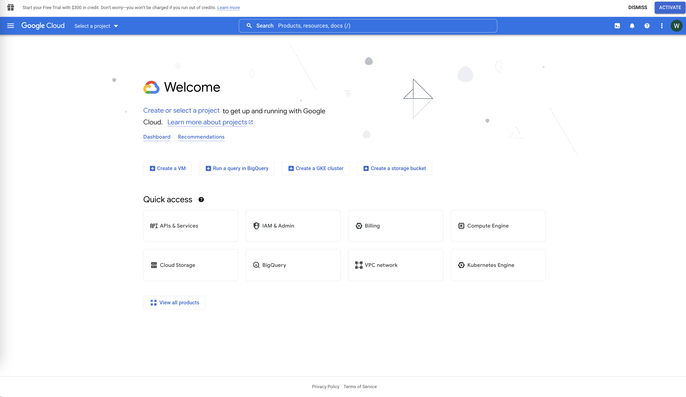
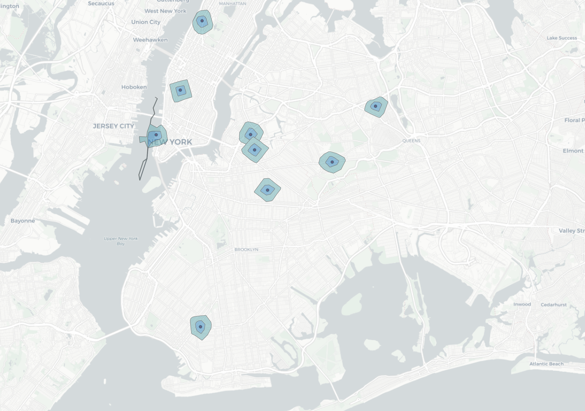
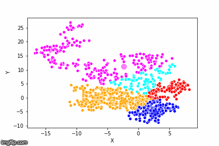

# Week 5 - Spatial Associations and more
**Today we will cover**
- Google Maps API
- Spatial associations: Isochrones
- Spatial associations: Clustering
- Spatial associations: Hub and Spoke
- Download the Mergin app on your phone and assignment for next week

# 1. Lab Tutorial


## 1.0 Geocoding - continued
To get started, we need to **create an API key**. You'll need your Cornell account to proceed. Please refer my email from earlier this week on the details. 

1. Go to the [Google Cloud console](https://console.cloud.google.com/), which is your landing page for all Google computing services (geocoding API is one of many tools you can use through the Google Cloud).
2. If your default account is your personal gmail (like it is mine), make sure to switch it to your Cornell email on the top right-hand corner.
3. You'll have to agree to their terms of service before proceeding (I think). An [interesting read](https://cloud.google.com/terms/?authuser=1) for another time.
4. This should take you to a page like this:
<p align='center'>

</p>

5. In the upper-left corner, click **Select a project** and **NEW PROJECT**. All API keys are associated with projects, which is more for developers who are using the services more heavily. This is so that we separate usage and keep track of what projects are using how much of which resources.
<p align='center'>

</p>

6. Here, input a project name. You'll need to create a **globally unique** name, all lower case, no spaces only dashes name. I'm calling this project `mapping-countermapping-wenfei`. You can call yours `mapping-countermapping-YOURNAME`
7. Once you click ok it will take a few seconds to create the project.
8. In the console, select your new project `mapping-countermapping-wenfei` (for me).
9. From here, go to the sidebar menu, select **Google Maps Platform->APIs**
<p align='center'>

</p>

10. You should get a page like this. Make sure that Geocoding API is in this list.
<p align='center'>


11. Now click **Credentials** in the menu bar on the left.
12. You should get to a page that shows a list of API keys (you probably don't have any yet). Next to the "Credentials" title, the selection should be **All Google Maps Platform APIs**.
13. Once you've selected this, click on **+ Create Credentials**. You should get a popup that says "API key created" and your API key. Copy and save that down on your computer. Again **do not share this API key or post it**.

Once you have this API key, try to the same geocoding with `real-estate-ny-10sample.csv` exercise we did last week using the Google Coding API instead of the Nomatim one. Call this newly geocoded shapefile `real-estate-ny-10sample_googlegeocoded.shp`


## 1.1 Spatial Associations: Isochrones
In the next few sections we are going to learn some different ways to describing spatial associations.

First, we are going to learn how to make **Isochrones**, which is the area we can get to within X minutes by various modes of transportation such as walking, car, bike, etc. The image below shows the 20, 40, 60, 100, and 120 minute isochrones from the points on the map if one were biking. To create somewhat accurate isochrones, we need to know the street network in order to find where we can travel.

<p align='center'>


We are going to make 5 and 10 minute walking and driving isochrones of our 10 points in `real-estate-ny-10sample_googlegeocoded.shp`.

To do this, first install the plugin **ORS Tools** in your plugins page. After you do this, you'll need to get an API key from [https://openrouteservice.org/](https://openrouteservice.org/). This is a free routing service that uses the OpenStreetMaps road network to calculate travel times.

You'll have to sign up for an account [here](https://openrouteservice.org/dev/#/signup). You'll have to check the email you signed up with to activate the account.

Once you get to the Dev dashboard, go to the **Request a token section** to create a `STANDARD` token, call it "Lab5" and click **CREATE TOKEN**.
<p align='center'>


It will take a second, but a row of information should appear under TOKENS. Click that long string under **Key**. Go back to QGIS and under **Web->ORS Tools->Provider Settings** paste in your key and click ok.

Now go to **Web->ORS Tools->ORS Tools** select the **Batch Jobs** tab and select the **Isochrones from Layer**.
<p align='center'>


We want to select the `foot-walking` option in the Isochrones tools that pops up. For the comma-separated ranges, we want a `5,10`. And then click **Run**.

Once your **Log** window shows
```
....
Loading resulting layers
Algorithm 'Isochrones from layer' finished
```
at the bottom, you can close this tool.

You should get something that looks like this:
<p align='center'>


#### **DELIVERABLE #1**
Using the same isochone tool, dataset, and time periods, create a driving isochrone map.
Answer the following questions:
- What are some other possible uses for isochrones maps?
- What are some aspects of walking and driving that do not factor in to the calculation of these maps? (Hint: if you are familiar with New York traffic, would these maps make sense?)


## 1.2 Spatial Associations: Clustering

The second type of method we'll explore today is **spatial clustering**. For those of you who may be unfamiliar with this concept, it is any rule that allows us to group spatial data in a intentional and meaningful way. Today, we'll learn about two methods **K-Means** and **DBSCAN**. We won't talk about the math, just the ideas behind these two methods.

#### K-Means
This is a clustering method that will allow you to divide up your data into **k** groups by iteratively trying to find splits in the data that minimizes the sum of distances between points in the group and the centroid. So, with each iteration, the membership of each point might change depending on whether that point is closer to the centroid of its current group or the centroid of other grouops.

This is what it looks like with k=2 groups:
<p align='center'>


This is what it looks like with k=5 groups:
<p align='center'>



In this exercise, say we are interested in creating **5 clusters** using K-means clustering of where people in New York City have been making [311 noise complaints](https://data.cityofnewyork.us/Social-Services/311-Noise-Complaints/p5f6-bkga/data) about `Loud Talking`.

Download the `311_Noise_Complaints_sept_loudtalking.csv` table from this week's github folder and create a shapefile from this CSV. Call this shapefile by the same name (`311_Noise_Complaints_sept_loudtalking.shp`)

In your menu bar, go to **Processing->Toolbar** and the "Processing Toolbox" should appear. Under **Vector Analysis**, select **K-means clustering**.

We are going to be using your newly geocoded `311_Noise_Complaints_sept_loudtalking.shp` as the **Input Layer**. You should have something like this:

<p align='center'>


Click **Run**.

A virtual layer called `Clusters` should appear in your Layers panel. Rename this `Clusters - Kmeans` in your layers panel to keep track of which layer clustering this is. It doesn't look like much right now. Open up the attribute table. You should see that, in addition the columns that `311_Noise_Complaints_sept_loudtalking.shp` had before, now you have two new columns called `CLUSTER_ID` and `CLUSTER_SIZE`.

Create a categorical map based on the `CLUSTER_ID`, which are the labels for each cluster. In other words, we want to visualize these clusters.

#### DBSCAN
Density-based spatial clustering of applications with noise (DBSCAN) is another clustering technique where we are more interested in minimizing the distance between points. Based on a certain radius (the "epsilon" typically), points are in the same cluster if they fall within another point's radii and there's a "core" of at least N number of points all in each other's radii. In this image below, green points all create one cluster because they are all close enough to each other. Same with the blue.
<p align='center'>


Two things to note about DBSCAN:
- The "noise" part means that some points will be considered "noise" because they are too far away from other points to be in a cluster.
- The technique is good at finding structure and non-linear shapes, which you can see from the animation below.

<p align='center'>


Now, using the same `311_Noise_Complaints_sept_loudtalking.shp` dataset, run the **DBSCAN clustering** tool in your Processing Toolbox. Use a minimum cluster size of 5. (Note, if you use this tool in the future, you should change this based on your own conception of what the minimum cluster size should be. It might be bigger for denser, larger datasets and smaller for sparser datasets.)

The tricky part is to set the "Maximum distance between clustered points", your radius or epsilon. We are going to use `0.004` degrees as our radius to approximate the neighborhood level. This was kind of arbitrarily picked, but if you wanted to calculate degrees equivalent of a specific distance to make your clusters more meaningful, you'll need to use a [Great Circle calculator](https://www.marinewaypoints.com/learn/greatcircle.shtml), which will convert distances on the surface of a sphere to degrees. 

Rename your new clustered layer `Clusters - DBSCAN 0.004` and style your new layer based on the `CLUSTER_ID` again. Also, notice that this time not everything was categorized. Color those that didn't end up in a cluster **gray**.

#### **DELIVERABLE #2**
A side-by-side comparison of your `Clusters - Kmeans` map and `Clusters - DBSCAN 0.004` map. In your print composer, you'll have to [lock layers](https://docs.qgis.org/3.4/en/docs/user_manual/print_composer/composer_items/composer_map.html#id10) to be make visible different layers in your print composer.

Answer the following questions:
- Visually, what can you say about the points that are included in the k-means map and the DBSCAN clusters?
- Which are the parts of the city that have the most noise complaints? Why do you think this is?


## 1.3 Spatial Associations: Hub and Spoke
Hub lines or hub and spoke diagrams are spatial visualizations of connections and networks.

<p align='center'>


For this exercise, we are going to re-visit our Syracuse parcel data. Today, we are going to use a subset of the parcels that have 10 or more violations per parcel. Download the `parcels_w_plus10violations` [data](https://www.dropbox.com/sh/0tq3mwm8ievmk4l/AACh2L6pb1sW8r3hSGqvzkRra?dl=0).

Last time we looked at this data, we talked about how many of the owners have their billing addresses (a good proxy for where they live?) out of town. Today, we are going to create a hub and spoke diagram that maps the billing addresses of building owners to the parcel where they own the building.

If you open up the attribute table of that dataset, we can see that next to `Ownername1`, `Ownername2` (towards the right) there is a `TaxBilling` column that contains the full address.

<p align='center'>


We now need to create a CSV (because the MMQGIS geocoder tool only takes CSVs for some reason) in order to geocode these address.

Right-click on the `parcels_w_plus10violations` layer and export your attribute table with only the `FID` (the unique id for each parcel, which we'll need later to connect it owners to parcels) and `TaxBilling`. I called my CSV file `parcels_w_plus10violations_TOGEOCODE.csv` just so it's clear what this file is for

<p align='center'>


Once you have your CSV, geocode using Google and your new API key. It turns out that we can actually just use `TaxBilling` in just the **Address** section since it has the full address and the Google geocoder is pretty flexible.

All 60 entries should have been geocoded. Great!

You new shapefile of owner billing addresses should look like this:

<p align='center'>


Finally, in the menu bar, go to **Processing->Toolbox->Vector Analysis->Join by lines (hublines)**

The **hub** layer is the "origin" of the lines, which is your parcel data. The **spoke** layer is your new owner billing address data. Both field IDs should be `FID`. In our case, it doesn't actually matter which layer is which, since there is a one-to-one correspondance between the two layers, but imagine if you were mapping one hub to many spokes, then which layer is hub vs spoke would matter more.

<p align='center'>


Now click **Run**.

#### **DELIVERABLE #3**
Create a side-by-side comparison of 1) the entire hub and spoke diagram, styling your owners dataset and parcels data a bit, and 2) the same diagram zoomed into the Syracuse metro region.

Answer the following questions
- Are you surprised by where these owners are located?
- The zoomed in version of the hub and spoke diagram doesn't work as well. Why is that?

# 2. OUT OF Class Exercise
To prepare for next week, there's a short assignment I'd like to you do: 
1. Download the **Mergin Maps** app on your phone (there are both iPhone and Android versions. Note: The screengrabs here are for my iPhone. I'm not sure what the Android interface looks like)
2. Sign up for a [Mergin Maps account](https://app.merginmaps.com/) so you can upload your survey and data.
3. In the **Home** page of your app, select **Create a Project**. 
4. You'll need to add a **text** field called `Activity type`.

<p align='center'>


5. Click **Create project**
6. You'll see your new project appear on your home page. Click the upload (cloud-arrow) button and upload this blank survey to your Mergin account online.
**Please do this by the end of the day **today**, since we'll start the self-survey tomorrow.**

#### Self-survey starting tomorrow: "How Far Away Do You Get from Sibley?"
8. For every day starting **Friday (Sept 23)** until **Wednesday (Sept 28)**, I would like you all to document where you are and what you are doing when you think you have traveled to your farthest point away from Sibley that day, using the new survey you've just created. Write a short **Note** about what you are doing at that point, take a **Photo** (keep it PC), and briefly categorize the **Activity type** using the following categories:
  - `Recreational`
  - `School`
  - `Work`
  - `In Transit`
  - `Errands`

9. To input this survey, you'll go to your **Lab 6 survey** project on the app. Select **Record**. Optional, but since the default zoom of your map will look like this:

<p align='center'>


It might be helpful to manually zoom in on your map in order to see where you are:
<p align='center'>


You may get a warning that your GPS has low position accuracy. You can ignore that since we don't need to be super accurate.

10. **Add Point** to fill out your survey.
  
**You should have six results by next Thursday.**
