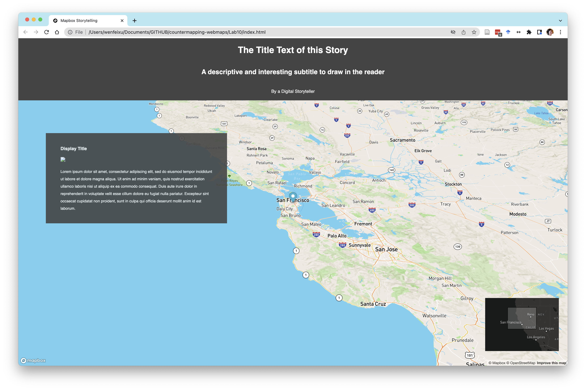
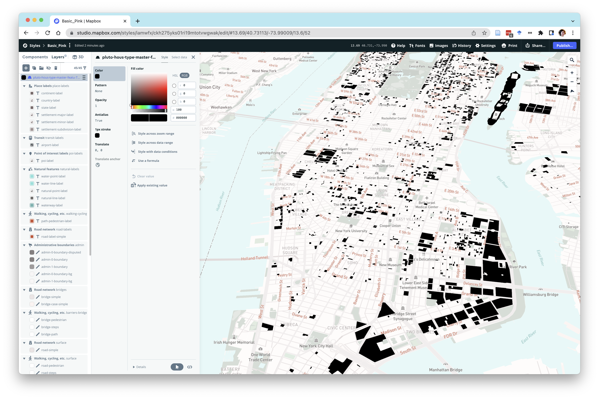
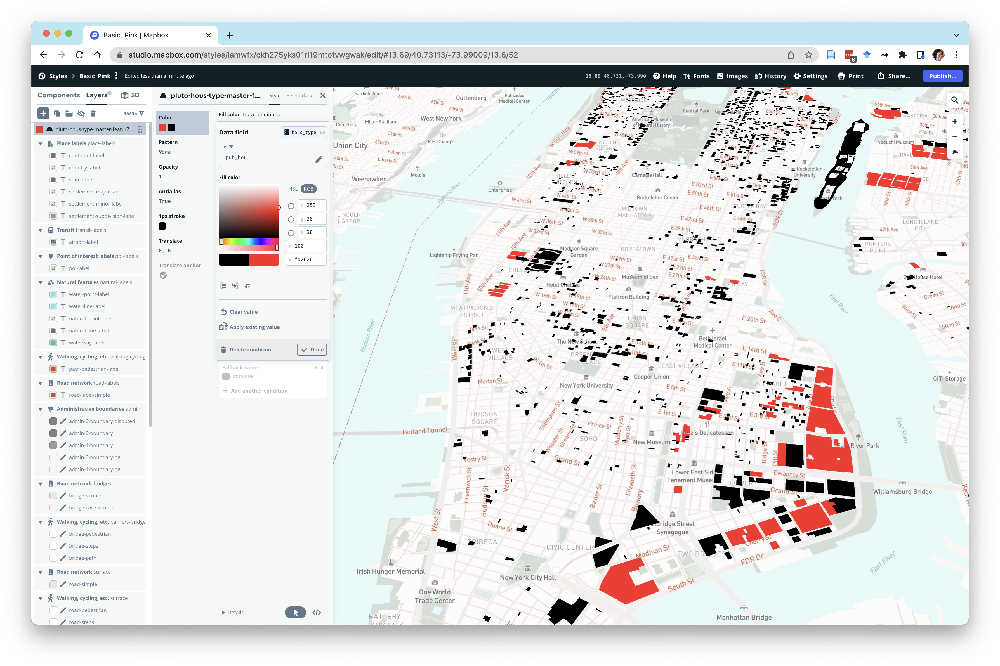
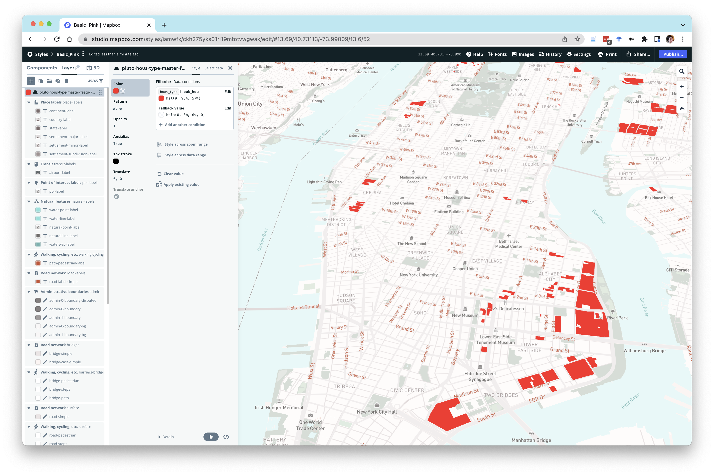
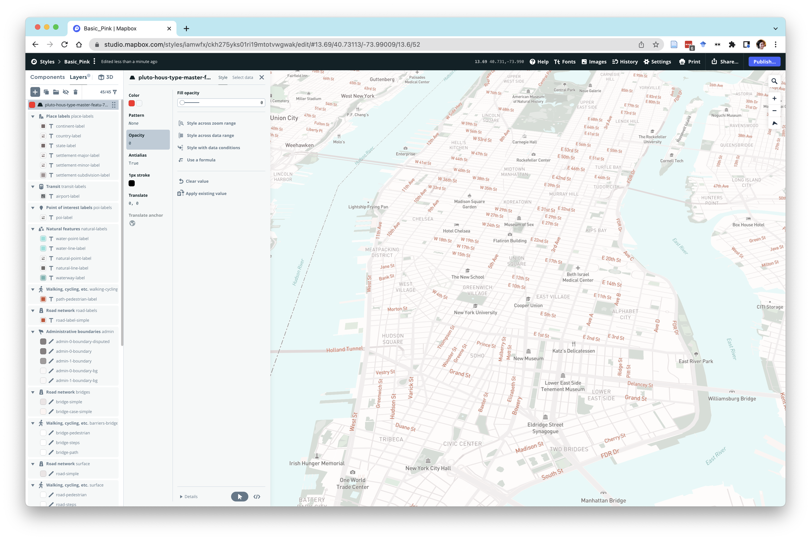

# Week 10 - Mapbox Storytelling tools

**Today we will cover**

- Basics of storytelling maps


Today we are going to dive into Mapbox's storytelling tools. Luckily, we have this [template from Mapbox](https://github.com/mapbox/storytelling), which structures the storymap.

# 0. Download the storytelling toolkit

Download the [starter files](https://github.com/iamwfx/crs_3850_5850_mapping_countermapping/blob/main/Fall_2023/Week10_mon_storymaps/story_starterfiles.zip) in this week's folder and put it in `Lab10` in your  `countermapping-webmaps` repo.

# 1. Creating a storymap
The storymap is essentially composed of scroll-driven interactions that allow us to do things like:
- Change the lat/lng, zoom, pitch, and bearing of a map
- Change the map layer appearance
- Change the basemap appearance
- Animate html elements


## 1.1 General Steps

Here are the general steps to creating a storymap in Mapbox:

(from Mapbox's storytelling repo)

#### Steps

1. **Select the map style** you want to use (the default is Mapbox Streets, but you can find more here https://docs.mapbox.com/api/maps/#styles, or use one of your custom Studio styles).

2. **Add a Mapbox access token.** A good practice is to [create a separate](https://docs.mapbox.com/help/how-mapbox-works/access-tokens/#creating-and-managing-access-tokens) token per map to be able to track traffic to your different maps.

3. **Choose whether or not to display a marker** at the center of each map location. If you are displaying markers, you can set the color using the `markerColor` property. The default color is light blue.

4. **Choose a theme for the story text**. There are `light` and `dark` options.

5. **Choose where your story should be aligned over the map**. Options are `center`, `left`, `right`, and `full`.

```js
{
    style: 'mapbox://styles/mapbox/streets-v11',
    accessToken: 'YOUR_ACCESS_TOKEN',
    showMarkers: true,
    markerColor: '#3FB1CE',
    theme: 'light',
    use3dTerrain: false,
    title: 'The Title Text of this Story',
    subtitle: 'A descriptive and interesting subtitle to draw in the reader',
    byline: 'By a Digital Storyteller',
    footer: 'Source: source citations, etc.',
    chapters: [
        {...
        }
      ]
}
```

6. **Add as many `chapters` in your template as needed.** You'll need a `,` between each section, but no comma at the end. Here is what a `chapter` looks like:

```js
{
            id: 'slug-style-id',
            alignment: 'left',
            hidden: false,
            title: 'Display Title',
            image: './path/to/image/source.png',
            description: 'Lorem ipsum dolor sit amet, consectetur adipiscing elit, sed do eiusmod tempor incididunt ut labore et dolore magna aliqua. Ut enim ad minim veniam, quis nostrud exercitation ullamco laboris nisi ut aliquip ex ea commodo consequat. Duis aute irure dolor in reprehenderit in voluptate velit esse cillum dolore eu fugiat nulla pariatur. Excepteur sint occaecat cupidatat non proident, sunt in culpa qui officia deserunt mollit anim id est laborum.',
            location: {
                center: [-122.418398, 37.759483],
                zoom: 8.5,
                pitch: 60,
                bearing: 0
            },
            mapAnimation: 'flyTo',
            rotateAnimation: false,
            callback: '',
            onChapterEnter: [],
            onChapterExit: []
        },
```

7. **Fill out your sections as needed.**  Give each section a unique name in the section `id` property. This will become the HTML `div` `id`, so avoid spaces in the name. The `title`, `description` properties are optional. The `description` supports HTML tags. If you have an image that goes with that section of the story, add the path to the image in the `image` property.

8. For `location`, you can use the `helper.html` file to help you determine the map's position. This tool prints the location settings of the map on the screen in a format ready for copy/paste into the template. Optionally, you can change the style in this file to your [custom style](https://docs.mapbox.com/mapbox-gl-js/example/custom-style-id/).

9. Repeat until you have the location entered for each of your sections.

10. Open `index.html` in a browser, and scroll. Voila!

## 1.2 Configuration

- Open up your `config.js` file in your text editor.

The `config.js` file is essentially **where you will be adding all of your content** in the storymap.

- Update the `accessToken` to your Mapbox public token.

Now open your `index.html` file in your browswer. You should get something like this:

<p align='center'>

</p>

- Scroll down and you can see the pieces of the template.


## 1.3 `helper.html`

The `helper.html` file helps you identify the lat/long, zoom, pitch, and bearing in the set of outputs in a map view.

- Open your `helper.html` file in your browser. You should see this:
<p align='center'>

</p>

- The crosshairs at the center of the map correspond to the `center` lat/lng
- You can also <ctrl> + drag or right-click and drag the mouse around to tilt and change bearing of the map.

We'l be using this tool to get the changing camera position inputs needed for the next step.

## 1.4 Configuration, continued

(again, borrowed from Mapbox's storytelling repo)

In your `config.js` file, the following are required (in **bold**) and optional configurations to change in your storymap.

#### Configuration Options

Note: items in bold are **required**.

**`style`**: This is the Mapbox style `url` to use for the app. It can be a standard style, or a custom style from your Mapbox account. Use a custom style if you want to include custom data or layers.

**`accessToken`**: Your Mapbox access token.

**`showMarkers`**: This controls whether markers are shown at the centerpoint of each chapter. If `true`, the map will display a default blue, inverted-teardrop icon.

**`markerColor`**: Accepts hexadecimal, RGB, and color names [compatible with CSS standards](https://developer.mozilla.org/en-US/docs/Web/CSS/color_value). If `showMarkers` is `true`, this property will override the default light blue marker color.

**`theme`**: Two basic themes (light and dark) are available.

`use3dTerrain`: Enables 3D terrain. (Optional)

`inset`: Enables inset map. (Optional)

`projection`: Set the Map object's [projection parameter](https://docs.mapbox.com/mapbox-gl-js/example/projections/) to create a map with a non-Mercator projection.. (Optional)

`title`: The title of the overall story. (Optional)

`subtitle`: A subtitle for the story. (Optional)

`byline`: Credit the author of the story. (Optional)

`footer`: Citations, credits, etc. that will be displayed at the bottom of the story.

**`chapters`**: This contains all of the story content and map controls for each section of the story. _Array of objects_

- **`id`**: A slug-style ID for the chapter. This is read by the JavaScript driving the app and is assigned as an HTML `id` for the `div` element containing the rest of the story. A best-practice format would be to use kebab case, like `my-story-chapter-1`.
- **`alignment`**: This defines where the story text should appear over the map. Options are `center`, `left`, `right`, and `full`. When the browser window is less than 750 pixels wide, the story will be `center` aligned.
- `hidden`: Sets the visibility of the chapter to `hidden` when `true`. The chapter will still trigger a map and layer transition.
- `title`: The title of the section, displayed in an `h3` element.
- `image`: The path to an image to display in this section.
- `description`: The main story content for the section. This should be aligned with what the reader is seeing on the map. In the vanilla version, this field will render as HTML. Images, links, and other items can be included as HTML.
- **`location`**: Details about the map display and camera view.
    - **`center`**: Center coordinates of the map, as `longitude, latitude`
    - **`zoom`**: Zoom level of the map.
    - **`pitch`**: Angle of the map view. `0` is straight down, and `60` is highly tilted.
    - **`bearing`**: Degrees of rotation clockwise from North (`0`). Negative values represent counter-clockwise rotation.
- `mapAnimation`: Defines the [animation type](https://docs.mapbox.com/mapbox-gl-js/api/#map#jumpto) for transitioning between locations. This property supports 'flyTo', 'easeTo', and 'jumpTo' animations. If not specified, defaults to `flyTo`.
    - flyTo and easeTo [options](https://docs.mapbox.com/mapbox-gl-js/api/map/#flyto-parameters) (`curve`, `maxDuration`, `minZoom`, `screenSpeed`, `speed`) can be included in the `location` array, for example:
```
            location: {
                center: [-113.72917, 48.58938],
                zoom: 12.92,
                pitch: 39.50,
                bearing: 36.00,
                speed: 0.2,
                curve: 1
            }
```
- `rotateAnimation`: Starts a slow rotation animation at the end of the map transition when set to `true`. The map will rotate 90 degrees over 24 seconds.
- `callback`: Accepts the name of a JavaScript function and executes the function. Use this if you have custom code you want to run for a chapter, like turning a legend on or off, adding data from an API request, or displaying an interactive graph.
- `onChapterEnter`: Layers to be displayed/hidden/muted when the section becomes active. _Array of objects_
    - `layer`: Layer name as assigned in Mapbox Studio.
    - `opacity`: The opacity to display the layer. `0` is fully transparent, `1` is fully opaque.
    - `duration`: The length of the opacity transition, numeric, in milliseconds. Default is 300. This is an optional parameter and can be omitted.
- `onChapterExit`: Same as `onChapterEnter` except it is triggered when the section becomes inactive. _Array of objects_

## 1.5 Mapbox studio for layer visualization and management

We can do many of the same adding and styling of layers we have been doing through code by adding them onto a map layer in Mapbox studio instead.

In order to do this, go to your Studio and open up a map style like so:
<p align='center'>

</p>

Notice that, on the left-hand tool bar, we have two sections: **Components**, and **Layers**.
- **Components** are features, like buildings, that we can style in a single unit.
- **Layers** are a collection of features of a single type that can vary, however, in how we style it.

- Click on **Layers** and then the **`+`** button, which should take you into an interface that looks like the below:
<p align='center'>

</p>

- We can now add another tileset layer onto our map style!
- Select the **Source** for our new tileset. This can either be 1) a tileset that already exists in your own account under **Tileset**, or this can be a public tileset if you have the tileset ID
<p align='center'>

</p>

- Select **Add Source by ID** and let's add our affordable housing lots, which has this tileset ID: `iamwfx.ab4g098q`. Your style should now have a new layer at the top of the layer order. And your "x-ray" map should display this new tileset layer
<p align='center'>

</p>

- Now, let's style this layer. Click on the layer name on the left-hand side toolbar and you should see this:
<p align='center'>

</p>

- Great! We were able to add this layer. Now let's style it. We can see that it's currently just black. Let's **Style with data conditions**, which will allow us to create a categorical map. Under the **Choose a data field from** dropdown, let's select `hous_type` again.
- If you click on `pub_hous` and select a color from the **Fill color** tool, we can choose a color for public housing. This is what you'd get:
<p align='center'>

</p>

- Pretty cool! Now, let's say we were only interested in public housing. This means that we can set the opacity for the rest of the layers to be 0.
<p align='center'>

</p>


# 2. In-Class Exercise

**Deliverables**

- Starting from an existing map style, play around with changing the water, land, and building colors. Turn on the 3D building component
- Add in all layers from the 2050 and 2100 predicted floodplains tilesets from [Lab 8](https://github.com/iamwfx/crs_3850_5850_mapping_countermapping/tree/main/Fall_2023/Week7_mapbox2) to your map. Make sure that they are below the housing layer and that the hierarchy of your flood layers is such that you can see all the layers.
- Set the opacity of the entire housing layer to 0 so that it's not visible:
<p align='center'>

</p>

- Using the template that you are given in the zip file, create a storymap with the predicted flood plains and housing data (styled only to show public housing).
- Start with the first "chapter" being the same text description we have been using in our previous flood risk maps, adjusting items like the `title`, `subtitle`, and `byline`.
  - Make sure we cannot see the housing layer
- Create another "chapter" that talks about flood-related damages to the [Red Hook Houses](https://en.wikipedia.org/wiki/Red_Hook_Houses). You'll have to do some searching online
  - Show the housing layer
  - Make sure to include a relevant image and link to it under `chapters[{...,image:XX,..}]`
