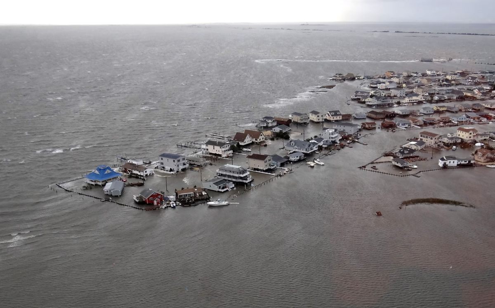
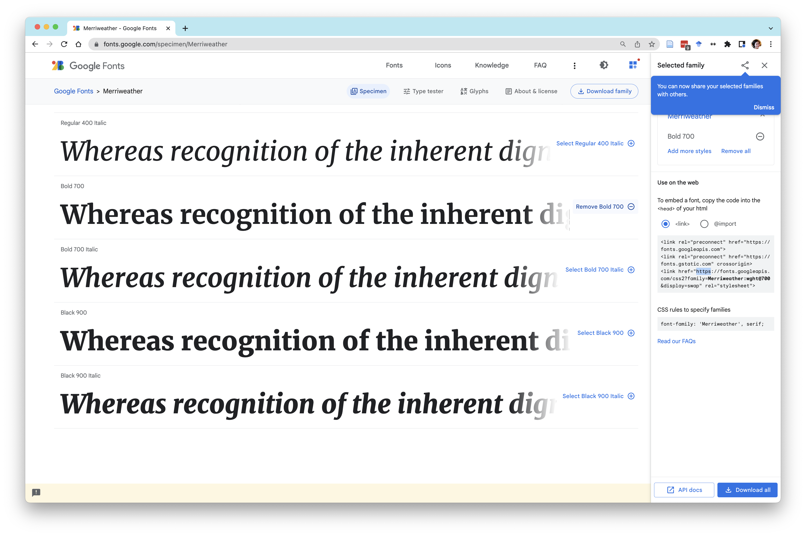
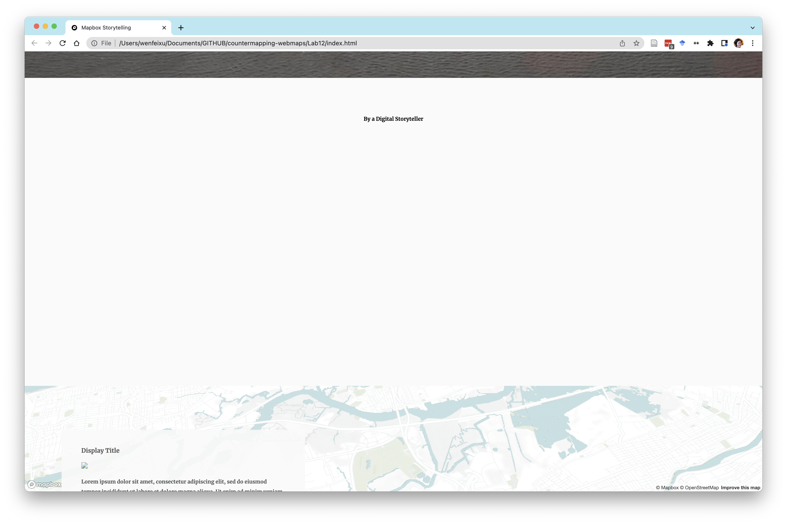
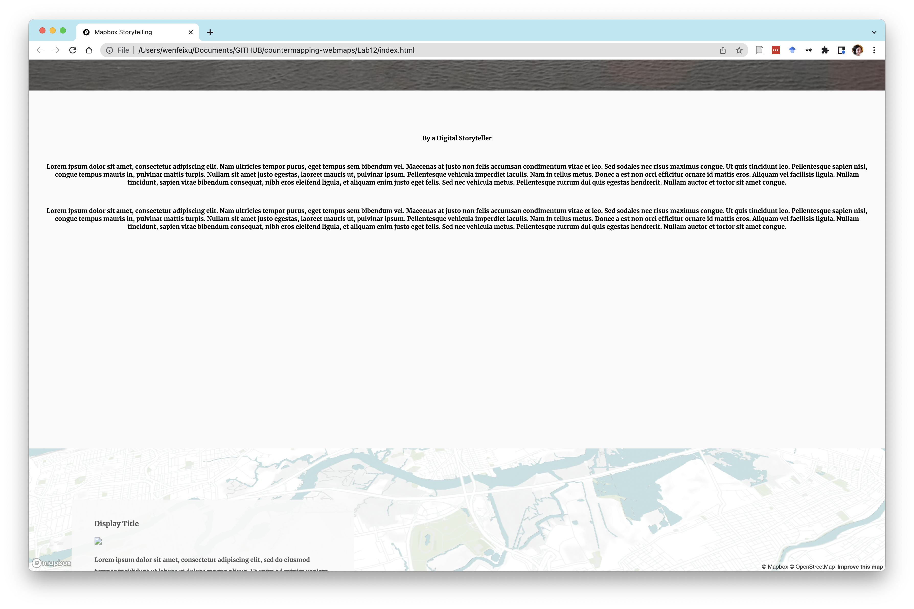
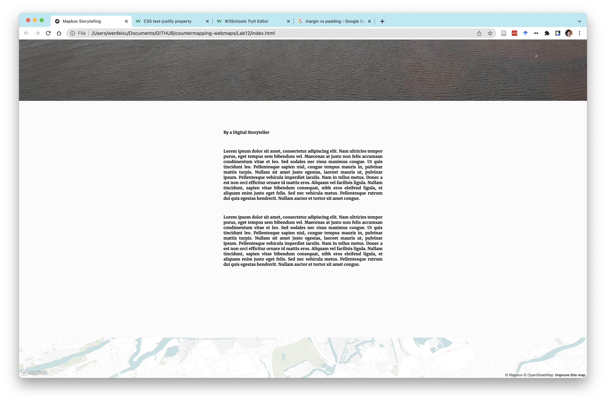

# Week 12 - Mapbox Storytelling tools 2

**Today we will cover**
- How to sandwich maps in between full page elements
- Videos

Today we are going to refine our storymap in Mapbox. We will dive into some HTML/CSS to modify the look and sequence of our Sandy narrative.


# 0. How does the storytelling tool work?

I'd like to unpack what's happening in all the new code that you've been introduced to. Let's start with the same `config.js` and `index.html` files from last time.

- Create a `Lab12` folder
- Create the following `config.js` and `index.html` files and put it into `Lab12`.
- Create an `images` folder in `Lab12`

```
Lab12
│   index.html
│   config.js
└───images

```

**`config.js`**:

```
var config = {
    style:  'mapbox://styles/iamwfx/cjjx6bl926vgt2ss0l9dbpmxz',
    accessToken: 'UPDATE-WITH-YOUR-TOKEN',
    showMarkers: true,
    markerColor: '#3FB1CE',
    //projection: 'equirectangular',
    //Read more about available projections here
    //https://docs.mapbox.com/mapbox-gl-js/example/projections/
    inset: true,
    theme: 'dark',
    use3dTerrain: false, //set true for enabling 3D maps.
    title: 'The Title Text of this Story',
    subtitle: 'A descriptive and interesting subtitle to draw in the reader',
    byline: 'By a Digital Storyteller',
    footer: 'Source: source citations, etc. <br> Created using <a href="https://github.com/mapbox/storytelling" target="_blank">Mapbox Storytelling</a> template.',
    chapters: [
        {
            id: 'first-chapter',
            alignment: 'left',
            hidden: false,
            title: 'Display Title',
            image: 'images/source.png',
            description: 'Lorem ipsum dolor sit amet, consectetur adipiscing elit, sed do eiusmod tempor incididunt ut labore et dolore magna aliqua. Ut enim ad minim veniam, quis nostrud exercitation ullamco laboris nisi ut aliquip ex ea commodo consequat. Duis aute irure dolor in reprehenderit in voluptate velit esse cillum dolore eu fugiat nulla pariatur. Excepteur sint occaecat cupidatat non proident, sunt in culpa qui officia deserunt mollit anim id est laborum.',
            location: {
                center: [-122.418398, 37.759483],
                zoom: 8.5,
                pitch: 60,
                bearing: 0
            },
            mapAnimation: 'flyTo',
            rotateAnimation: false,
            callback: '',
            onChapterEnter: [
                // {
                //     layer: 'layer-name',
                //     opacity: 1,
                //     duration: 5000
                // }
            ],
            onChapterExit: [
                // {
                //     layer: 'layer-name',
                //     opacity: 0
                // }
            ]
        },
        {
            id: 'second-chapter',
            alignment: 'right',
            hidden: false,
            title: 'Second Title',
            image: 'images/source.png',
            description: 'Copy these sections to add to your story.',
            location: {
                center: [-77.020636, 38.886900],
                zoom: 8.5,
                pitch: 60,
                bearing: -43.2,
                // flyTo additional controls-
                // These options control the flight curve, making it move
                // slowly and zoom out almost completely before starting
                // to pan.
                //speed: 2, // make the flying slow
                //curve: 1, // change the speed at which it zooms out
            },
            mapAnimation: 'flyTo',
            rotateAnimation: true,
            callback: '',
            onChapterEnter: [],
            onChapterExit: []
        },
        {
            id: 'third-chapter',
            alignment: 'left',
            hidden: false,
            title: 'Third Title',
            image: './path/to/image/source.png',
            description: 'Copy these sections to add to your story.',
            location: {
              center: [-73.97615, 40.71901],
              zoom: 15.84,
              pitch: 56,
              bearing: 260.44,
              speed: .5, // make the flying slow
              curve: 1, // change the speed at which it zooms out
            },
            mapAnimation: 'flyTo',
            rotateAnimation: false,
            callback: '',
            onChapterEnter: [
                {
                    layer: 'housing',
                    opacity: 0,
                    duration: 10
                }],
            onChapterExit: []
        }
    ]
};

```

**`index.html`**

```
<!DOCTYPE html>
<html>
<head>
    <meta charset='utf-8' />
    <title>Mapbox Storytelling</title>
    <meta name='viewport' content='initial-scale=1,maximum-scale=1,user-scalable=no' />
    <link rel="icon" type="image/x-icon" href="https://raw.githubusercontent.com/mapbox/assembly/publisher-staging/src/svgs/mapbox.svg">
    <script src='https://api.tiles.mapbox.com/mapbox-gl-js/v2.10.0/mapbox-gl.js'></script>
    <link href='https://api.tiles.mapbox.com/mapbox-gl-js/v2.10.0/mapbox-gl.css' rel='stylesheet' />
    <script src="https://unpkg.com/intersection-observer@0.12.0/intersection-observer.js"></script>
    <script src="https://unpkg.com/scrollama"></script>
    <style>
        body {
            margin:0;
            padding:0;
            font-family: sans-serif;
        }
        a, a:hover, a:visited {
            color: #0071bc;
        }
        #map {
            top:0;
            height: 100vh;
            width:100vw;
            position: fixed;
        }
        #mapInset {
            bottom:50px;
            right:30px;
            height: 180px;
            width:250px;
            max-width:100%;
            position: fixed;
            z-index: 1;
            opacity: 1;
            transition: opacity 0.5s ease-in-out;
            pointer-events: none;
        }
        #mapInset .mapboxgl-ctrl-bottom-left{
            display: none;
        }
        @media (max-width: 500px) {
            #mapInset {
                display: none;
            }
        }
        #header {
            margin: auto;
            width: 100%;
            position: relative;
            z-index: 5;
        }
        #header h1, #header h2, #header p {
            margin: 0;
            padding: 2vh 2vw;
            text-align: center;
        }
        #footer {
            width: 100%;
            min-height: 5vh;
            padding-top: 2vh;
            padding-bottom: 2vh;
            text-align: center;
            line-height: 25px;
            font-size: 13px;
            position: relative;
            z-index: 5;
        }
        #features {
            padding-top: 10vh;
            padding-bottom: 10vh;
        }
        .hidden {
            visibility: hidden;
        }
        .centered {
            width: 50vw;
            margin: 0 auto;
        }
        .lefty {
            width: 33vw;
            margin-left: 5vw;
        }
        .righty {
            width: 33vw;
            margin-left: 62vw;
        }
        .fully {
            width: 100%;
            margin: auto;
        }
        .light {
            color: #444;
            background-color: #fafafa;
        }
        .dark {
            color: #fafafa;
            background-color: #444;
        }
        .step {
            padding-bottom: 50vh;
            /* margin-bottom: 10vh; */
            opacity: 0.25;
        }
        .step.active {
            opacity: 0.9;
        }

        .step div {
            padding:  25px 50px;
            line-height: 25px;
            font-size: 13px;
        }

        .step img {
            width: 100%;
        }

        @media (max-width: 750px) {
            .centered, .lefty, .righty, .fully {
                width: 90vw;
                margin: 0 auto;
            }
        }

        /* Fix issue on mobile browser where scroll breaks  */
        .mapboxgl-canvas-container.mapboxgl-touch-zoom-rotate.mapboxgl-touch-drag-pan,
        .mapboxgl-canvas-container.mapboxgl-touch-zoom-rotate.mapboxgl-touch-drag-pan .mapboxgl-canvas {
            touch-action: unset;
        }

        </style>
</head>
<body>

<div id="map"></div>
<div id="mapInset"></div>
<div id="story"></div>

<script src="./config.js"></script>
<script>
var initLoad = true;
var layerTypes = {
    'fill': ['fill-opacity'],
    'line': ['line-opacity'],
    'circle': ['circle-opacity', 'circle-stroke-opacity'],
    'symbol': ['icon-opacity', 'text-opacity'],
    'raster': ['raster-opacity'],
    'fill-extrusion': ['fill-extrusion-opacity'],
    'heatmap': ['heatmap-opacity']
}

var alignments = {
    'left': 'lefty',
    'center': 'centered',
    'right': 'righty',
    'full': 'fully'
}

function getLayerPaintType(layer) {
    var layerType = map.getLayer(layer).type;
    return layerTypes[layerType];
}

function setLayerOpacity(layer) {
    var paintProps = getLayerPaintType(layer.layer);
    paintProps.forEach(function(prop) {
        var options = {};
        if (layer.duration) {
            var transitionProp = prop + "-transition";
            options = { "duration": layer.duration };
            map.setPaintProperty(layer.layer, transitionProp, options);
        }
        map.setPaintProperty(layer.layer, prop, layer.opacity, options);
    });
}

var story = document.getElementById('story');
var features = document.createElement('div');
features.setAttribute('id', 'features');

var header = document.createElement('div');

if (config.title) {
    var titleText = document.createElement('h1');
    titleText.innerText = config.title;
    header.appendChild(titleText);
}

if (config.subtitle) {
    var subtitleText = document.createElement('h2');
    subtitleText.innerText = config.subtitle;
    header.appendChild(subtitleText);
}

if (config.byline) {
    var bylineText = document.createElement('p');
    bylineText.innerText = config.byline;
    header.appendChild(bylineText);
}

if (header.innerText.length > 0) {
    header.classList.add(config.theme);
    header.setAttribute('id', 'header');
    story.appendChild(header);
}

config.chapters.forEach((record, idx) => {
    var container = document.createElement('div');
    var chapter = document.createElement('div');

    if (record.title) {
        var title = document.createElement('h3');
        title.innerText = record.title;
        chapter.appendChild(title);
    }

    if (record.image) {
        var image = new Image();
        image.src = record.image;
        chapter.appendChild(image);
    }

    if (record.description) {
        var story = document.createElement('p');
        story.innerHTML = record.description;
        chapter.appendChild(story);
    }

    container.setAttribute('id', record.id);
    container.classList.add('step');
    if (idx === 0) {
        container.classList.add('active');
    }

    chapter.classList.add(config.theme);
    container.appendChild(chapter);
    container.classList.add(alignments[record.alignment] || 'centered');
    if (record.hidden) {
        container.classList.add('hidden');
    }
    features.appendChild(container);
});

story.appendChild(features);

var footer = document.createElement('div');

if (config.footer) {
    var footerText = document.createElement('p');
    footerText.innerHTML = config.footer;
    footer.appendChild(footerText);
}

if (footer.innerText.length > 0) {
    footer.classList.add(config.theme);
    footer.setAttribute('id', 'footer');
    story.appendChild(footer);
}

mapboxgl.accessToken = config.accessToken;

const transformRequest = (url) => {
    const hasQuery = url.indexOf("?") !== -1;
    const suffix = hasQuery ? "&pluginName=scrollytellingV2" : "?pluginName=scrollytellingV2";
    return {
      url: url + suffix
    }
}

var map = new mapboxgl.Map({
    container: 'map',
    style: config.style,
    center: config.chapters[0].location.center,
    zoom: config.chapters[0].location.zoom,
    bearing: config.chapters[0].location.bearing,
    pitch: config.chapters[0].location.pitch,
    interactive: false,
    transformRequest: transformRequest,
    projection: config.projection
});

// Create a inset map if enabled in config.js
if (config.inset) {
 var insetMap = new mapboxgl.Map({
    container: 'mapInset', // container id
    style: 'mapbox://styles/mapbox/dark-v10', //hosted style id
    center: config.chapters[0].location.center,
    // Hardcode above center value if you want insetMap to be static.
    zoom: 3, // starting zoom
    hash: false,
    interactive: false,
    attributionControl: false,
    //Future: Once official mapbox-gl-js has globe view enabled,
    //insetmap can be a globe with the following parameter.
    //projection: 'globe'
  });
}

if (config.showMarkers) {
    var marker = new mapboxgl.Marker({ color: config.markerColor });
    marker.setLngLat(config.chapters[0].location.center).addTo(map);
}

// instantiate the scrollama
var scroller = scrollama();


map.on("load", function() {
    if (config.use3dTerrain) {
        map.addSource('mapbox-dem', {
            'type': 'raster-dem',
            'url': 'mapbox://mapbox.mapbox-terrain-dem-v1',
            'tileSize': 512,
            'maxzoom': 14
        });
        // add the DEM source as a terrain layer with exaggerated height
        map.setTerrain({ 'source': 'mapbox-dem', 'exaggeration': 1.5 });

        // add a sky layer that will show when the map is highly pitched
        map.addLayer({
            'id': 'sky',
            'type': 'sky',
            'paint': {
                'sky-type': 'atmosphere',
                'sky-atmosphere-sun': [0.0, 0.0],
                'sky-atmosphere-sun-intensity': 15
            }
        });
    };

    // As the map moves, grab and update bounds in inset map.
    if (config.inset) {
    map.on('move', getInsetBounds);
    }
    // setup the instance, pass callback functions
    scroller
    .setup({
        step: '.step',
        offset: 0.5,
        progress: true
    })
    .onStepEnter(async response => {
        var chapter = config.chapters.find(chap => chap.id === response.element.id);
        response.element.classList.add('active');
        map[chapter.mapAnimation || 'flyTo'](chapter.location);
        // Incase you do not want to have a dynamic inset map,
        // rather want to keep it a static view but still change the
        // bbox as main map move: comment out the below if section.
        if (config.inset) {
          if (chapter.location.zoom < 5) {
            insetMap.flyTo({center: chapter.location.center, zoom: 0});
          }
          else {
            insetMap.flyTo({center: chapter.location.center, zoom: 3});
          }
        }
        if (config.showMarkers) {
            marker.setLngLat(chapter.location.center);
        }
        if (chapter.onChapterEnter.length > 0) {
            chapter.onChapterEnter.forEach(setLayerOpacity);
        }
        if (chapter.callback) {
            window[chapter.callback]();
        }
        if (chapter.rotateAnimation) {
            map.once('moveend', () => {
                const rotateNumber = map.getBearing();
                map.rotateTo(rotateNumber + 180, {
                    duration: 30000, easing: function (t) {
                        return t;
                    }
                });
            });
        }
    })
    .onStepExit(response => {
        var chapter = config.chapters.find(chap => chap.id === response.element.id);
        response.element.classList.remove('active');
        if (chapter.onChapterExit.length > 0) {
            chapter.onChapterExit.forEach(setLayerOpacity);
        }
    });
});

//Helper functions for insetmap
function getInsetBounds() {
            let bounds = map.getBounds();

            let boundsJson = {
                "type": "FeatureCollection",
                "features": [{
                    "type": "Feature",
                    "properties": {},
                    "geometry": {
                        "type": "Polygon",
                        "coordinates": [
                            [
                                [
                                    bounds._sw.lng,
                                    bounds._sw.lat
                                ],
                                [
                                    bounds._ne.lng,
                                    bounds._sw.lat
                                ],
                                [
                                    bounds._ne.lng,
                                    bounds._ne.lat
                                ],
                                [
                                    bounds._sw.lng,
                                    bounds._ne.lat
                                ],
                                [
                                    bounds._sw.lng,
                                    bounds._sw.lat
                                ]
                            ]
                        ]
                    }
                }]
            }

            if (initLoad) {
                addInsetLayer(boundsJson);
                initLoad = false;
            } else {
                updateInsetLayer(boundsJson);
            }

        }

function addInsetLayer(bounds) {
    insetMap.addSource('boundsSource', {
        'type': 'geojson',
        'data': bounds
    });

    insetMap.addLayer({
        'id': 'boundsLayer',
        'type': 'fill',
        'source': 'boundsSource', // reference the data source
        'layout': {},
        'paint': {
            'fill-color': '#fff', // blue color fill
            'fill-opacity': 0.2
        }
    });
    // // Add a black outline around the polygon.
    insetMap.addLayer({
        'id': 'outlineLayer',
        'type': 'line',
        'source': 'boundsSource',
        'layout': {},
        'paint': {
            'line-color': '#000',
            'line-width': 1
        }
    });
}

function updateInsetLayer(bounds) {
    insetMap.getSource('boundsSource').setData(bounds);
}


// setup resize event
window.addEventListener('resize', scroller.resize);

</script>

</body>
</html>

```
Let's take a look at what's actually happening here.

First, you are mostly used to seeing the `style.css` file as a separate file, which is then referenced in the `index.html` (Recall the line `<link href='style.css' rel='stylesheet'/>` in previous html files you've been working with.) Here, instead of our stylesheet being referenced somewhere else, we are putting it into the HTML directly. The section in between the `<style></style>` tags is our CSS.
```HTML
<style>
        body {
            margin:0;
            padding:0;
            font-family: sans-serif;
        }
        a, a:hover, a:visited {
            color: #0071bc;
        }
        #map {
            top:0;
            height: 100vh;
            width:100vw;
            position: fixed;
        }

</style>
```

- Move all the CSS in between the style tags in a separate file and call it `style.css`
- In the `<head></head>` section of your `index.html`, add in a line `<link href='style.css' rel='stylesheet' />` that references this file.

Your folder structure should now look like this:

```
Lab12
│   index.html
│   config.js  
│   style.css
└───images
```

- Now, just as you moved your styles to a separate file, move the code in between  your two main `<script></script>` tags (see below) into a new file called `script.js`
```js
var initLoad = true;
var layerTypes = {
    'fill': ['fill-opacity'],
    'line': ['line-opacity'],
    'circle': ['circle-opacity', 'circle-stroke-opacity'],
    'symbol': ['icon-opacity', 'text-opacity'],
  }
    etc
```

Your folder should now look like this:

```
Lab12
│   index.html
│   config.js  
│   style.css
│   script.js
└───images

```

And your `index.html` file is should be very short! Now you should see that the `index.html` file is essentially
1. In the `<head></head>`: Pulling in a bunch of packages (like Mapbox, which is `https://api.tiles.mapbox.com/mapbox-gl-js/v2.10.0/mapbox-gl.js`) and styles and interaction code (your `style.css` and `script.js`)
2. In the `<body></body>`: adding three elements, which are here called `map`, a `mapInset`, and a `story`. On our website, they correspond, respectively, to the map, the map inset, and our set of text/media elements.

Now, let's unpack what the `script.js` is doing, broadly:

First, as you discovered last week, the storymap is basically a tool that allows you to show maps at different zooms and bearings and to make layers visible/invisible. The first section of the code is essentially building a function that you can use later on to make layers visible/invisible by changing the opacity.  

```js
var initLoad = true;
var layerTypes = {
    'fill': ['fill-opacity'],
    'line': ['line-opacity'],
    'circle': ['circle-opacity', 'circle-stroke-opacity'],
    'symbol': ['icon-opacity', 'text-opacity'],
    'raster': ['raster-opacity'],
    'fill-extrusion': ['fill-extrusion-opacity'],
    'heatmap': ['heatmap-opacity']
}

var alignments = {
    'left': 'lefty',
    'center': 'centered',
    'right': 'righty',
    'full': 'fully'
}

function getLayerPaintType(layer) {
    var layerType = map.getLayer(layer).type;
    return layerTypes[layerType];
}

function setLayerOpacity(layer) {
    var paintProps = getLayerPaintType(layer.layer);
    paintProps.forEach(function(prop) {
        var options = {};
        if (layer.duration) {
            var transitionProp = prop + "-transition";
            options = { "duration": layer.duration };
            map.setPaintProperty(layer.layer, transitionProp, options);
        }
        map.setPaintProperty(layer.layer, prop, layer.opacity, options);
    });
}
```

Notice that in the next few lines, we have:

```js
var story = document.getElementById('story');
var features = document.createElement('div');
features.setAttribute('id', 'features');
```
The first line grabs the element `<div id="story"></div>` by referencing it through the ID and puts it into a variable.

The second line creates a `<div></div>` and adds it to body of `index.html`. It is called `features` in the script.

The third line, gives `features` an id called `features`, which is the equivalent of saying "add `id='features'`" to my `<div></div>`, to create `<div id='features'></div>`

Now, notice that if you open up your `index.html` file in your browser and look at your inspector, you should see this in the **Elements** tab:

<p align='center'>

</p>

The next chunk of code is about your header, that section of the page currently containing the next "Coastal Flooding in New York City" etc.

```js
var header = document.createElement('div');

if (config.title) {
    var titleText = document.createElement('h1');
    titleText.innerText = config.title;
    header.appendChild(titleText);
}

if (config.subtitle) {
    var subtitleText = document.createElement('h2');
    subtitleText.innerText = config.subtitle;
    header.appendChild(subtitleText);
}

if (config.byline) {
    var bylineText = document.createElement('p');
    bylineText.innerText = config.byline;
    header.appendChild(bylineText);
}

if (header.innerText.length > 0) {
    header.classList.add(config.theme);
    header.setAttribute('id', 'header');
    story.appendChild(header);
}
```

The first three are all of the format:

- If you added a XX (title, subtitle, byline)
- Create an element (`h1`,`h2`,`p`)
- Add text to the newly created element
- Append the element to the header.

The last one says:
- If you have any header text after the three first three steps,
- Add a class to the header, based on what `config.theme` (this is whether the code block is either `dark` or `light`) is
- Add the header to the story

This code block creates a chapter:
```js
config.chapters.forEach((record, idx) => {
    var container = document.createElement('div');
    var chapter = document.createElement('div');

    if (record.title) {
        var title = document.createElement('h3');
        title.innerText = record.title;
        chapter.appendChild(title);
    }

    if (record.image) {
        var image = new Image();
        image.src = record.image;
        chapter.appendChild(image);
    }

    if (record.description) {
        var story = document.createElement('p');
        story.innerHTML = record.description;
        chapter.appendChild(story);
    }

    container.setAttribute('id', record.id);
    container.classList.add('step');
    if (idx === 0) {
        container.classList.add('active');
    }

    chapter.classList.add(config.theme);
    container.appendChild(chapter);
    container.classList.add(alignments[record.alignment] || 'centered');
    if (record.hidden) {
        container.classList.add('hidden');
    }
    features.appendChild(container);
});
```
It's basically adding the chapter title, image, description and setting the theme. It is also giving each chapter the `step` class and also sets the first chapter to be `active`.

I cannot figure out what `features` is doing. It looks like an empty `<div></div>` element. Which are adding to our story, with the next piece of code:

```js
story.appendChild(features);
```

This just adds the footer:
```js

var footer = document.createElement('div');

if (config.footer) {
    var footerText = document.createElement('p');
    footerText.innerHTML = config.footer;
    footer.appendChild(footerText);
}

if (footer.innerText.length > 0) {
    footer.classList.add(config.theme);
    footer.setAttribute('id', 'footer');
    story.appendChild(footer);
}
```

Parts of the next chunk should look familiar. We are just creating our map:

```js

mapboxgl.accessToken = config.accessToken;

const transformRequest = (url) => {
    const hasQuery = url.indexOf("?") !== -1;
    const suffix = hasQuery ? "&pluginName=scrollytellingV2" : "?pluginName=scrollytellingV2";
    return {
      url: url + suffix
    }
}

var map = new mapboxgl.Map({
    container: 'map',
    style: config.style,
    center: config.chapters[0].location.center,
    zoom: config.chapters[0].location.zoom,
    bearing: config.chapters[0].location.bearing,
    pitch: config.chapters[0].location.pitch,
    interactive: false,
    transformRequest: transformRequest,
    projection: config.projection
});

```
Here, `mapboxgl.accessToken` is being set to the `accessToken` in the `config` variable in `config.js`. Don't worry about `transformRequest` for now. And `var = map = new mapboxgl.Map({...})` should look familiar. We are just giving our map some initial styling, lat/lng, zoom, pitch, bearings, etc.

This creates the inset map:

```js
// Create a inset map if enabled in config.js
if (config.inset) {
 var insetMap = new mapboxgl.Map({
    container: 'mapInset', // container id
    style: 'mapbox://styles/mapbox/dark-v10', //hosted style id
    center: config.chapters[0].location.center,
    // Hardcode above center value if you want insetMap to be static.
    zoom: 3, // starting zoom
    hash: false,
    interactive: false,
    attributionControl: false,
    //Future: Once official mapbox-gl-js has globe view enabled,
    //insetmap can be a globe with the following parameter.
    //projection: 'globe'
  });
}
```

- Set `inset:false` in your `config.js`. What happens? We don't really need this inset since we're not flying across the world that much.

This code block turns on/off the markers showing where the center of the map is:

```js
if (config.showMarkers) {
    var marker = new mapboxgl.Marker({ color: config.markerColor });
    marker.setLngLat(config.chapters[0].location.center).addTo(map);
}
```

This creates the scrollama instance, which is the tool that is associating scrolling with changes on the website:

```js
// instantiate the scrollama
var scroller = scrollama();
```

Next is a section that looks kind of familiar! Let's parse what is happening inside the

```js

map.on("load", function() {
  //WHAT'S HAPPENING IN HERE??
})

```
First, we have. This is not super relevant. It has to do with whether we're using 3D terrain:

```js
if (config.use3dTerrain) {
    map.addSource('mapbox-dem', {
        'type': 'raster-dem',
        'url': 'mapbox://mapbox.mapbox-terrain-dem-v1',
        'tileSize': 512,
        'maxzoom': 14
    });
    // add the DEM source as a terrain layer with exaggerated height
    map.setTerrain({ 'source': 'mapbox-dem', 'exaggeration': 1.5 });

    // add a sky layer that will show when the map is highly pitched
    map.addLayer({
        'id': 'sky',
        'type': 'sky',
        'paint': {
            'sky-type': 'atmosphere',
            'sky-atmosphere-sun': [0.0, 0.0],
            'sky-atmosphere-sun-intensity': 15
        }
    });
};
```

Next, this is just updating the inset map based on where the main map is:

```js
// As the map moves, grab and update bounds in inset map.
if (config.inset) {
map.on('move', getInsetBounds);
}
```

This is the where most of the action is happening (I'll comment in code):
```js
// setup the instance, pass callback functions
scroller
.setup({
    step: '.step',
    offset: 0.5,
    progress: true
})
.onStepEnter(async response => {
    // Once we've entered a new "step", which is just
    // each of our chapters, we are going to create a text/media block on our map based on the information for that chapter we've provided in the config.js
    var chapter = config.chapters.find(chap => chap.id === response.element.id);
    // We are going to set that chapter as "active"
    response.element.classList.add('active');
    // Fly to the location provided by us in the chaper definitions,
    map[chapter.mapAnimation || 'flyTo'](chapter.location);
    // Incase you do not want to have a dynamic inset map,
    // rather want to keep it a static view but still change the
    // bbox as main map move: comment out the below if section.

    // These are certain design elements that will get activated if we've
    // included these in our chapter
    if (config.inset) {
      if (chapter.location.zoom < 5) {
        insetMap.flyTo({center: chapter.location.center, zoom: 0});
      }
      else {
        insetMap.flyTo({center: chapter.location.center, zoom: 3});
      }
    }
    if (config.showMarkers) {
        marker.setLngLat(chapter.location.center);
    }
    if (chapter.onChapterEnter.length > 0) {
        chapter.onChapterEnter.forEach(setLayerOpacity);
    }
    if (chapter.callback) {
        window[chapter.callback]();
    }
    if (chapter.rotateAnimation) {
        map.once('moveend', () => {
            const rotateNumber = map.getBearing();
            map.rotateTo(rotateNumber + 180, {
                duration: 30000, easing: function (t) {
                    return t;
                }
            });
        });
    }
})
.onStepExit(response => {
  //This next section just tells the page what to do when we've scrolled
  //past the chapter and "exited".
    var chapter = config.chapters.find(chap => chap.id === response.element.id);
    response.element.classList.remove('active');
    if (chapter.onChapterExit.length > 0) {
        chapter.onChapterExit.forEach(setLayerOpacity);
    }
});
```

The rest of the `script.js` are just helper functions, which I won't get into now.


# 1. Add more elements to our storymap

Let's say I want my website to have a landing page that is not a map, but I do want my scroll to reveal the map. I want the following to be a full screen image on my landing page, followed by some introductory text:
<p align='center'>

</p>

## 1.1 Adding the map
- First, download this image and put it in your `images` folder.

Now your folder structure should look like this:
```
Lab12
│   index.html
│   config.js  
│   style.css
│   script.js
└───images
│   │   sandy1.png
```

- Then go to your `style.css`. The following section is determining your layout for the header:
```css
#header {
    margin: auto;
    width: 100%;  
    position: relative;
    z-index: 5;
}
```
- To add a background image and style so that it span the full page and doesn't tile, we want to update our header to the following:

```css
#header {
  margin: auto;
  width: 100%;
  position: relative;
  z-index: 5;
  background-image: url("images/sandy1.png");
  background-position: top;
  background-repeat: no-repeat;
  background-size: cover;
}

```

Your page should now look like this:
<p align='center'>

</p>

Great, we have our image, but it's not full screen yet. This is because our header's height is sized to be as tall as whatever it contains (those three `h1`, `h2`, and `p`). To do this, we'll have to manually specify the height.

- We'll need to add `height: 100vh` to our header CSS. `vh` is a CSS unit of measurement that means "relative to 1% of the height of the viewport". Since we want our image to be 100%, we use 100vh.

Now you should get this:
<p align='center'>

</p>

Great! Almost there. Now I just want to change my header text so it looks more like a landing page. This pretty easy, since it will just involve some more CSS changes.

- First, I'm going to use a `light` instead of dark theme for this website. Go ahead and change this `theme` to `light` in your config.js code.
- Next, I want to change the `h1` within the header so its text is bigger and a different color. Create a new `#header h1{}` element in your `style.css` file. You can put it **after**
  ```CSS
  #header h1, #header h2, #header p {
      margin: 0;
      padding: 2vh 2vw;
      text-align: center;
  }
  ```
- Inside your new `#header h1{}`,
  - let's define our `font-size` as `7vh` and
  - let's change the font color, which is just called `color` to be `white`
  - and add more space above the text with `padding-top:30vh;`

Now you should get this:
<p align='center'>

</p>

- Now, change the `h2` and `p` elements so you get something like this in the end:

<p align='center'>

</p>

- Lastly, let's pick a new font! Go to https://fonts.google.com/ and select a font you like. I chose **Merriweather Bold 700**. Notice that when you click on a font, Google gives you the html links and CSS to use this font.

<p align='center'>

</p>

- Copy/paste the link text into your header.
- Copy/paste your css into the `body` of your `style.css`. You'll need to replace `font-family: sans-serif;` with your new font css.

I got this (but your fonts might be different):
<p align='center'>

</p>

(Yes, I forgot to include the image credits. They are from the U.S. Coast Guard via Getty Images in [this article](https://www.theatlantic.com/photo/2012/11/hurricane-sandy-the-aftermath/100397/).)
## 1.2 Adding a full width text block

I want to try two ways of interspersing our website with full-width text blocks. The first will be adding a text block right below the image. The second will be to introduce it between two map scrolls.

### 1.2.1 Adding text after the landing page image

- First, we'll need to fix the size of our background image. Replace `background-size: cover;` with `background-size: 100vw 100vh;`. This means our image is going to be 100% of the viewport in width, and 100% in height.
Remember how we made the `#header` to have a height of `100vh`?
- Now, try changing the height of the header height to be `170vh`. In other words, we want the header height to be 170% of the viewport. That means, we should get an extra 70% piece of header space after our image.
- I want to move my `byline` and more text (to be added in a second) to this white space. In order to do so (this is kind of a hacky way to do this), I'll add roughyl enough padding to the bottom of my `h2` piece (the "Assessing Risks to Vulnerable Housing" text) to "push" my byline into the white space. Add `padding-bottom:60vh;` to your `#header h2{}` css.
- Also, change the color of your `#header p{}` to be `black` from `white`.

You should get something like this:
<p align='center'>

</p>

Now, imagine that I want to introduce some background and context to my project before I show you the maps. (All that text you all wrote in your proposals will come in handy about here!)

- Let's add two paragraphs of text in this white space. For now, I'm going to put in some filler text. Go to the [Lorem Ipsum](https://www.lipsum.com/) generator and generate two paragraphs.
- Next, in our `config.js`, we are going to create two new key-value pairs. After `byline: 'By a Digital Storyteller',` and before your `footer`, add in (and don't forget commas in between)
  - `para1:YOUR FIRST LOREM IPSUM PARAGRAPH`
  - `para2:YOUR SECOND LOREM IPSUM PARAGRAPH`

We're not quite done yet. Our `script.js` isn't expecting anything called `para1` and `para2`. We'll need to add some code, so our script knows that if we have these paragraphs, to add it to our header text.

- After
```js
if (config.byline) {
    var bylineText = document.createElement('p');
    bylineText.innerText = config.byline;
    header.appendChild(bylineText);
}
```
- you'll want to add to add another paragraph if `para1` exists, get the text, and append it to the header.
```js
if (config.para1) {
    var bylineText = document.createElement('p');
    bylineText.innerText = config.para1;
    header.appendChild(bylineText);
}
```
- do the same for `para2`

You should something like this:
<p align='center'>

</p>

Finally, I want to make the margins on either side of this text much narrower and I want to justify the text so it's blocky instead of centered. This is pretty each as well!

- Update `#header p` to the following. This just means that I want the left and right
```css
#header p{
    font-size: 1.2vh;
    text-align: justify;
    margin-left: 34vw;
    margin-right: 34vw;
    color: black;
}
```
Now your page should look like this:

<p align='center'>

</p>

(I don't love this font, and you can change it just for the `p` elements if you want!)

Sometimes we have used `margin` vs `padding`. One is inside the border of an element, and the other is outside, like the image shown below. It matters a little which one we use here, but not enough to go into detail for now.

<p align='center'>

</p>

### 1.2.2 Add another full width text/media section in between two chapters

Now, let's add another piece of text and media in between two map chapters.
- In between your `second-chapter` and `third-chapter`, add new section called `interlude`
```css
{
    id: 'interlude',
    alignment: 'center',
    hidden: false,
    description: 'Lorem ipsum dolor sit amet, consectetur adipiscing elit. Nam ultricies tempor purus, eget tempus sem bibendum vel. Maecenas at justo non felis accumsan condimentum vitae et leo. Sed sodales nec risus maximus congue. Ut quis tincidunt leo. Pellentesque sapien nisl, congue tempus mauris in, pulvinar mattis turpis. Nullam sit amet justo egestas, laoreet mauris ut, pulvinar ipsum. Pellentesque vehicula imperdiet iaculis. Nam in tellus metus. Donec a est non orci efficitur ornare id mattis eros. Aliquam vel facilisis ligula. Nullam tincidunt, sapien vitae bibendum consequat, nibh eros eleifend ligula, et aliquam enim justo eget felis. Sed nec vehicula metus. Pellentesque rutrum dui quis egestas hendrerit. Nullam auctor et tortor sit amet congue.',
    location: {
      center: [-73.97615, 40.71901],
      zoom: 14.84,
      pitch: 48,
      bearing: 142.44,
    },
},
```
Notice that I got rid of a lot of the key-value pairs and kept **the same location information** as the previous chapter. This will ensure that you map doesn't move when you scroll-enter into this section.

How, without any additonal CSS, this section should just look like the below:

<p align='center'>

</p>

- In your `style.css`, add the following to set the width to 100% of the viewport:
```css
#interlude {
    width: 100vw;
}
```
- Now let's say we want the text to have the same characteristics as the intro text. Then we can include another style chunk in our CSS to have:
```css
#interlude p{
    font-size: 1.2vh;
    text-align: justify;
    margin-left: 34vw;
    margin-right: 34vw;
    background-color: : white;
}
```
Now my section looks like this:

<p align='center'>

</p>

## 1.3. Embedding a video
Let's say you have an `.mp4` that you want to include in here as well.
- Download this video from the `Images` folder:

<video width="100%" controls>
  <source src="Images/902-1_902-2364-PD2_preview.mp4" type="video/mp4">
</video>

 and put it into your `images` folder.

- In your `config.js`, add the following key-value pair after your `description` key-value pair:
  - `video: 'images/902-1_902-2364-PD2_preview.mp4',`
- In your `script.js`, we have to tell our script what to do when encountering this video, which this code will do. Add this after your `if (record.description) {...})`
```js
if (record.video) {
    var videoDiv = document.createElement('div');
    videoDiv.setAttribute('class', 'videoContainer');
    video =  document.createElement('video');
    video.controls=true;
    video.autoplay=true;
    video.loop=true;
    video.src = record.video;
    videoDiv.appendChild(video)
    chapter.appendChild(videoDiv);
}
```
- Lastly, we just need to size the video appropriately in the `style.css` (I eyeballed a width that was roughly the width of the text, and used the `margin-left` and `transform` characteristics to center it. I'm not sure this is the best way, but it works!)
```css
video {
    margin-left: 45vw;
    width:32%;
    transform: translate(-50%);
}
```

You text and video middle section should look like this:

<p align='center'>

</p>

# 2. In-Class Exercise
Your inclass exercise is just to finish the above, which is to:
- Add and style and landing page with a background image
- Add text below that land page
- Add a middle section that has more text and a video.
