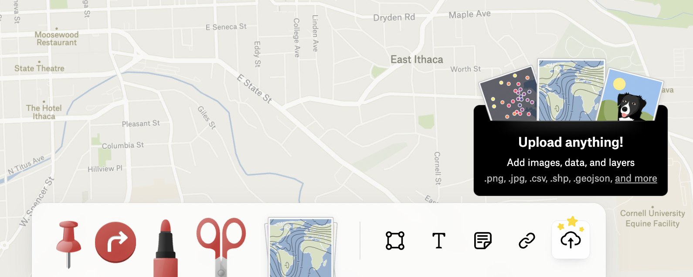

# Week 1 - Mapping with Felt

**Today we will cover**

In today's lab we will explore spatial data and map design without worrying too much about the technical GIS part. We will cover: 

- Map spatial and style data
- Adding media
- Annotation 
 
This week, I'll be sparser with the instructions since I think most of the functionalities should be fairly intuitive.

# 1. Lab Tutorial
In this first exercise, you will make a map of Ithaca through one dataset. 

## 1.1 - Felt Sign-Up and Overview
1. First, you'll need to sign up for a free Felt account [here](https://felt.com/signup).
2. Add the email address you used to sign up [here](https://docs.google.com/spreadsheets/d/1oG5OafHRC_dym4a5-WfgStWnkQQC8mLASSXxN_v4xOY/edit?usp=sharing) so I can add you as a contributor to our first collaborative map.

Once you've done these , watch [this short video](https://www.youtube.com/watch?v=kodNAqe8g3U) to get a sense of how to use Felt (it's very easy).

## 1.2 - Get your data 
Go to the [City of Ithaca's open data portal](https://data-ithacany.opendata.arcgis.com/pages/community-data). Go ahead and download any dataset in the **GeoJSON** format onto your computer. 

## 1.2 - Add your data
In your Felt account, select **New Map** to create a new map. 

Using the **Upload Anything!** tool in the menu bar, upload your `YOURFILENAME.geojson` as a **Data Layer** on to the map. 

## 1.3 - Style your data
After everyone has uploaded their `YOURFILENAME.geojson`, explore your data through styling based on numerical and categorical values. 

On the right-hand side, you can **Style Layer** by clicking on the pencile button. 

Click on that and explore styling your data by numerical (numbers) or categorical (categories/labels) values. For instance, here, I've styled my zoning data by the zoning code. 

(I forgot to add that I changed my basemap! You can do that by clicking the map on the lower right hand.)

**Play around with styling different categories and with learning more about each of the data columns. 

### 1.3.1 Optional: Advanced Styling using 
Felt has a [style language](https://feltmaps.notion.site/Felt-Style-Language-0f4de46f0cf2450ea2a19853741097d6#09076b738fe74e6494a481905df13103) that allows users more control over how we style maps. This "language" uses the `JSON` notation (it is stands for JavaScript Object Notation) that uses a **dictionary** of key-value pairs to store information. For instance, the following is a `JSON`: ``{"name":"John", "age":30, "car":null}``. Here, `name`, `age`,`car` are the **keys**, and the information that follows each of the `:` are the **values**. We know it's a dictionary by the `{` and `}` that begin and end the code. 

If you're familiar with JSON format, you can also play around with styling here. 

# 2. In-Class Exercise
For this exercise, you will tell a story through something new Ithaca you learned through the data. For instance, through looking at the zoning data, I discovered that there is a region of `MH-1`, mobile homes, in the middle of their commercial and industrial district. Some questions that might come to mind: Why is the placement of this district here? What are the types of amenities and disamenities that are around this area? 

For this exercise, tell the story of an interesting discovery or finding through your exploration of your dataset. Present this as a map in Felt including the following: 
- Images 
- Links to relevant background or context-providing sources such as journal and news articles. 
- 2-3 Sentences of introductory text. 
- Other drawn annotations as relevant.

Your map should address the following questions: 
- What new discovery did you find through the data? 
- Why do you think this phenomenon exists? 
- Do you think this phenomenon improves the quality of life in the city overall? Why or why not? 