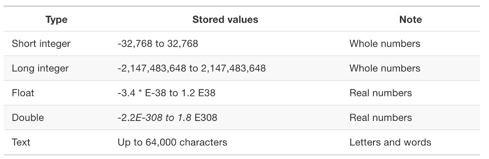

# Week 3 - Data Types, Census Data, and Attribute Joins
**Today we will cover**

- Different types and formats for spatial data
- Census survey and statistical boundaries
- Getting Census data
- Out-of-the-box base maps
- Filtering data
- Attribute joins
- Creating a choropleth

# 1. Lab Tutorial

## 1.1 Different types and formats for spatial data

#### Spatial Data Basics
There are two categories of spatial data: **vector** and **raster**. The image below gives you a sense of what the difference is: Raster data is generally in the form a picture of image, with each pixel representing a point in space and a value (for ex: the number of people in that pixel) or a type (for ex: river vs land). Vector ‘data’ is composed of a series of points and lines that connect them. We’ll be working with only vector data in this course and most spatial data is vector data.

 
Conceptual diagram of Vector and Raster data (From https://mgimond.github.io/Spatial/introGIS.html)

#### Components of Spatial data: the Geometry (Vector)
There are three different types of vector data: points, polylines, and polygons. These are pretty much what they sound like: Points at lat/long coordinate pairs. Polylines are composed of a sequence of points that make a line, and polygons are a sequence of points that make a closed shape that has area.

#### Components of Spatial data: the Attribute Table
Typically, each point, polyline, or polygon is associated with typically one attribute. Remember the evictions data we’ve been working with? We can consider at the attributes in that dataset. Each row in the table is associated with and represents a point in space where the eviction took place.

When we link the attribute tables (such as the evictions table before we created points data) with the actual geometries, then we can create our spatial dataset. Generally, there is a unique ID that links the rows of our attribute tables to their respective geometry.

#### Data Types
There are different types of values (numeric, text, for instance) that can be stored in a table. It’s often necessary to specify the type of data you have in each column. This table below shows the different data types.

 
Different data types (From https://mgimond.github.io/Spatial/feature-representation.html#measurement-levels)

#### Spatial Data File Formats
There are several different kinds of spatial data file formats, each with their strengths and weaknesses.

Here are the commonly used ones (from https://www.gislounge.com/how-to-tell-gis-file-formats:

  - **Shapefile**: This is the file format we used last week. It consists of a bundle of files that work together.
  - **Geodatabase**: Esri’s geodatabase file format is noted by files with a .gdb extension.  This is the recommended native file format by Esri for data storage for ArcGIS (which we won't be using in this course).
  -	**KML/KMZ**: KML stands for Keyhole Markup Language.  Originally developed by Keyhole and then acquired by Google, KML files are now an Open Geospatial Consortium standard. KML was originally used for viewing geographic data in Google Earth but since its adoption by the OGC, has become more widespread as a GIS data exchange format.  KMZ files are zipped files containing a main KML file and associated support files.
  - **OpenStreetMap**:OpenStreetMap, a crowdsourcing GIS data project, denotes .osm for its XML based file formats.  Files with the extension .osm.pbf denote OSM’s Protocolbuffer Binary Format (PBF), a more efficient, smaller file format intended to replace the XML format files.
  - **GeoJSON**: Another common spatial data format is the GeoJSON. This is one file that has both the attribute and geometry information in one file and uses a more common information/file format (the JSON file). A JSON file is most succinctly described as a ‘dictionary’ that is composed of a set of “key-value” pairs. A GeoJSON is composed of three key-value pairs: the ‘type’, the ‘geometry’, and the ‘properties’.

A typical GeoJSON file looks like this:

    

## 1.2 Census survey and statistical boundaries

#### Census Surveys
The United States Census Bureau has been collecting information on its residents in the country since 1780 through surveys sent by mail (since 2020, you can submit your survey by phone, mail, or online). Census data is used for a variety of governmental purposes including: provision of housing, infrastructure, and public amenities; making districting decisions for schools, precints, and elections; and more generally, to understand the population, socio-economic, and demographic characteristics of residents in the country. [Did you know that the punch card machine (a prototype for the computer) was created for the 1890 Census?](https://en.wikipedia.org/wiki/Tabulating_machine)

The US Census has historically been taken every 10 years. Every household in the U.S. is sent a Census survey (and you are legally required to respond.) In 2005, the Census Bureau created the American Community Survey (ACS), which is collected every month on a sample of households.

Since 2020, the Census only contains 10 questions (historically called the "short form census") such as age, sex, race, Hispanic origin, and owner/renter status. The ACS contains a larger set of questions such as employment, education, transportation.

Because the ACS is more frequent, it is often used for more current census needs; however, because it is also a sample, we generally need a longer time span to get a robust sample. This is why we will often use the **5-yr ACS** (for ex: 2012 - 2016 ACS) to represent the year (here, 2014).

Census data is often the baseline survey dataset in the area of urban planning because it provides racial, socio-economic, housing, etc. information that is often the highlight or backdrop of a study.

#### Census Geographies
There are different, often nested Census geographic regions used for  different administrative scales. The most commonly used regions are statistical areas, typically nested within each other, whose boundaries are defined by certain physical, administrative, and population constraints. For instance, a **Census block** is bounded by physical features such as streets and administrative boundaries such as city limits and school districts. **Block groups**, the smallest unit of analysis that is still mostly statistically robust, are collections of Census blocks (hence the name) that generally have between 800 to 5000 people. **Census tracts** generally have between 1000 and 8000 people. [Here's more information](https://pitt.libguides.com/uscensus/understandinggeography) about Census geographies if you're curious.

See the image below for how these regions nest within one another.

    

#### [Social Explorer](https://www-socialexplorer-com.proxy.library.cornell.edu/ezproxy)
This is a great tool for looking at Census and ACS data visually. They also have datasets beyond just Census Bureau data. You can also output images and shareable links to the map. I encourage you to sign up (through Cornell it's free) and explore this tool on your own time.

## 1.3 Getting Census survey data
So how we do query and use Census data for our projects?

In this class, we will mostly be using Census data provided by [IPUMS](https://www.ipums.org/), mostly because they are the easiest source of Census to work with.

You will see that IPUMS provides data from various sources, including the Census Bureau, the Bureau of Labor Statistics, the National Science Foundation, the National Center for Health Statistics, the Centers for Disease Control, and the National Aeronautics and Space Administration. According to IPUMS, there is also census or survey data available for over 100 countries. For US data, there is Census data going back to 1790.

For our lab, we are using Census data from IPUM's [National Historical Geographic Information System](https://www.nhgis.org/) (NHGIS).

First you'll need to register an account here:
https://uma.pop.umn.edu/nhgis/user/new

IPUMS will also send you an email verification.

From the [NHGIS website](https://www.nhgis.org/), click on **Get Data**. This should take you to a page like this:

   

We are going to use the **2016 - 2020** 5-year ACS at the **block group level** in New York City to understand the **rents as a percentage of income** (Remember: we use the 5-year to represent the middle year.)

There are two main sections on the page:
- **APPLY FILTERS** allows you to choose which datasets and what levels of granularity. (The default year of 2019, but we can change this.)
- **SELECT DATA** lets you choose specific tables and columns in your dataset once you've chosen your dataset.

Now, let's make the following selections:
1. In geographic levels, select `BLOCK GROUP` amongst the different levels.
2. In years, select `2016-2020`.
3. In topics, select **HOUSING** on the left hand panel, and select `Rent and Renter Costs`.
4. Hit **SUBMIT**.

Now, we can see that our **SELECT DATA** table has been populated with the relevant scale, topics, and years. A good first step is to sort by Popularity. You should see something like this.

  

Next to the table name `Median Gross Rent as a Percentage of Household Income in the Past 12 Months`, select the **plus**.

After selecting our data, we need to select our Census block group geometries that go along with it.

Under **SELECT DATA**, go to the third tab that says we have 54 potential GIS files. Here, we'll want to find New York state and select that as our extent. We can download the whole country, but that will be a huge file.

Your data cart in the upper right should show:
- `1 SOURCE TABLE`
- `0 TIMES SERIES TABLES`
- `1 GIS FILE`

Confirm this is what you have, then click **Continue**. You'll be taken to a Data Option page, click the **Continue** button again. In the next page, click on the green **Geographic Extents** button and select `New York`.

  

In the description box, you can write anything. I recommend including a text that has the tables you selected, ACS vintage, and scale. (For ex: `median gross rent as % of income, 2016-2020 ACS block group`) Then hit **Submit**. (If you haven't logged in already, you might have to do that first.)

You'll be taken to your Extracts History. It might take a minute, but soon the **Download Data** column should be populated with two buttons that allow you download the tables and GIS files.

  

Save these two zips to your folder for this class and unzip them. You'll have to unzip the shape folder twice.

## 1.4 Out-of-the-box base maps
Ok, now we can finally take a look at our data in QGIS. Open up QGIS and bring in our two datasets (the CSV and the block group shapefile). You be asked to choose the projection for the block group data. Choose the default option.

  

We are now going to add some out-of-the-box basemaps to our map. In your menu bar go to **Web -> QuickMapServices -> Settings**. In the **More Services** tab click the **Get Contributed Pack** button and click **Save** in the lower-right corner of the pop-up.

Go to **Web -> QuickMapServices** again and now see that you have a decent selection of maps. Select one of these as your base map (I will select `CartoDB/Dark Matter`). Make sure it's on the bottom in your Layers section.

Change the projection to `3857` (Pseudo-Mercator).

## 1.5 Filtering data
Alright, we can start to work on our map. Woohoo! First, we only need the block groups for NYC. There is a way to filter the block groups we don't need by excluding the counties not in NYC.

Open up the attribute table of your **NY_blck_grp_2020** layer. You can see there are counties starting from `001` and going all the way to `123`. The NYC counties are:
- The Bronx is Bronx County (`005`)
- Brooklyn is Kings County (`047`)
- Manhattan is New York County (`061`)
- Queens is Queens County (`081`)
- Staten Island is Richmond County (`085`)

Now close out of the attribute table, right click on your **NY_blck_grp_2020** layer again and select **Filter..**.

Now we'll write a short expression that filters for these counties. In the **Provider Specific Filter Expression** use this: `"COUNTYFP" = '005' OR "COUNTYFP" = '047'  OR  "COUNTYFP" = '061' OR  "COUNTYFP" = '081'OR  "COUNTYFP"  '085'`.

Zoom to your layer. You should see something like this:

Great!

## 1.6 Attribute joins: Joining data and boundaries by a common ID
Open up the attribute table of your data. There is a lot of geographical data here, but the one we really care about is the columns `AMV6E001`. What is that, you say?

In your data folder (`nhgisXX_csv`), you should actually have two files:
- `nhgisXX_ds249_20205_blck_grp.csv`
- `nhgisXX_ds249_20205_blck_grp_codebook.txt`

The codebook is the **metadata**. Scroll through. At some point we should see this:

This tells us that `AMV6E001` corresponds to the **estimate** for the median gross rent percentage, while `AMV6M001` is the **margin of error**. The estimate is the column we want, the margin of error is the extent to which that estimate might be wrong. We are only going to work with the estimates for now, but keep the margin of error columns in mind for later!

Now, finally, we're going to join our Census data to our block groups. Right click on your block group layer and select **Properties**.

Click on the funnel-like icon on the left-hand side and then the small plus sign. This window should pop up. It detects what you might want to join automatically, in this case. The `GISJOIN` column in both layers is the IPUMS-specific unique ID for each unit of analysis here.

We don't actually need all the fields in our data table, just the `AMV6E001` and our ID `GISJOIN` to check if the join was performed correctly. Check **Joined Fields** and select these two columns.

Also, select **Custom field name prefix** and use a prefix like `Census_` because it's less clunky. Click **Ok**.

If we open up the attribute table of the block group layer again, we should see the new field we just added. Because the values of this field are strings - that is, they are being read as text rather than numbers - we will create a new field that is basically a copy of `AMV6E001` but numbers.

Select the small abacus that will **Open Field Calculator**.
We want to:
- Create a new field that has as a field type `Decimal number (real)`
- Call this field `rent_inc_p` (p for percentage). You'll have to change the output field length (the number of characters) of your field to 11 first to accommodate the longer field name. And in the expression, select your field from **Fields and Values**. And then click **Ok**.

Finally!, right click on your block group layer and de-select **Toggle Editing** and select **Yes** when you are asked to save.

## 1.7 Creating a choropleth
Right click on the block group layer and click the paintbrush and select **Graduated** as the symbology method.

Under **Value**, we can now select our new column `rent_inc_p` and create a choropleth map.

A choropleth is a map that uses differences in shading, coloring, or the placing of symbols within predefined areas to indicate the average values of a property or quantity in those areas. Choropleth maps will generally use a sequential [color scheme or a divergent color scheme](https://colorbrewer2.org/learnmore/schemes_full.html) to show difference.

A sequential color scheme allows you to compare relative levels of a value.

Select a **Color ramp** from the drop-down menu. QGIS will create a number of breaks to bin or group your data based on the **Mode** that you select. I am going to use `Equal Count (Quantile)`, which gives me the same number of values sorted into each bin. I will also select 5 **Classes** on the lower right. Then click **Classify**.

You should see something like this (I added the borough labels):

I don't love this color scheme since I think the colors are too similar to one another. Perhaps you can create a better one.

### Final output # 1 for lab: 
Map, legend, scale bar, and title.

## 1.8 OPTIONAL: Turn you map into a web map (No need to submit this part)
You can work on the in-class exercise now. However, if you're interested, here's a quick tutorial on how to turn this map into a very basic web map.

Under in your menu bar, select **Web -> qgis2web -> Create web map**.

In the **Layers and Groups** tab, you can select to the left of the layers that you want to be visible on your map. I would keep all three (Borough boundaries, NY Block Group, Basemap).

Now, next to each layer you can select which information you want to pop up when you hover over the geometry.

Do you really need boroughs as a pop-up? Probably not, since we have these borough labels already. **Uncheck pop-ups** for the boroughs layer.

In the **Appearance** tab, check **Address Search**. (Why not?) And in **Add Layers List** select **Expanded**, which will allow you to check and uncheck the three layers we have in our map.

Lastly, at the bottom of the tab, select the radio button **Leaflet** instead of the default.

Under the **Export** tab, select the **three dots button** next to the Export to Folder selection and select this week's folder.

Finally, click **Export**. When your map is done exporting, your Progress window should look like this:

Your files should have been exported to a folder called something like `qgis2web_YYYY_MM_DD-HH_MM_SS_MMMMM`.

Double-click the `index.html` file to open it up in your browser.

Hooray! It looks a little *rough* (read: not something we would accept as a final map in this course) but the basic functionality along with a legend and a pop-up are there. In future weeks, we'll learn how to build this more carefully from the ground up.

# 2. In-class Exercise
**Final output #2 for lab**: Building off of the eviction data from last week, create a visual comparison between the `Eviction` (and not `Legal Possession`) in the `Eviction/Legal Possession` category and a Census category. Some potential ideas: race/ethnicity, median rent, indicators of housing quality, and changes to these categories.

This can be two layers overlaid, two side by side, or any arrangement you think articulates a clear visual comparison.

Write a short blurb on why you chose this comparison and what conclusions you may draw from this. What are next steps to consider if you were work to continue working with this evictions dataset? 

In your map, include a line of text on where you data came from and make sure to include a legend if it makes sense.
