# Week 5 - Geocoding and Georeferencing
**Today we will cover**
- Geocoding with OpenStreetMaps's geocoding API
- Georeferencing digital images

# 1. APIs and Geocoding
Geocoding is the process of transforming some spatial description of a place into geographical coordinates. We have already done the simpler kind of geocoding, which is taking a table that already has geographic coordinates in the form of lat/long columns and turning those into points. This is fairly straightforward.

Today, we're going to geocode **addresses** though we'll circumvent standard geocoding methods. If you've taken an Intro to GIS course, you may have learned that you need some kind of address locator and reference street dataset that needs to be properly styled and formatted so that your geocoder can properly interpolate between street numbers and find the location of an address.

We are going to learn a different method that takes advantage of OpenStreetMap's geocoding API, called [Nominatim](https://wiki.openstreetmap.org/wiki/Nominatim). This is a geocoder that takes the OSM data, which contains roads, buildings, neighborhoods, cities (essentially all the information - and more - that you see on the OSM basemap in QuickMapServices), and tries to locate addresses based on the information they already have through this data. 

## 1.1 What is an API? 
API stands for Application Programming Interface and essentially is a tool that, in this case, OSM created to allow us to communicate and use its "servers" (computers) in a regulated manner. There are different kinds of APIs, though most APIs that you will use are called REST APIs, which is when we (the "client") send data to the OSM (the "server") so that its geocoding API reads the data and returns the outputs we asked for - the lat/long in this case.

This won't be as complicated as it sounds. 

Some things to note: Because we are using an API and because it is regulated by the server, there are typically some limitations. Usually, for APIs offered by private organizations, you have to pay for the service after you've maxed out on your quota. For the OSM geocoding API, which is free, we have other types of limitations: 

- There's a limitation of one request per second
- If there are typos in the addresses it might not get picked up (unlike in the Google geocoding API, which might still be understand yours and, very often, my typos)

*Note: Google Maps' API is probably the most widely used geocoding API. And it's accuracy is better if you have fuzzy names for places or addresses. Given time constraints, we won't be learning how to use that in this class.*

## 1.2 Geocoding real estate listings
In this week's lab folder, there are two CSVs that you should download. These are `n=10` and `n=200` samples of just listings in NY state:

- `real-estate-ny-10sample.csv`
- `real-estate-ny-200sample.csv`

We are going to use the `n=10` sample to start. The original 923k sample is [here](https://www.dropbox.com/s/6uxgjney859894w/realtor-data.csv?dl=0) and 120MBs, FYI.

In QGIS, bring the `real-estate-ny-10sample.csv` into the layers pane and take a look at the attribute table. It should look like this:

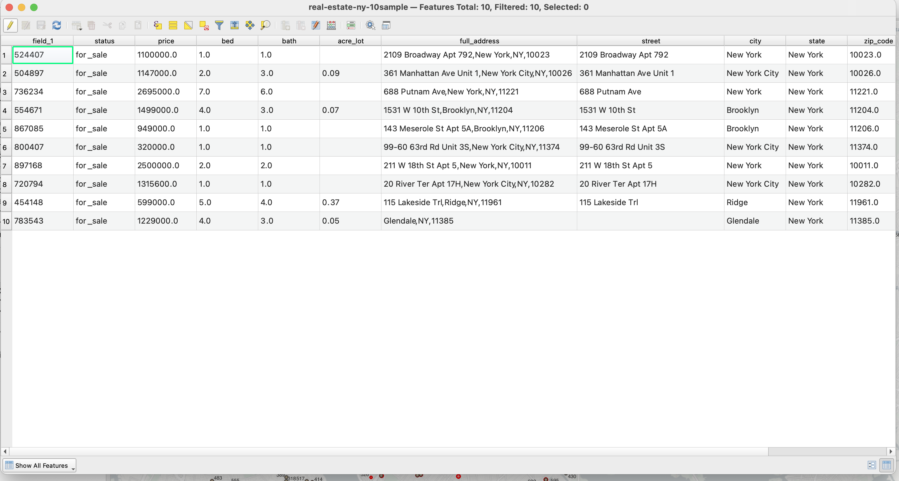

We can see that the:

- `street` column is where we have the number, street name, apt name
- `city` has the city name. Sometimes NYC is `New York`, sometimes `New York City`. Perhaps `Brooklyn` is encoded separately? Hard to say just by looking.
- `state` is the state, thankfully there seems to be a consistent formatting, at least for this sample.
- `zip_code` is formatted as a number, which we already know about
- There are some values in the other columns that are missing. Not ideal, though not the end of the world (for now).
- The last entry has no street address, so we're not going to expect that to be geocoded. (Maybe.)

- Go to **Menu->Geocode->Geocode CSV with Web Service**, you should see a window like this pop up:

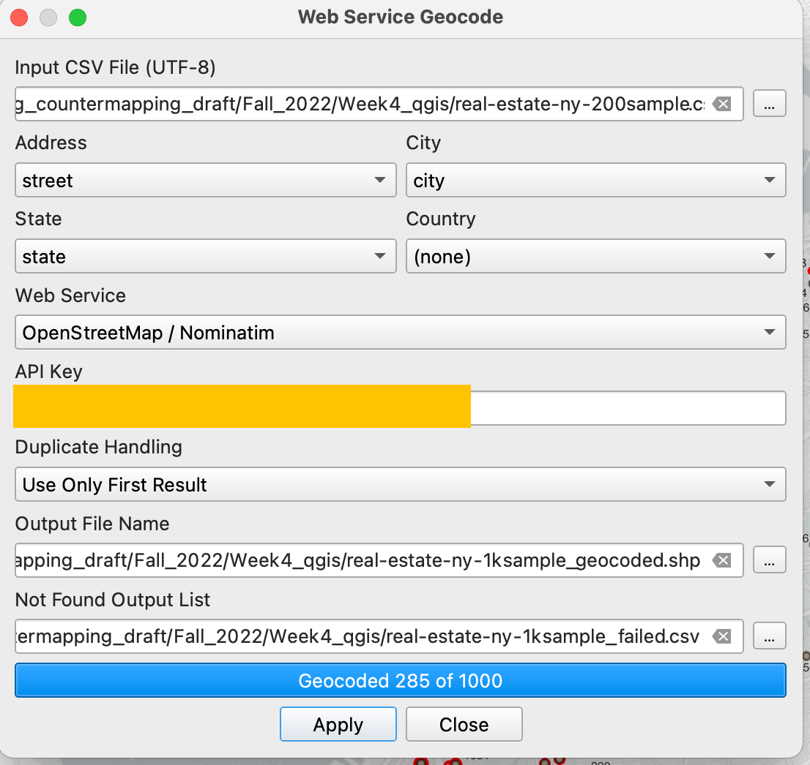

(I've hidden my google maps API key, which is not needed for Nominatim anyways. Not relevant now, but **NEVER PUBLISH YOUR API KEY.**)

- In the **Input CSV File** section, you should select your `real-estate-ny-10sample.csv.` file.

- Under **Address**, you should be using `street`, under **City** it should be `city`, **State** should be `state`.

- If there are duplicate responses, the default is to `Use Only First Result`, which we'll stick with. If we think that there are some systematic ways that first results are wrong, we can switch to the second `Multiple Features for Multiple Results` option. When the geocoder tries to find the location of an address, the first one is typically the best guess.

- For the **Output File Name**, make sure to save it down to a location you can find later. I have named my shapefile `real-estate-ny-10sample_geocoded.shp`. Same with the **Not Found Output List**, which returns a table of what was not geocoded (so you can make corrections and send it through the geocoder again). I've named this table `real-estate-ny-10sample_failed.csv`.

- Once you've made the correct inputs, hit **Apply**. We have 10 rows, it should take about 10 seconds.

## 1.3 Formatting for better geocoding
So it looks like only 4 entries were geocoded. Close the window and let's see what worked and what didn't:

Opening up the attribute table of my `real-estate-ny-10sample_geocoded.shp`, I can see that the entries with addresses but not apartment units worked. Surprisingly, the one without a street address, only the city, also worked! **We are learning that the OSM geocoder will default to the city when it doesn't find the address**. 

- Bring in the `real-estate-ny-10sample_failed.csv` file into my layers section and opening up the attribute table, I can see that all the failed entries have an apartment number.

- For our purposes now, since we're just trying to understand the basic lat/lng location of these units, I'm going to go ahead and **Edit** (using the pencil tool in the attribute table) and remove the apartment numbers from each entry manually.

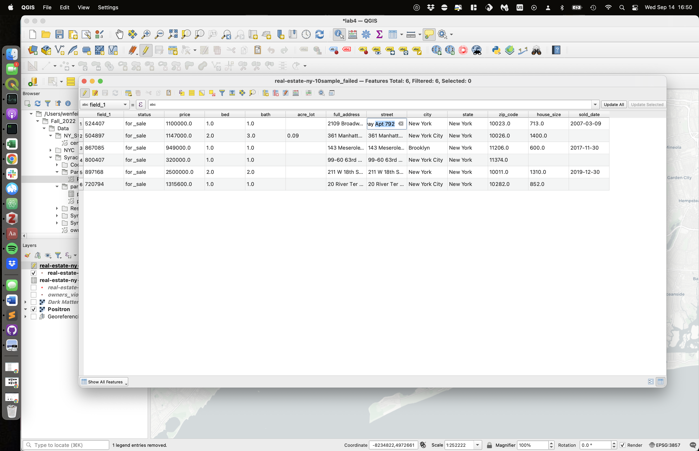

**Don't forget to click the pencil button again and save down your edits after you finish.**

- Now, geocode this **revised** `real-estate-ny-10sample_failed.csv` again. Make sure to change the output names from the original so you don't write over those 4 points. And don't forget to name the second failed table as something else.

Woohoo! It looks like all 6 remaining entries worked.

- Lastly, we'll want to merge these two geocoded shapefiles into one file so it's easier to work with. Click **MMGIS->Combine->Merge Layers**.

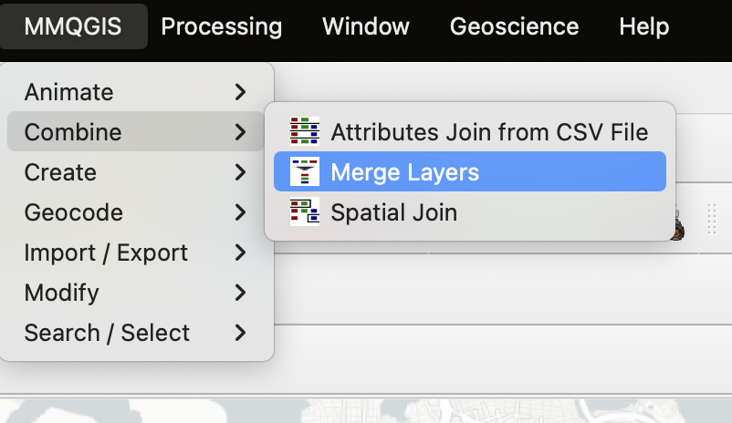

- Make sure to select both layers you want to merge and rename the new file:

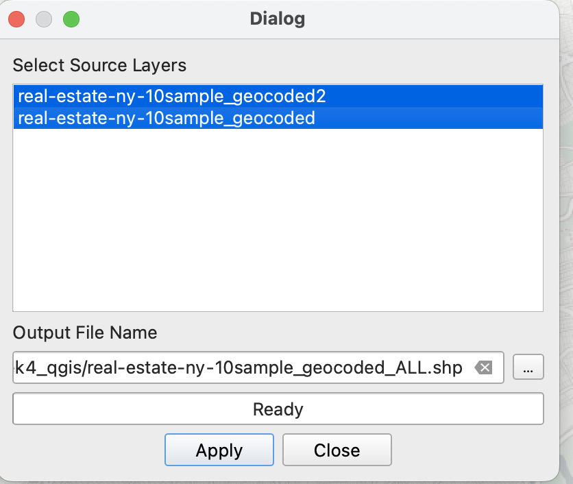

- Your final 10 points should be here (we had one listing in Long Island). I added a basemap to see where the point landed:

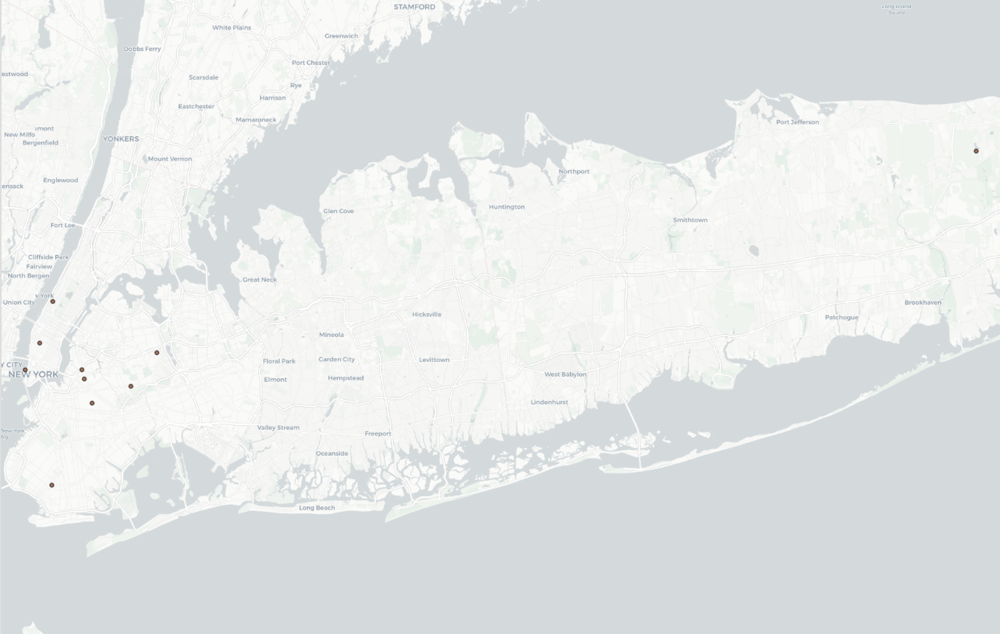

# DELIVERABLE #1
Screenshot of just the listings map after you've geocoded (no title, legend, etc. needed) them.

# 2 Georeferencing

Georeferencing is the process of associating pixels to geographic coordinates. This is a method that is great for layering other maps sources of data for comparative analysis. We typically start off with a digital raster map in a standard image format like `.png`, `.jpeg`, or `.TIFF`/`.TIF` and create a `.GeoTIFF`. (If you have a handdrawn map, you can scan or even photograph it.) Georeferencing can be can useful for:

- Maps, especially older ones
- Aerial images
- Handrawn maps, possibly in the course of field surveys.

Today, we're going to work with a map from the *Atlas of the Borough of Brooklyn* map collection published in 1916 by E.B. Hyde & Co. This atlas is essentially a collection of parcel and road infrastructure data. This collection is part of the New York Public Library's Digital Collections, which as a great archive of historic NYC maps, many of which are [digitized](https://www.nypl.org/collections/nypl-recommendations/guides/nyc-maps).

 
A small section of northern Brooklyn

First, what does this map even show? Here's an index with a legend. The colors correspond to the type of housing (for ex: frame, iron, stone, brick)  and you can see that we also have the block and lot numbers of each parcel. (Link [here](https://digitalcollections.nypl.org/items/6c05633e-3bdd-b9cf-e040-e00a18063bc7)) 

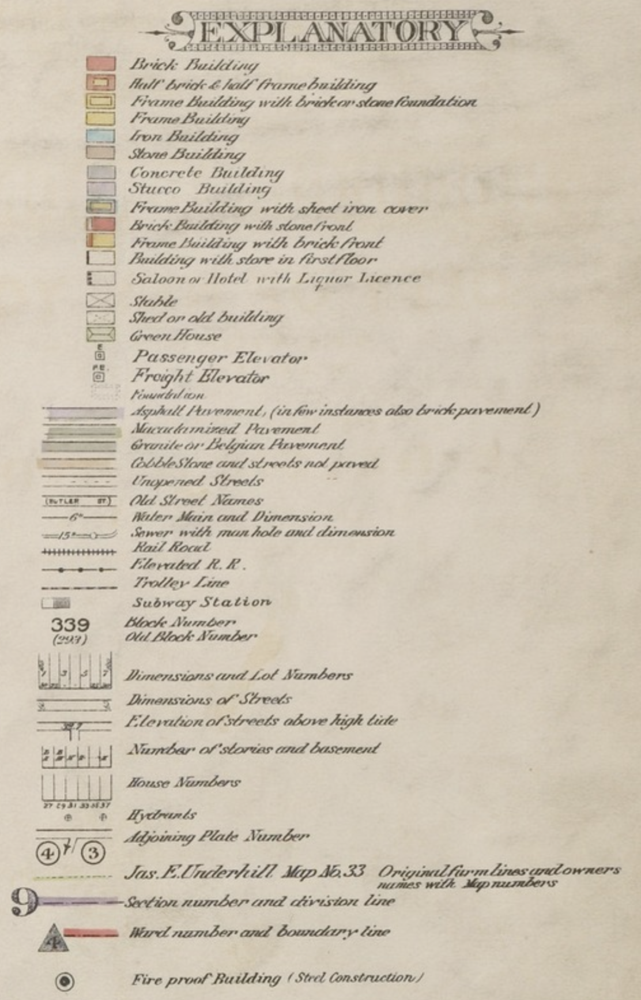

- Download the original copy of this map from [here](https://digitalcollections.nypl.org/items/6c05633e-3bde-b9cf-e040-e00a18063bc7). For georeferencing, we'll want something with a higher resolution. FYI, there is a `.TIFF` version of this map that is very high resolution, which you might want if you need to zoom in a lot and to preserve the resolution of the image. For our purposes, we don't really need the (many MBs) `.TIFF` file. Any image 300 dpi or above is usually fine.

- We are going to use one of our **QuickMapServices** basemaps to do the georeferencing. Even though these basemaps show the NYC of today, most of the significant reference points, like roads, parks, and buildings are the same today as it was in 1916. Here I'm using the **OSM->OSM Standard** basemap. It doesn't look as pretty as some of the other ones we've been using, and that's because it more clearly shows most of the physical features that will be useful for us.

- Now click **Layer -> Georeferencer**. You will get a blank georeferencer window like this:

- Click on the **Open Raster** button that looks like a checker-board and open up your 1916 Brooklyn map. It should appear in your georeferencer window:

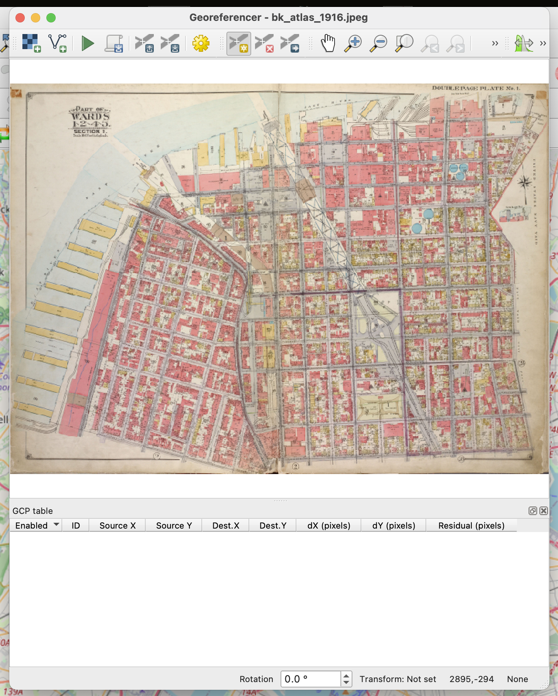

Generally, it's better to start by covering a lot of ground, so starting at the corners and edges of the image. You'll be able to iterate.

- I'm going to start off at the upper-right hand corner, at the intersection of **Marshall and Gold** streets. (I've also located this on my OSM map)

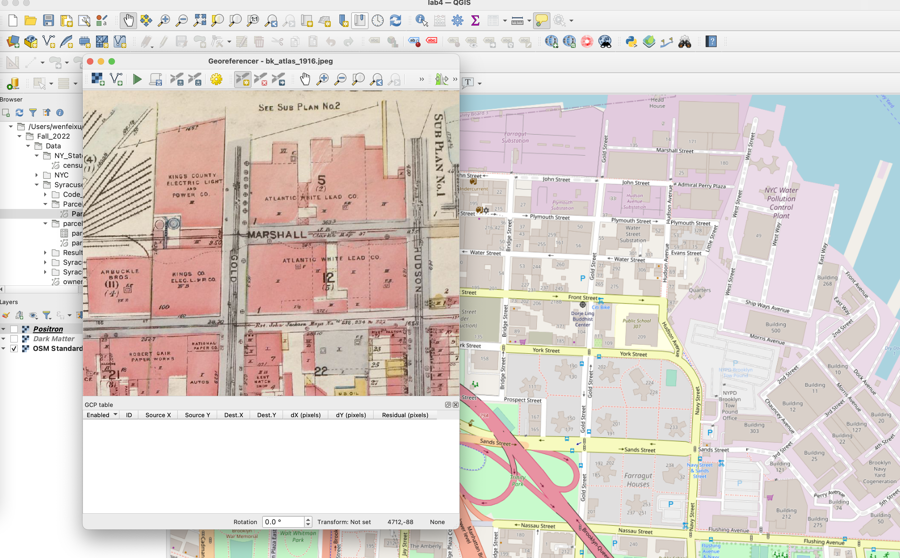

**Now, we are basically going to add a series of points on our image and reference them in our OSM basemap and essentially "stretch" the image until it fits onto our basemap.**

To do this, click on the **Add Point** button, which will ask you to:

1. Click on a point on the image (you can zoom in)
2. (Select **From Map Canvas**)
3. Click on its location in the OSM map on your main map canvas

- After you put down a point on Marshall and Gold streets, a window should pop up:

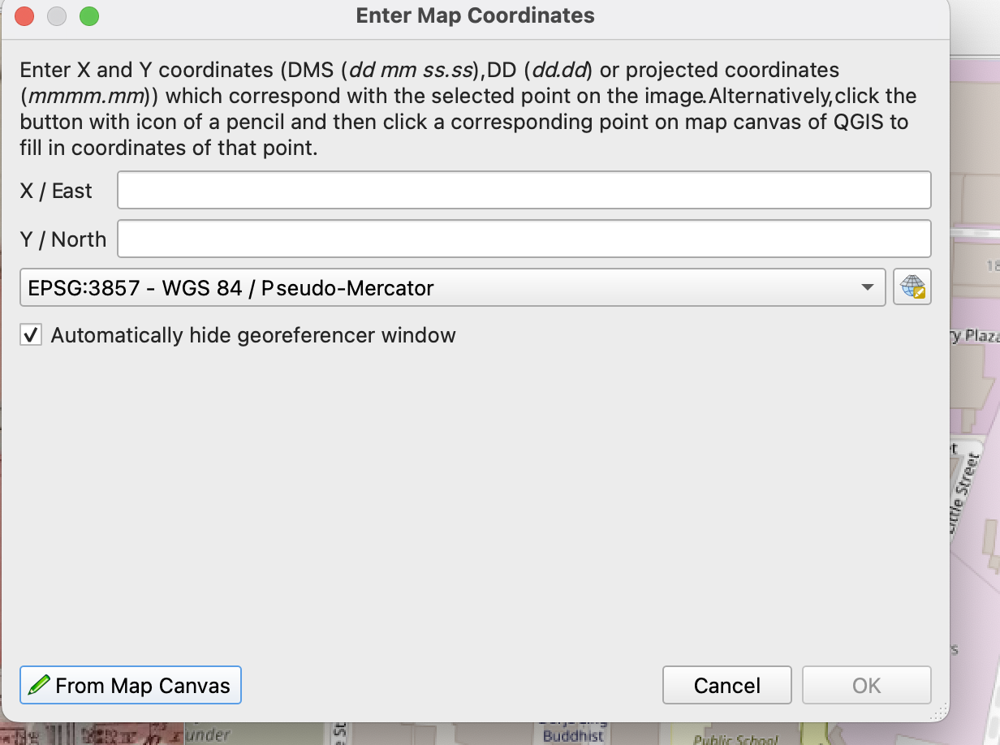

- You select the point on the OSM map and now your coordinate box should be filled out:

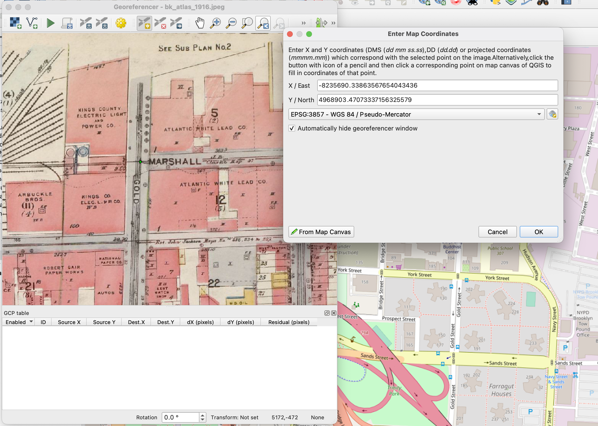

There should be now a pair of points, one on your image map and one on your OSM map:

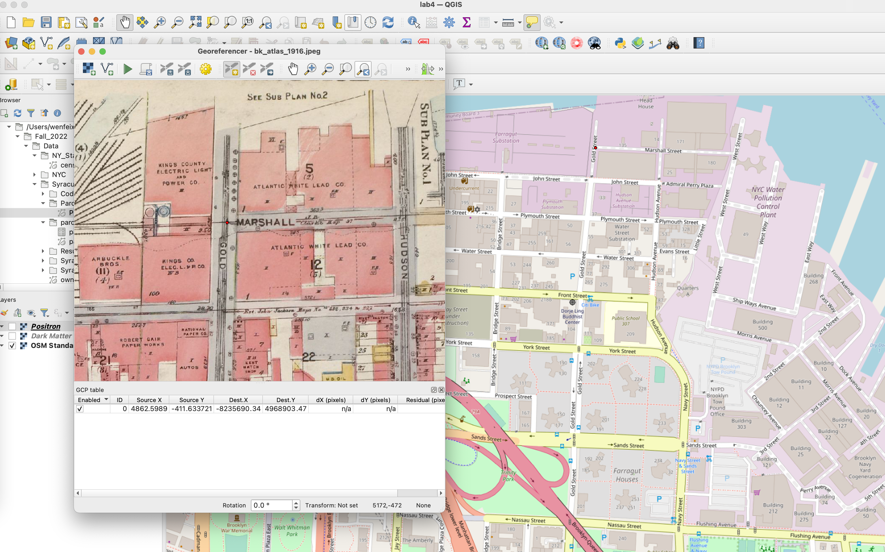

Now do this for more (maybe 7-8?) points and make sure you have points evenly distributed across all the corners and edges. (Note: We do have some roads, such as the Brooklyn-Queens Expressway, and public housing developments that were built after 1916. Actually...this area saw a lot of new developments post-1916...)

This is what my first iteration looks like:

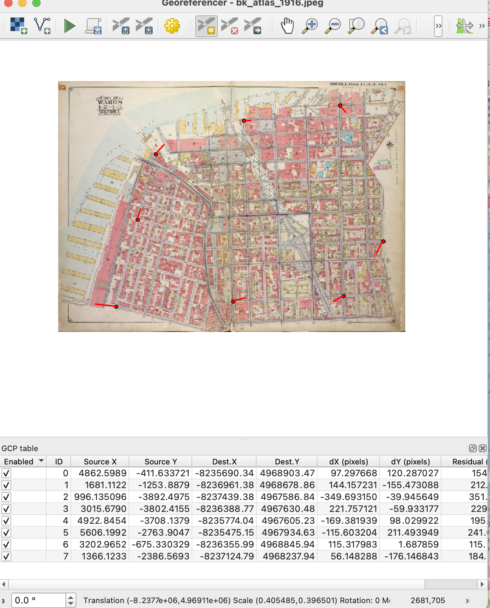
 
The lines are telling us how the image will distort.

- **Save down your GCP points!** In your lab folder or wherever you can find it easily.

Now, click the yellow gear button to change preferences, since we need to change how we distort the image. We want to change the transformation type from `Linear` (which won't actually stretch your image, but try to rotate it into place and **will not work** here) to `Polynomial 2`.

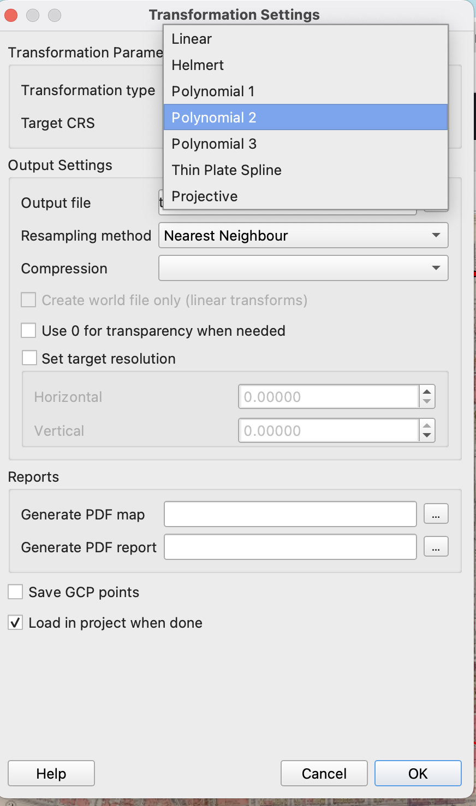

Here is my translation of the possible way to transform your image (from the documentation [here](https://docs.qgis.org/2.8/en/docs/user_manual/plugins/plugins_georeferencer.html#available-transformation-algorithms)):

- The **Linear** algorithm rotates the image.
- The **Helmert** transformation performs simple scaling and rotation transformations.
- The **Polynomial** algorithms 1-3 are among the most widely used algorithms introduced to match source and destination ground control points. The most widely used polynomial algorithm is the second-order (2) polynomial transformation, which allows some bending. Polynomial 1 allows scaling, translation and rotation only. Polynomial 3 allows more localized curving of the image to fit your GCP points, which might do some weird, hyper-localized transforms.
- The **Thin Plate Spline (TPS)** algorithm is a more modern georeferencing method, which is able to introduce local deformations in the data. This algorithm is useful when very low quality originals are being georeferenced.
- The **Projective** transformation is a linear rotation and translation of coordinates.

- Finally, you can hit the **"Play"** button to start georeferencing your points.

This is what I got, not bad for the first iteration!

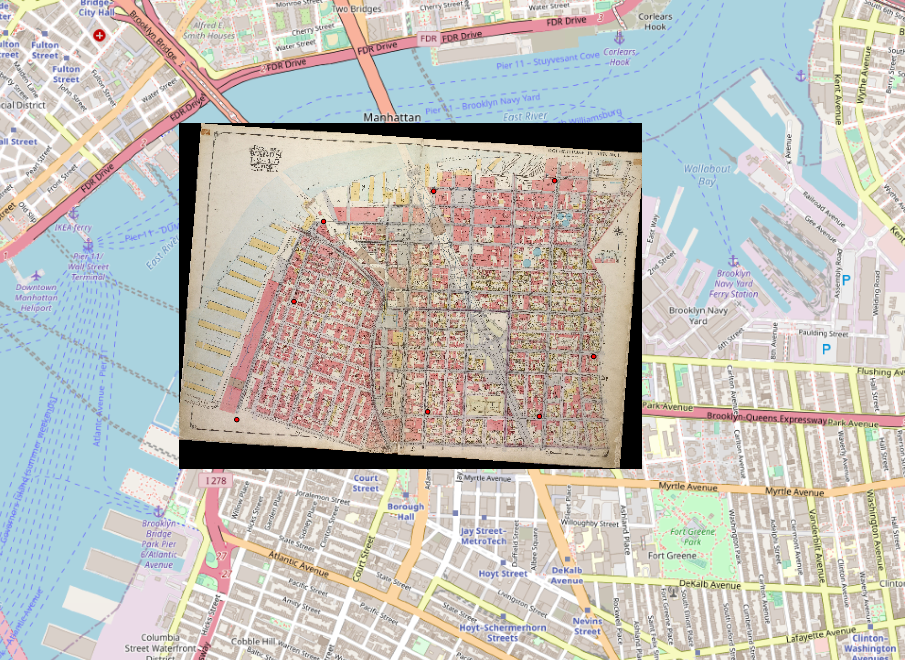

You can zoom in and turn on and off the newly georeferenced layer to compare it with the OSM map. If you right-click on the layer and select **Properties**, you can also change the transparency to see the OSM map underneath.

If I zoom into my map, I can see that the georeferencing is just *slightly* off (I changed my georeferenced map transparency to 40%).

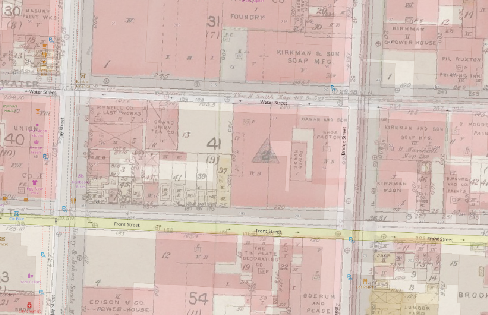

You can go ahead and open the georeferencer again, load in the points you saved, and now add new ones on top of that to make these smaller adjustments. (Thankfully OSM also has building footprints. We could have also brought in a building footprints dataset to include in our map canvas.)

It looks like my Pierrepont Street GCP was pretty off, so I'm actually going to delete a GCP I have around there and add a new point. Just hit **Delete Point** in your georeferencing window and select the point on the image you want to remove.

**Make sure to save your GCP points down each time before you georeference!** Don't lose your work.

# DELIVERABLE #2
Finish georeferencing this image and create a PDF output of the whole georeferenced map with 40% transparency so we can see the basemap underneath. No title, legend necessary.

# 3. Optional: Proportional Symbol Map
Download the `real-estate-ny-200sample.csv` dataset and geocode with one round of edits for the points that failed to geocode. Also, I've already done the laborious scrubbing of the data of its apt unit info for you. 

Using your newly geocoded dataset, create a proportional symbol map that shows the price per sq foot of your listings. Use the **Graduated** option in **Symbology**. Under **Method**, instead of `Color` to create a choropleth map, select `Size`.

Also, my recommendation: Add some transparency to the fill of your symbols and a solid line for the border. Your symbols will overlap and it will be easier to see them with transparency.

# Optional DELIVERABLE #3 (2 pts)
Create a proportional symbol map, output as a PDF, of the available price to square foot for your geocoded data. Make sure to include a scale bar, title, and your data with a basemap. Also, as text on your map, answer the following:

- How many points were you able to geocode?
- Of the points you were able to geocode, how many price entries and size entries are missing?
- Which addresses was the geocoder not able to find? Any patterns?
- Is this map an accurate representation of home values across the city? Why and why not?
