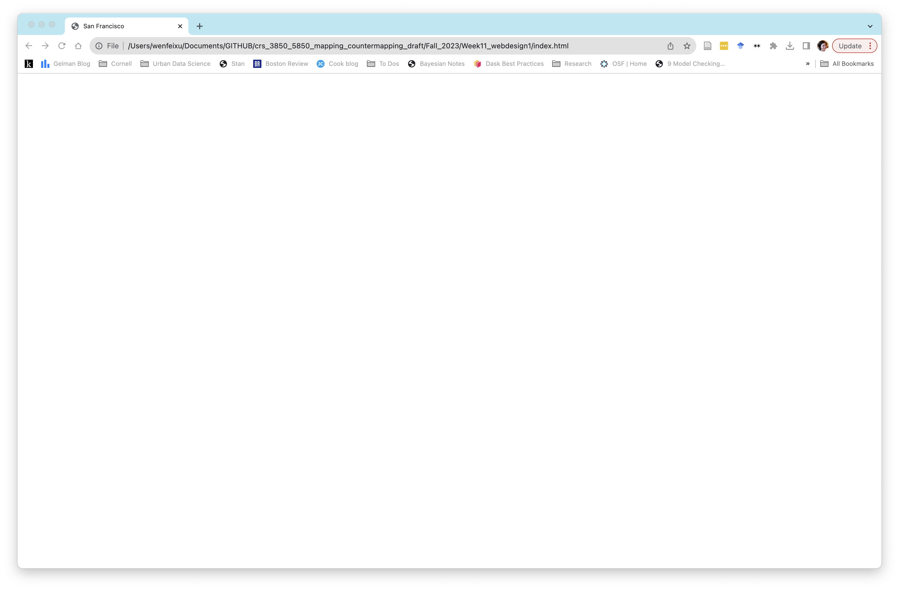
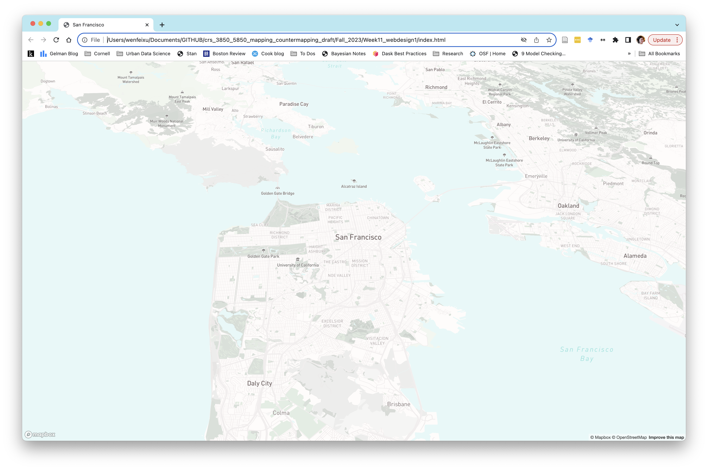
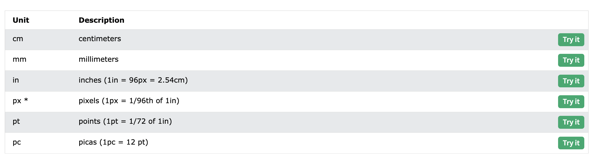
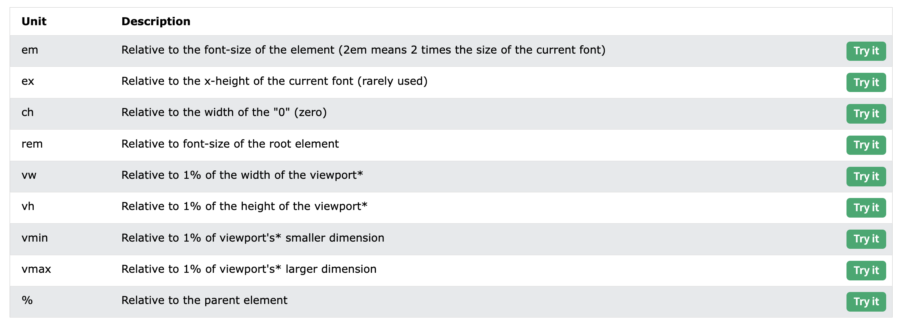
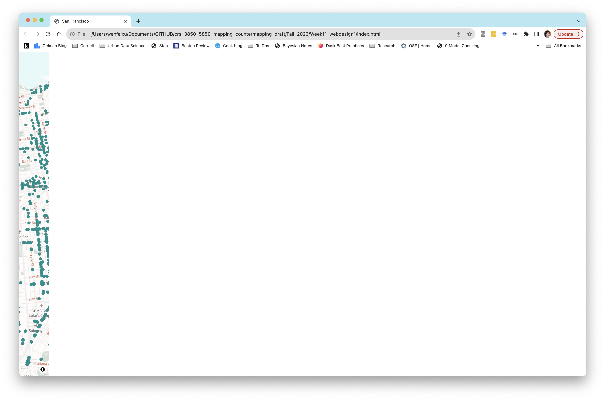
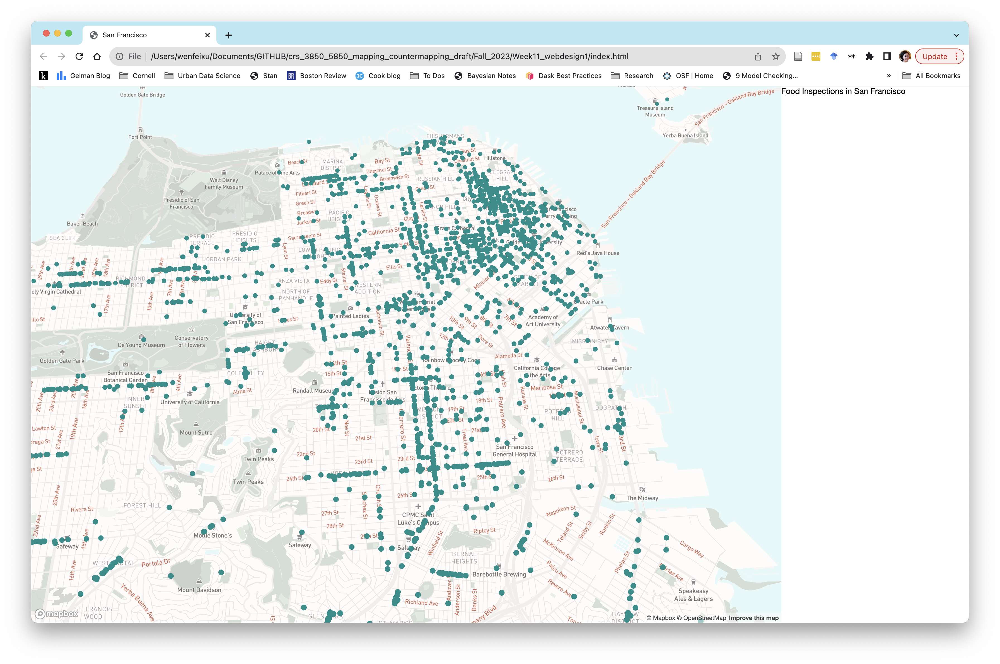
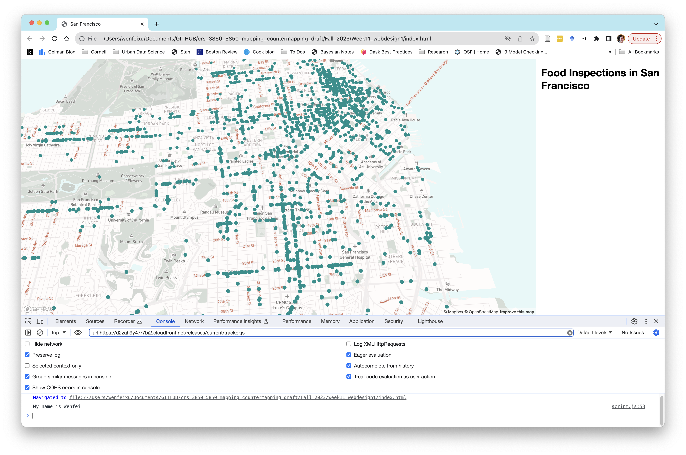
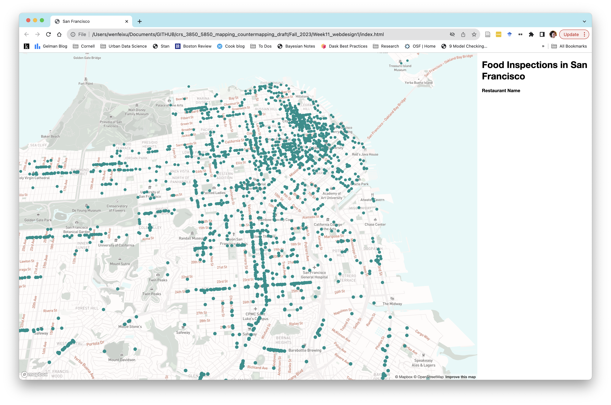
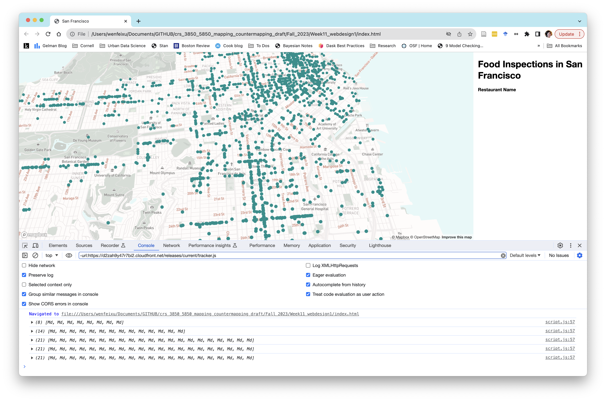
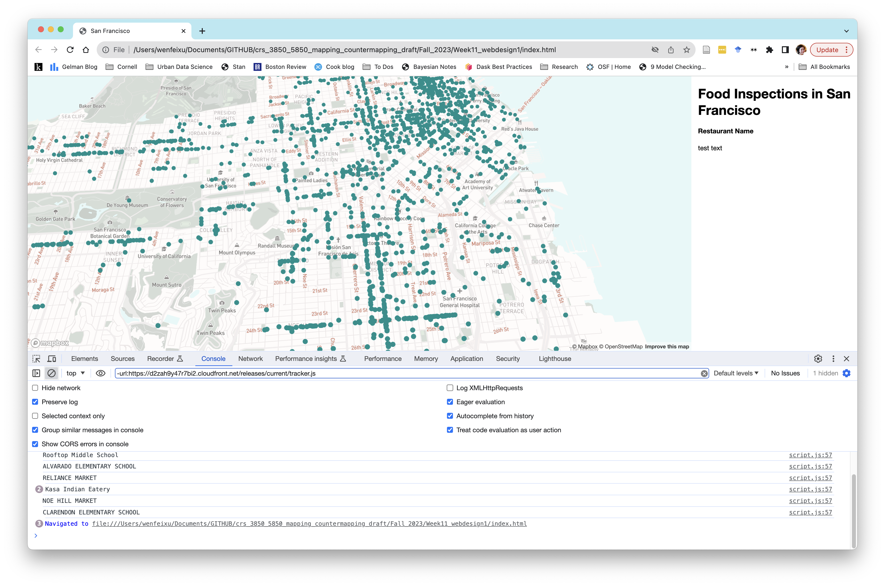

# Week 11 Monday - Web Design Basics

**Today we will cover**
- Creating a map tool from scratch
- HTML Elements 
- CSS styling
- `console.log()`
- Displaying information a toolbar
- Adding a new page. 
 
## 1. Creating a Basemap

Today we are going to *more slowly* go over some website basics together. 

Let's start with a basic `index.html` template. 


```HTML
<!-- This is to indicate we have an HTML document -->
<!DOCTYPE html>

<!-- All our code goes within this tag-->
<html>

<!-- All the metadata and packages/tools we'll use go in here-->
<head>

<!-- The charset attribute specifies the character encoding for the HTML document.-->
<meta charset="utf-8" />

<!-- The title of your page, which will appear in the browser tab -->
<title>San Franciscos</title>

<!-- The size of the viewport vs the rendered page -->
<meta name="viewport" content="initial-scale=1,maximum-scale=1,user-scalable=no" />

<!-- We are going to call the Mapbox GL javascript library, which will allow us to use its functionality -->
<script src="https://api.mapbox.com/mapbox-gl-js/v2.14.1/mapbox-gl.js"></script>

<!-- Alongside this, we are going to bring in the Mapbox GL stylesheet -->

<link href='https://api.mapbox.com/mapbox-gl-js/v2.14.1/mapbox-gl.css' rel='stylesheet' />

<link href='style.css' rel='stylesheet' />

<!-- This allows us to bring in new fonts -->
<link href="https://fonts.googleapis.com/css2?family=Montserrat&display=swap" rel="stylesheet">
</head>

<!-- The body contains the actual content of a page -->
<body>

<!-- The "div" tag delineates a "division" or section of the HTML page.-->


</body>

</html>
```

**Open up this page** and you should see something like this: 
<p align='center'>

</p>

It's blank because we have not put anything on the page yet. In between the `<body></body>` tags we have nothing right now. 

**Add the following code in between the body tag** 

```HTML
  <div id="YOUR-GIVEN-NAME"></div>
```

`YOUR-GIVEN-NAME` should be your actual name. 

There is still nothing, why? The `<div>` tag is just an invisible "division" of the HTML document. *We have to give it attributes* by styling it with CSS, adding text and other HTML elements to it, and manipulating it with javascript .

Why are we giving it an `id = "YOUR-GIVEN-NAME"`? For our project, we want to be able to reference this div to add elements to it. 

**Create a file in the same folder as the `index.html`, call this `style.css` and add the following code:**

```CSS
body {
  margin: 0;
  padding: 0;
}
#YOUR-GIVEN-NAME {
  position: fixed;
  top: 0;
  bottom: 0;
  width: 100%; } 
```

Here, we are defining some style choices about what the body of our HTML document looks like and what the div with the ID `YOUR-GIVEN-NAME` looks like. 

Remember, in CSS: 

- `#YOUR-GIVEN-NAME` refers to the div with the **ID** `YOUR-GIVEN-NAME`
- `.YOUR-GIVEN-NAME` would refer to the div with the **class** `YOUR-GIVEN-NAME` (which we don't have here). You can multiple divs with the same class, but **only** one div per ID.


**Create a file in the same folder as the `index.html` and call this `script.js`.**


**In `script.js `, choose a basemap (one without your own data layered on) and add it to the map through:**

- Adding your mapboxgl access token
- Adding a new mapboxgl `Map` object.
- Center the map on San Francisco

**Remember to link  your `script.js` in the `index.html` file so that your script is actually being used.**


Your website should look something like this: 
<p align='center'>

</p>

## 2. Adding a data layer

For this example, we are going to look at restaurant health inspections. Let say we wanted to look at the spatial distribution of inspection grades and see if there are certain kinds of restaurants that have worse grades. 

**Let's first add our restaurant health inspection data layer:** 

- [Here](https://data.sfgov.org/Health-and-Social-Services/Restaurant-Scores-LIVES-Standard/pyih-qa8i) is the dataset from the SF Health and Social Services department. 
- Download this dataset and then upload it has a tileset to mapbox. 

If you explore this tileset you should see fields and data like this: 
<p align='center'>

</p>

**Add code for the events after the map has loaded**

#### Order matters!
Your browser parses code line by line. For instance you can't reference the Mapbox library unless you load it in first in your `index.html` file, right? The same goes with other parts of your website code. 

You can't put something on your map until you have a map object first. This is why most of the map code we've written so far has been within the following code: 

```js
map.on('load', function () {
	// MORE CODE WILL GO INSIDE HERE
})
```

The above code says that, once the basemap is finished loading, do the stuff inside the code. 

**Add your inspection data layer to your `script.js`**

*Remember to correctly specify the source*, which can be one of the [following](https://docs.mapbox.com/style-spec/reference/sources/): vector, raster, raster-dem, geojson, image, video. As I mention at the beginning of this class, we are mostly working with vector sources here. 

**Add your data layer onto the map and style.**

Some things to keep in mind: 

- **Layers have [different types](https://docs.mapbox.com/style-spec/reference/layers/)!**: background, fill, line, symbol, raster, circle, fill-extrusion, heatmap, hillshade, sky.
- Use the [layers style specifications](https://docs.mapbox.com/style-spec/reference/layers/) to see which tags are used for each layer type. 

**Lastly, color your inspection layer to be `#008F8C` for now**.

## 3. Sizing and Spacing

We are now going to talk about sizing and space on our page through creating a sidebar on our page. 

### 3.1 Sizing

Until now, our maps have almost always been full screen maps. 

**Instead of a 100% width map, go to your CSS and change your map object to be `80%`**. 

CSS units of measurement come in two kinds: 

- Absolute
<p align='center'>

</p>

- Relative
<p align='center'>

</p>


**Change the width of your map object to be `100px` and see what happens**. 

You might get something like this:

<p align='center'>

</p>

I have a Macbook and if I'm using a 1792x1120 resolution screen, that 100 px is going to be very narrow!

**Add a new line of code describing the div style for `#YOUR-FIRST-NAME`.**

```CSS
left: 10%;
```
What happened? Top, bottom, left, and right define the positions of this div. So, we can say that we want to position this map starting at 10% of the screen. In this case, we're actually centering it, since 10% on the left + 80% means the right 10% is also blank.

Note, these conditions are for the `position:fixed` position type of this element. There are others (static, relative, fixed, absolute, sticky) that we are not going over today.

**Change your width back to `80%` and remove the `left: 10%;`**. 

### 3.2 Spacing

Let's say I want this tool bar to have a title.

**Create a new div in your `index.html` and a title called "Food Inspections in San Francisco using the following code**

```HTML
<div id="toolbar">
    <div id='title'>
      Food Inspections in San Francisco
    </div>
  </div>
```

**Now, let's make this toolbar div positioned on the left side at 80% by adding some css about the `#toolbar` div.** 
You can follow the template of the `#YOUR-FIRST-NAME` css.

<p align='center'>

</p>

Remember headers? h1, h2, h3, etc.?

**Amend the text within the `title` div to be**: 

```<h1>Food Inspections in San Francisco</h1>```

Now you should have text that is now bigger and bolded. Most browsers interpret `<h1>` with the following CSS: 

```CSS
h1 {
  display: block;
  font-size: 2em;
  margin-top: 0.67em;
  margin-bottom: 0.67em;
  margin-left: 0;
  margin-right: 0;
  font-weight: bold;
}
```

`em` means relative to the font-size of the element (2em means 2 times the size of the current baseline font). 

Let's say that I don't really like how my title text start right at the edge of my toolbar. I want to give it a bit of space. 

#### Margins vs Padding

We've introduced margins and padding already, but let's revisit this a bit more slowly: 

- *Margins* are the space *inside* our div's invisible border. In this case, this would be the space between the border and the text "Food Inspections in San Francisco". 
- *Padding* is the space *outside* our div's invisible border. In this case, this would be the space our `title` div and our `toolbar` div. 

<p align='center'>

</p>

If we take a look at our inspection tool, some browsers will show how much margin, border, padding, and content you have: 

<p align='center'>

</p>

Here, the H1 tag gave our text some top and bottom margins. 

**Add a `margin-left` and `margin-right` condition to the `title` div**

You can use any CSS unit you'd like. 

Ah, much better!

<p align='center'>

</p>

## 4. `console.log()`

We have already learned about "inspect element" as a way troubleshoot and get information about what's happening in the background of our website.

`console.log()` is another method we can use. It allows us to write messages to the console. 

**Somewhere inside your `map.on(load), function(){SOMEWHERE HERE…})` insert the following code: 

```JS
console.log('My name is YOUR-NAME);
```

**Now open, up your website and open the inspect element and make sure your console is in view.** 

You should see something like this:
<p align='center'>

</p>

The `console.log()` tool is a way to pass messages and tests to yourself so you can see if something works as you want. 

## 5. Change the information based on your mouse movement

Let's say we want to add more information to our tool bar. We would like to add the name of the restaurant based on which point our mouse is hovering over. This will be similar to the pop-up tooltip we made a few weeks ago. 

**First, add another header with the text "Restaurant Name**

- This will involve creating another div after the div with the id `title`, 
- Perhaps you can give it an id called `restName`. 
- Add "Restaurant Name" as text within this div. You might want to use a smaller header (I used `h4` so that you can preserve the hierarchy of text). 
- Make sure that you also give it a margin left and right condition. (In hind sight, we probably wanted to give this margin condition to all the elements within the `toolbar` div.

You should get something like this: 
<p align='center'>

</p>

Next, we want to select the name of each point when we hover over it and display it under "Restaurant Name". As we saw in the popup example a few weeks ago, we can obtain information about a geometry on our layer when our mouse clicks or hovers over it. 

**Create a function to display all of a geometry's features on hover**: 

Here I called my layer `inspections`. The below code will print our all the features on each geometry my mouse "enters" or hovers over. 

```js
map.on('mouseenter', 'inspections', (e) => {
        console.log(e.features);
```

#### My mistake: 
This data sometiems contains multiple inspections for each restaurant, which we should have filtered out by year! Oh well, next time. For the sake of demonstration, I'm going to show you how to **find the first feature of each restaurant**. 

**Now, when you hover over each point, you should something like this in your console:**
<p align='center'>

</p>

**Clicking open one of these will reveal that you've grabbed all the attribute information for each point**
<p align='center'>

</p>

Now, we know that we want to navigate to the: 

- First feature (that the 0th item in that list)
- The `properties` key
- and the `business_name` under the `properties` key

**Change your `console.log(e.features)` to `console.log(e.features[0]['properties']['business_name'])`**

When you open up your console again, you should see just a printout of the names of each business. 

Now, we'd like to take these names and add them in a div underneath "Restaurant Name" on "mouseenter" (i.e. hover). 

**After your console.log() code, assign `var name = CODE-TO-GET-TO-BIZ-NAME`.**

**Now, go back to your html code and add another div with the id `restText`.**

**Add the text "test text" between the two div tags. **

You should see something like this: 
<p align='center'>

</p>

Finally, we know that we want to replace the "test text" with our new `restText` on "mouseenter".

**We are going to get the text with through its id `restText` and assign it to a new variable:**

```js
var textField = document.getElementById('restText');
```

**Then, we are going to set the `textField` to be the `name` variable we just created.**

```js 
textField.innerHTML = name;
```


## In class exercise: 

- Create a choropleth map from the points. Use the following breakdowns: 
	- [45 - 80) = `##440154
	- [80 - 85) = `##3b528b`
	- [85 - 90) = `#21908d`
	- [90 - 95) = `#5dc963`
	- [95 - 100] = `#fde725`

Points with no score are gray. 

- Add in a legend after the Restaurant name section of the tool bar to show a legend. 