# Week 6 - Introduction to web mapping using Mapbox GL

**Today we will cover**

- Set up: Github, Sublime, and Mapbox
- Uploading point data and styling it
- Basic components of a Mapbox web map

# 1. Lab Tutorial

This week we are beginning a series of tutorials that takes another approach to mapping. We are going to learn how to make web maps using [Mapbox GL JS](https://docs.mapbox.com/mapbox-gl-js/guides/). Mapbox GL is the graphics library at the core of how we build web maps, in 2D and 3D. It's built on top of [OpenGL](https://en.wikipedia.org/wiki/OpenGL) which is a vector-rendering tool that takes advantage of your computer's graphics card (the graphics processing unit or GPU).

The standard way of rendering web maps used to be that you created **raster tiles** at each zoom level of a map, like in the image below. Each raster tile was just an image, which was a piece of a larger zoom level. On a web map, you had to zoom in enough to get to the next zoom level.

<p align='center'>
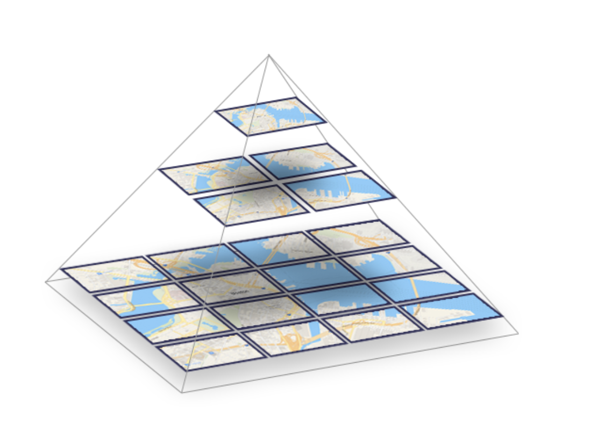
     <br>
Raster tile hierarchy from the <a href="https://documentation.maptiler.com/hc/en-us/articles/4411234458385-Raster-vs-Vector-Map-Tiles-What-Is-the-Difference-Between-the-Two-Data-Types-">Maptiler documentation</a>
</p>

Because of the dynamic graphics capability offered by the "GL" functionality, we can now build maps from **vector tiles**, which are not images, but squares that have layers of vectors.

<p align='center'>
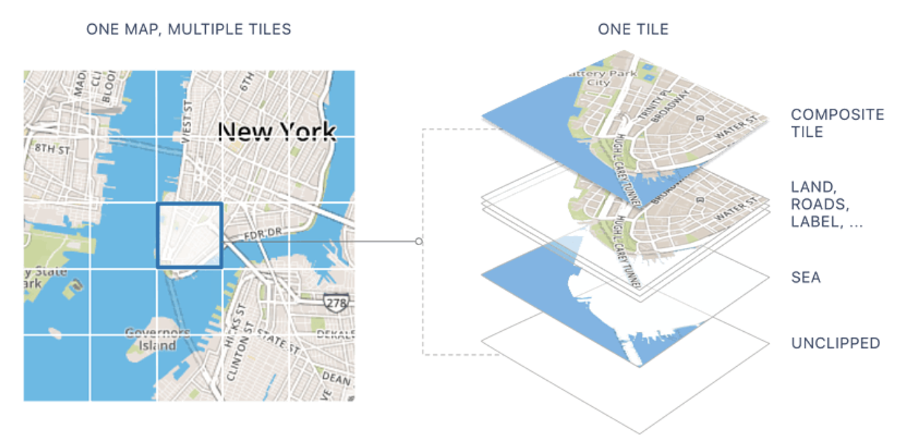
  <br>
  Example of a vector tile composition from <a href="https://bachasoftware.com/what-is-tile-and-differentiate-between-raster-tile-and-vector-tile/">BHSoft</a>
</p>

What does this mean? It means smooth zooming at every scale and that we can control what the map looks like more easily.

## 1.1 Setup
Github, which we have been using to access the tutorials for this class, is a platform that facilitates software development through [Git](https://en.wikipedia.org/wiki/Git), which is a tool that allows you to keep track of the changes you made to code/software.

We are going to learn *just* enough Git to learn how to publish your map and website online.

### 1.1.1 Github account set-up
- Create a github account by selecting **Sign up** on the [Github homepage](https://github.com/).
- Once you've logged in, you should get something that looks like this if this is your first time using github.

<p align='center'>
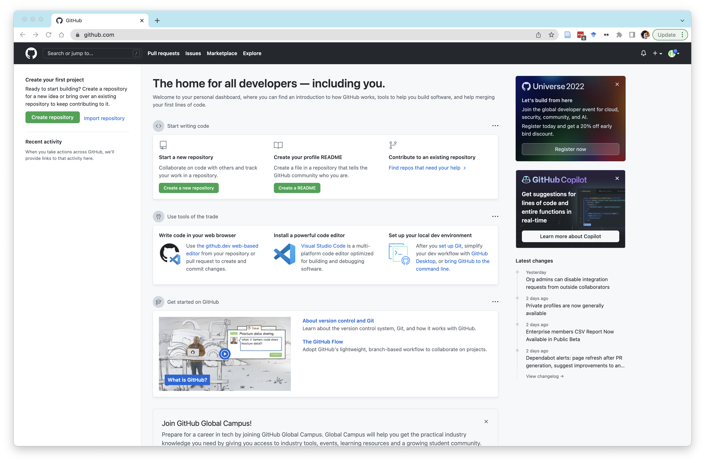
</p>

### 1.1.2 Project website set-up

- Select **Create Repository**. You will be putting the code for all the web maps you make here and hosting it from here.
  - Give your repo a name. You can use `countermapping-webmaps` like I have, if you'd like. To separate words, only use a `-`.
  - Make sure it's a public repo (so it can be a website later on)
  - Add a readme text file.
  - Since, you're making something that you've written public, add a license that delineates the terms of use for other people. It's not so important for now, I typically choose an open source license such as the MIT or Creative Commons one.
  - Select **Create Repository**

  <p align='center'>
  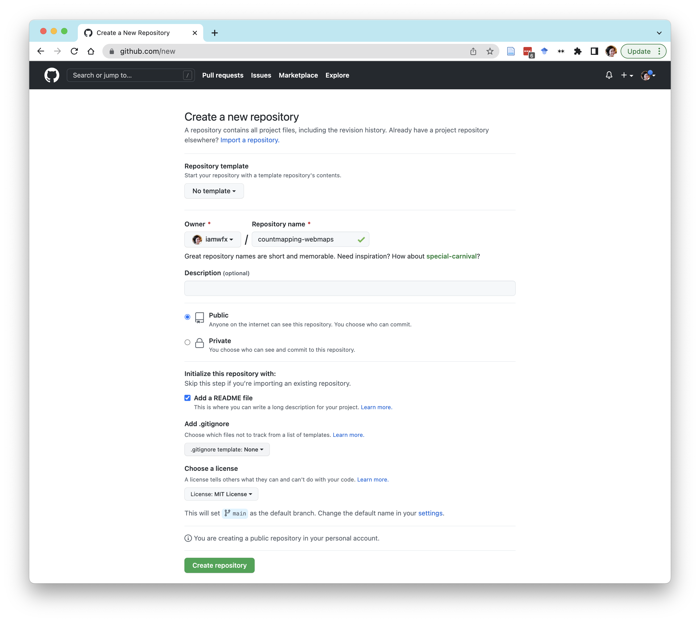
  </p>

- Now you need to make this repo into a Github Page. The instructions for how to do this are on [this site](https://pages.github.com/)
  - We will be creating a **Project Site**
  - You are going to **Start from scratch**
  - Select "Github Desktop" when it asks which git client you're using
  - At step 1: where the instructions tell you to "Create an index file", you're going to navigate to your `countermapping-webmaps` repo and select **Add file->Create new file**.

<p align='center'>
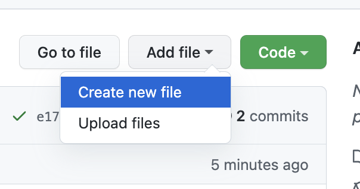
</p>

- Follow the rest of the instructions on the [Github Pages site](https://pages.github.com/).
- Once you done this, you should have a website that is `USERNAME.github.io/countermapping-webmaps`. It should look something like the below:
<p align='center'>
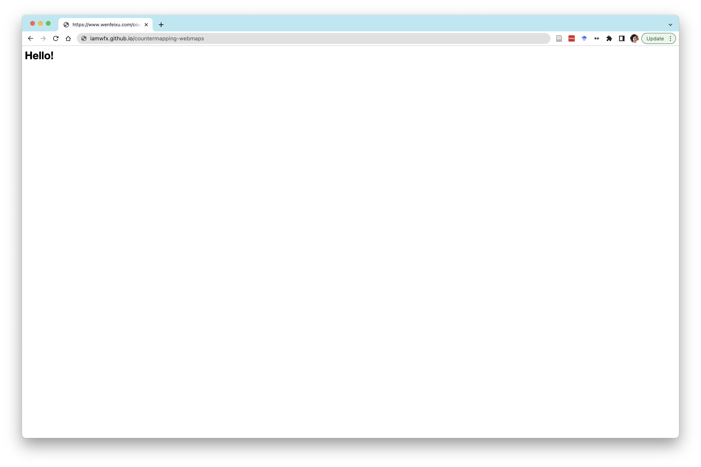
</p>

### 1.1.3 Github Desktop Set-up
Great! Now you have a space online where your repo and the `index.html` file allows you to host a website. However, we are not going to be writing code on github.com. We want to be able to:

- Have a copy of these files in your **local repo** on your computer. ("Local" typically just means on your own computer)
- Write and test our code in the local repo.
- **Commit** (read: save) the code on our local repo and then
- **Push** (read: "upload") these commits to the **remote repo**, which is the version of your `countermapping-webmaps` repo on github.com

Whenever we have a version of our code that is a good stopping point that you want saved, we should make sure that the local and remote repos are synced.

- If you (or, more typically, your collaborators) made any changes in the remote repo, you'll generally want to **Pull** (read: update on your computer) that code from the remote repo so that your local version reflects the changes.

All this done using the **Git** version control system. It's typically used through command line, but we'll use Git through its interface on [Github Desktop](https://desktop.github.com/).

- Download the Mac or Window version onto your computer.
- Once you've completed your installation, open up Github desktop.
- Go to **Preferences** and **sign-in** to your account.
- In a general documents folder that is **not synced to Dropbox, Box, or any other synced web drive** and **not your class folder**, create a folder called `GITHUB`. This will be the folder where you store all your future Github repos locally (hopefully, including future projects outside of this class.)
- Go back to your repo online, and under the green **Code** button, select **Open with Github Desktop**.
- This should prompt your Github Desktop to open to a window that looks like this:
<p align='center'>
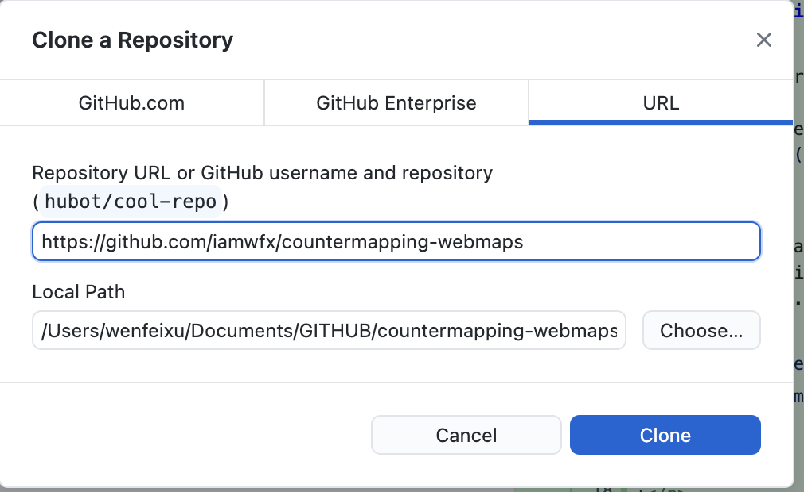
</p>

- If this did not work you can clone (read: create a copy of) your repo locally by selecting the HTTPS address, going to **File->Clone Repo**, and entering the URL while making sure it is cloning your repo within the `GITHUB` folder.
- Once you've done this, you should see the files from your remote repo appear within a folder that is the name of your repo:
<p align='center'>
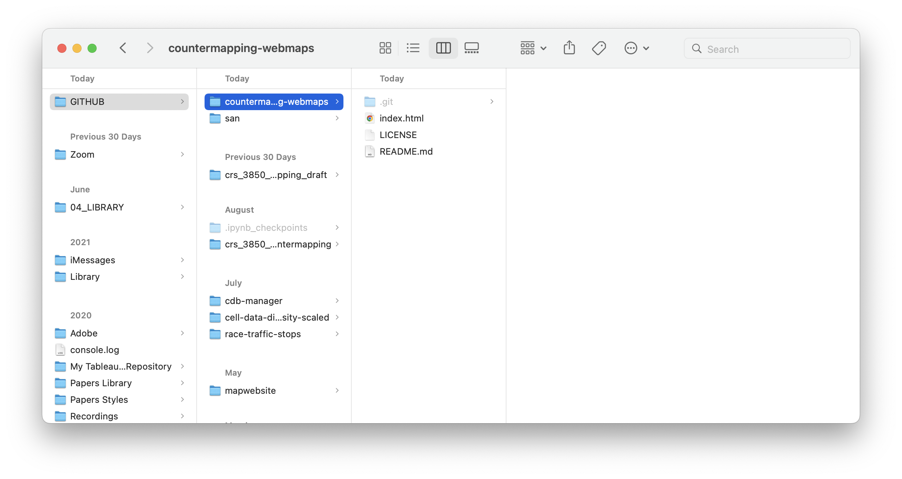
</p>


### 1.1.3 Sublime Text Editor Set-up
Next, install a text editor onto your computer. There are few commons ones that everyone uses such as Sublime, Atom, Notepad++.

- We are going to download [Sublime Text](https://www.sublimetext.com/) since it's fairly lightweight and has a bunch of good features. (The internet says Sublime is paid? As far as I know, it's free, donation-based software. Let me know if this is not the case.)
- For Macs, the download is a zip of the Sublime Text application, which you should move to your **Applications** folder.
- After you've done this, open the `index.html` file from your local repo using Sublime, you should see something that looks like this:
<p align='center'>
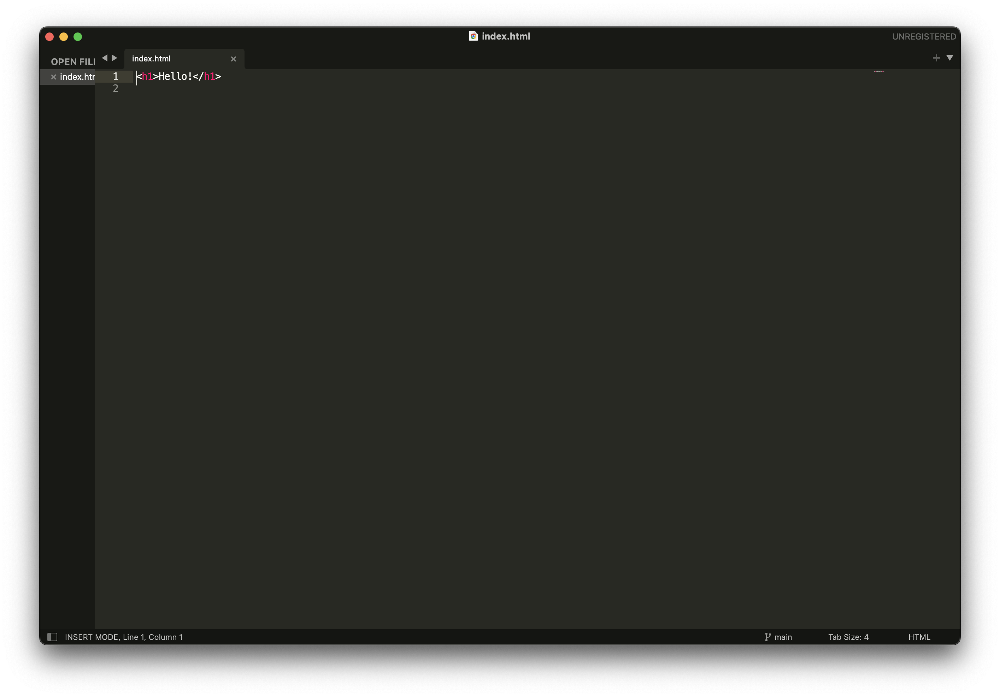
</p>

- Next, we are going to install a tool called **Package Control** that will allow us to install another plugin. The instructions for installing Package Control are [here](https://packagecontrol.io/installation).
- In Sublime, go to **Preferences->Package Control** and Select `Package Control: Install Package`
<p align='center'>
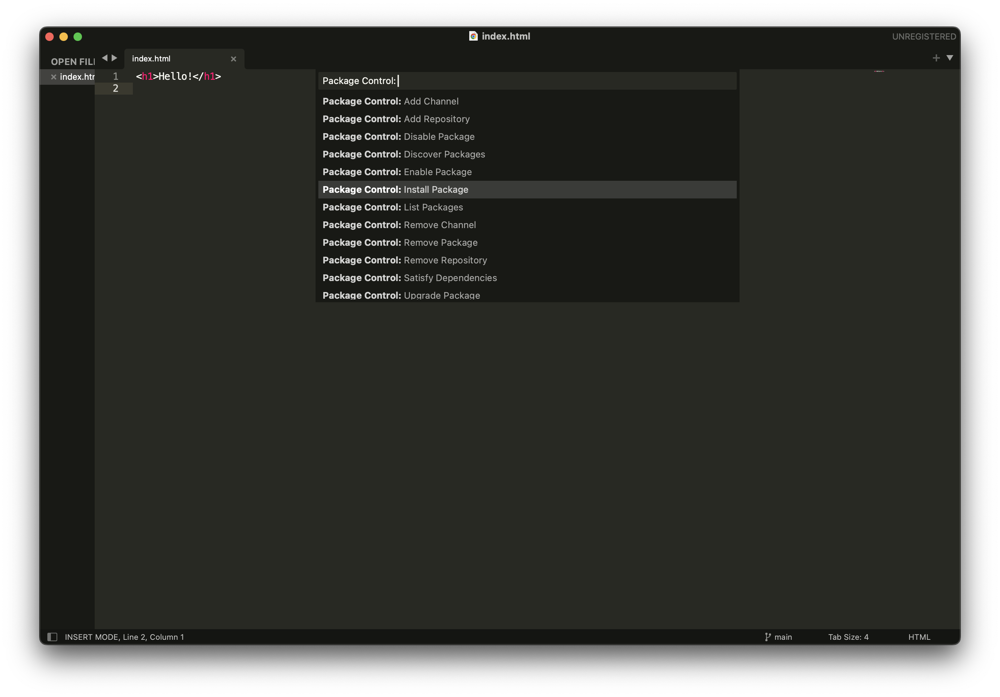
</p>

- A list of all the packages that you can install should appear. Install the following packages (select +  `enter`):
  - `BracketHighlighter`: This will allow you to more easily see whether and what's not closed!
  - `SublimeLinter`: A linter is a tool that flags syntax errors, bugs, and other lower-level kinds of errors in your code.


### 1.1.4 Mapbox Account Set-up
- Lastly, sign up for a mapbox account [here](https://account.mapbox.com/auth/signin/) using your Cornell email. You will need to put in a billing address, but you don't need to include a credit card.
- Check your email for a verification link, but there's no need to fill out that survey.
- Once you've logged in, note that there's a **Default public token**.

You are required to have an API key (here they call them tokens) to use Mapbox services. You can set the [scopes](https://docs.mapbox.com/accounts/guides/tokens/#scopes) of different tokens, meaning you can set which does has access to which APIs. Mapbox's free quotas are pretty generous, so even if you plan to use the free tier API token to service a website, it'll take a [bunch of requests](https://www.mapbox.com/pricing) before you'll have to start paying.

The public tokens are pretty disposable and can be changed pretty easily. One great aspect about Mapbox's documentation is that your public token is automatically embedded in the code that you see in the tutorials on their site.


## 1.2 Uploading data to Mapbox
For the next few weeks, we are going to look at how climate change (sea level rise and storm surges) may impact shoreline buildings in New York City, especially paying attention to risk to those living in public and affordable housing.

To begin, we are going to consider the impacts of a superstorm called Hurricane Sandy that hit New York City in 2012 and flooded the coastline in all five borough of the city. Here's a [report from the NYU Furman Center](https://furmancenter.org/files/publications/SandysEffectsOnHousingInNYC.pdf) summarizing Sandy's impacts on housing in the city.

- To begin with, we are going to make a map of Hurricane Sandy's inundation zone. Download Sandy's inundation zone data [here](https://data.cityofnewyork.us/Environment/Sandy-Inundation-Zone/uyj8-7rv5). Download the `GeoJSON` version. Mapbox will accept the other data formats, but I find it easier to work with one file (as opposed to the 4-5 files in a shapefile).

- Once your download is complete, go to [studio.mapbox.com](https://studio.mapbox.com/).
- Select **Tilesets**. You should see some Mapbox tilesets, which are often used as basemaps and starter datasets and a section called "Custom tilesets". The data that you upload will appear here.
<p align='center'>
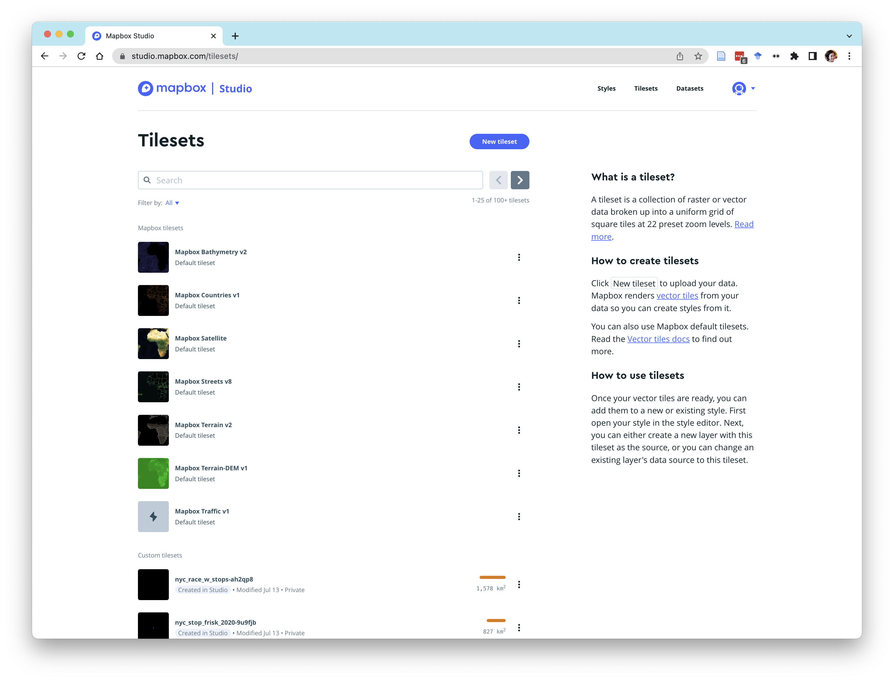
</p>

- Click **New tileset** button to upload your Hurricane Sandy data. (Note the different file formats that Mapbox takes). It will take a few minutes for your dataset to upload. The larger the file is, the longer it will take. Note that the free tier only allows you `20 uploads per month | 300 MB per upload`.
  - **A note: Uploading through Chrome never works on my computer for some reason. I've got all kinds of pop-up and privacy blockers. If you run into the same issue, you can try another browser (I typically use Safari).**
- The new file (the naming convention Mapbox uses is typically the file name and then a unique ID) should appear in your Custom tilesets. Click on your new dataset and check that the data upload worked. You should see something like the below:
<p align='center'>

</p>

## 1.3 Create a web page with a base map and the Sandy inundation zone
Now we are going to create a basic web page with just our map and a small text box.

### 1.3.1 Making a basic web page
All the pages we are going to create in this class have three basic components:

- HTML (HyperText Markup Language): describes the elements to be displayed in your web browser. This will be your `filename.html` file.
- CSS (Cascading Style Sheet): the language that is used to style the elements in the HTML document.
  - This is most often another file called `stylesheetname.css`
  - Sometimes, if the styling is pretty short, it may be embedded in the HTML file under the `<style>...</style>` tags
- JS (Javascript): A file that codes the activity or interactivity of a website. For instance, if you want your map to change with a computer mouse action, you will code a `yourJScode.js` style to decsirbe how this works or embed the JS code into your HTML file.

- In your `countermapping-webmaps` folder (i.e. your local repo), create a new folder called `Lab6`
- In your text editor, create a new file called `index.html` and start off with the following code (below). Note that:
  - All of our "elements" are framed by their appropriate `<element>...</element>` tags to indicate the beginning and end of each type of element.
  - Also note:
    - `<!-- All the text in between these arrows is not executed. It allows us to comment on the code in html -->`
    - `// This is how you comment code in Javascript, i.e. within your <script></script> element`


```html
<!-- This is to indicate we have an HTML document -->
<!DOCTYPE html>

<!-- All our code goes within this html tag-->
<html>

<!-- All the metadata and packages/tools we'll use go in the head.>
<head>

<!-- The charset attribute specifies the character encoding for the HTML document.-->
<meta charset="utf-8" />

<!-- The title of your page, which will appear in the browser tab -->
<title>NYC Housing Flood Risk</title>  

<!-- The size of the viewport vs the rendered page -->
<meta name="viewport" content="initial-scale=1,maximum-scale=1,user-scalable=no" />

<!-- We are going to call the Mapbox GL javascript library, which will allow us to use its functionality -->
<script src='https://api.mapbox.com/mapbox-gl-js/v2.9.2/mapbox-gl.js'></script>

<!-- Alongside this, we are going to bring in the Mapbox GL stylesheet -->
<link href='https://api.mapbox.com/mapbox-gl-js/v2.9.2/mapbox-gl.css' rel='stylesheet' />

<!-- You'll be creating this file in a bit -->
<link href='style.css' rel='stylesheet' />

<!-- This allows us to bring in new fonts -->
<link href="https://fonts.googleapis.com/css2?family=Montserrat&display=swap" rel="stylesheet">
</head>

<!-- The body contains the actual content of a page -->
<body>

<!-- The "div" tag delineates a "division" or section of the HTML page.-->
  <div id="map">
  </div>


  	<div class="map-overlay top">
  	<div class="map-overlay-inner">
  	<h2>Public and Affordable Housing Flood Risk</h2>
    <!-- INSERT TEXT HERE -->
  	</div>
  	</div>

<script>
// You'll be inserting your JS code to initialize your map here

// Within a script, you comment using two backslashes.
</script>

</body>

</html>

```
A few basics you'll need to know now:

- HTML is *not** a case-sensitive language. That means `div` and `DIV` and `Div` are all interpreted as a div element.
- We use `class` and `id` to reference elements in order to style them (CSS) or use them in a function (JS).
  - A `class` is a characteristic that you assign to an element. A class name can be used by *multiple* HTML elements
  - An `id` name must only be used by *one* HTML element within the page
- Almost all elements that are "opened" `<element>` need a corresponding `</element>` to "close" it.
- In JS (`<script></script>`), statements are separated by `;`


Create a separate file called `style.css` in the same directory that you've saved down your `index.html` file.

```css
body { margin: 0; padding: 0; }
#map { position: absolute; top: 0; bottom: 0; width: 100%; }
.map-overlay {
font-family: 'Montserrat', sans-serif;
/*font: 12px/20px 'Helvetica Neue', Arial, Helvetica, sans-serif;*/
position: absolute;
width: 40%;
top: 0;
left: 0;
padding: 10px;
}

.map-overlay .map-overlay-inner {
background-color: #fff;
box-shadow: 0 1px 2px rgba(0, 0, 0, 0.2);
border-radius: 3px;
padding: 10px;
margin-bottom: 10px;
}

.map-overlay h2 {
line-height: 24px;
display: block;
margin: 0 0 10px;
}
.mapboxgl-popup {
max-width: 400px;
font: 12px/20px 'Montserrat Neue',sans-serif;
}

```
Your directory should have the following files currently:  

- `index.html`
- `style.css`

Double-click and open the `index.html` file in your browser, you should see something like this:
<p align='center'>
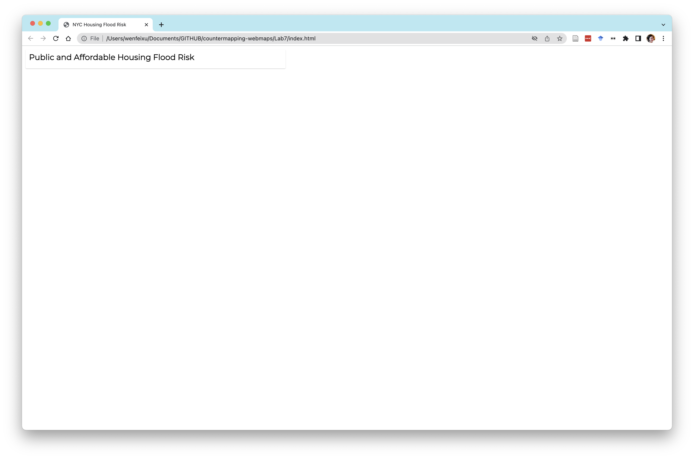
</p>

### 1.3.2 Adding our basemap
We are now going to call our `map` div and add our map in that div.

To do this, in between your `<script></script>` elements, first add your default public API token that you can find on your Mapbox account landing page:
```JS
mapboxgl.accessToken = 'INSERT YOUR KEY HERE'
```

After you've done this, we will first pick out a base map style. Go to your Mapbox studio page. You should see a list of styles. *I think* you should all have a style called **Cali Terrain**. 

- Click on the three dots next to the map and duplicate it.  
- Click on that map style and you should get something like this:

<p align='center'>
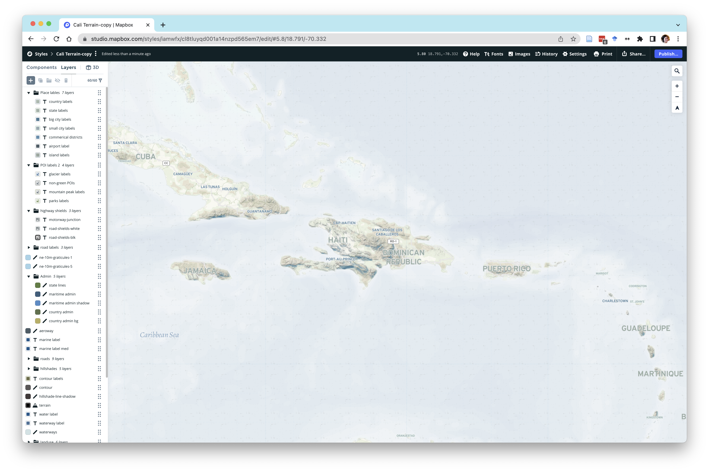
</p>

We will use this as our base map since it shows topography.

- First, click on the name of the map (it should currently be `Cali Terrain-copy` and rename it `Cali Terrain NYC`.
- Now fly over to NYC:
<p align='center'>

</p>

Notice that this base map, because it's tileset, is composed of many different layers (from OpensStreetMap) that you can style. You can create your own basemaps based on the needs of your map and your aesthetic preferences.

- For instance, let's say that I want to get rid of the small shields that mark the highways. Note that there are three layers in our basemap that relate to the highway shields. I'm going to select all of them:
<p align='center'>

</p>
- And then hide them using the eye-slash button at the top of my toolbar. The result should be this:
<p align='center'>

</p>

As another example, let's say I want to make my water a bit darker.

- Scroll all the way down to the bottom where you see the **Water** layer, click on it, and click on **Color** in the panel. (The order the layers are listed is the order they appear on the map):
<p align='center'>

</p>
- Using the color tool. you can change the color. I'm going to make my water a little darker:
<p align='center'>

</p>

- Now click on **Opacity**. Note that the amount of opacity is a function your zoom level. Zoom out a lot. You might see that your water color changes:
<p align='center'>

</p>

As you can see from the dot on graph, our **Fill opacity** is 0 right now, therefore, the color from the **Water Texture** layer is coming through. One of the more useful aspects of being able to control the base map are these zoom- and data-driven styling changes.

- Zoom back to NYC. Your water color should be closer the new color you gave it.
- Hit **Publish** to save the changes in this map and to be able to access it publicly.
- Under **Share** in the top menu bar, copy your **Style URL**. Mine is `mapbox://styles/iamwfx/cl8tluyqd001a14nzpd565em7`

Add another chunk of code that add sin your map object to the `map` div:

```JS
const map = new mapboxgl.Map({
  container: 'map', // container id
  style: 'your-style-url' // replace this with your style URL
});
```
Now open the `index.html` file in your `Lab7` folder. You should see your base map:
<p align='center'>

</p>

- To have just a little more control over where your map is centered and at what zoom level, you can explicitly state it in the `mapboxgl.Map()` dictionary:

```JS
const map = new mapboxgl.Map({
  container: 'map', // container id
  style: 'your-style-url' // replace this with your style URL,
  center: [-73.935242, 40.730610], // The convention for coordinates is  typically [long, lat]
  zoom: 12 // The zoom level can be any decimal number
});
```

### 1.3.3 Add in your inundation area
Now we are going to add in the layer we uploaded with the Sandy inundation area. (Note: There is a new, no-code way to do this, but I'll show you an older method that allows you more control from your script)

What this section is doing:

- `map.on('load',function(){...})` is an event that occurs after all the content in the `map` object has been completely loaded. In our case, this means once our base map, which is what we have defined as our `map` object has been rendered. Once this has happened, this code will run a function, which is defined by what we have inside this function.
- Our function is doing the following:
  - `map.addSource()`: This is the [source](https://docs.mapbox.com/mapbox-gl-js/api/sources/) data, images, videos, etc. that we are going to use in some way. Here we are adding our Sandy inundation area, which is a `VectorTileSource` (we just uploaded these as a vector tile to Mapbox, remember?). This function takes two parameters:
    - `id`: A `string` (read: text) nickname that you will give to your layer for easier referencing
    - A dictionary that includes:
      - `type`: whether `vector`, `geoJSON`, etc. We know that we are going to add a `VectorTileSource` so the type is vector.
      - `url`: Where to find your data. Since this dataset is already on Mapbox, this URL needs to be in the format of `'mapbox://YOURTILESETID'` (Note: all these key-value pairs are strings).
  - `map.addLayer()`: This actually adds a visualized layer onto your `map` object. Read the [documentation](https://docs.mapbox.com/mapbox-gl-js/api/map/#map#addlayer) for all the different parameters function can take, but we are going to focus on the required ones below:
    - `id`: This is a unique ID you are giving to this layer (Note: you can use the same data source and create two different layers with it.)
    - `type`: According to the Mapbox [style specifications](https://docs.mapbox.com/mapbox-gl-js/style-spec/layers/#type), this can be "One of "fill", "line", "symbol", "circle", "heatmap", "fill-extrusion", "raster", "hillshade", "background", "sky". We are going to use `fill` for now.
    - `source`: This is the ID of data source.
    - `source-layer`: If your vector tile has more than one layer of data, you need to specify which layer this is. For our Sandy tileset, this will be the name of your the tileset. For me it is `'Sandy_Inundation_Zone-4qcajo'`, but it will be called something different for each of you. Check on your studio dashboard to get the name
    - `paint`: This a dictionary defines how the data is going to be visualized. I'm not going to detail all the properties here. You can [read the documentation](https://docs.mapbox.com/help/glossary/layout-paint-property/) to find out more. I'll just mention that not all properties will work for all layer types. For instance, if you are drawing a line, specifying `fill-color` will not make any sense, since there is no shape to "fill".


```JS
map.on('load',function(){
  // Give your layer's source a nickname you'll remember easily. I've called my source `sandy_layer`.
  map.addSource('sandy_layer',{
    'type':'vector',
    'url': 'mapbox://YOURTILESETID'
  });
  // add a new layer with your polygons
  map.addLayer({
    'id':'flood_zones',
    'type':'fill',
    'source':'sandy_layer',
    'source-layer':'Sandy_Inundation_Zone-UNIQUEID',
    'paint':{
      'fill-color':'#00158f',
      'fill-opacity': 0.5
    }
  })
});
```

Adding the above code, I get something like this:
<p align='center'>

</p>

If your inundation layer doesn't show up, try zooming in. These larger layers in the free tier are often zoom-restricted so that Mapbox can avoid rendering a lot of data all at once.

Optionally, you can set a minimum zoom level when defining your `map` object to include the following parameter.

```JS
const map = new mapboxgl.Map({
  ...,
  minZoom: 12
})
```
## 1.4 Pushing your code
Finally, let's push your website code to your remote repo
- Go to your Github desktop page and make sure you are in the right repo:  
<p align='center'>
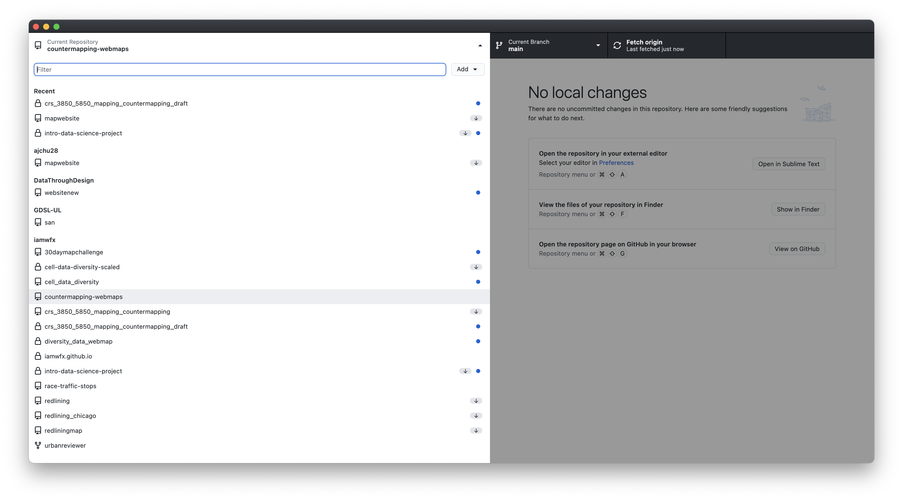
</p>
- All the changes you have made to your repo since it's initial creation should appear checked your **Changes** tab. Uncheck these boxes.
- Check one file, down in the **Summary** section, write a message (1 sentence) on what the change to the file is. This is just a note to yourself and others who may be working on your code to keep track of what you've done. n
- Click **Commit to main**.
- Repeat this until all your (two) files are committed.
- Now click **Push origin** to push your code to the Github remo repo.

Your website `YOURUSERNAME.github.io/lab7/index.html` should now be updated with your new map and data layer.

# 2. In-Class Exercise

## 2.1 Add NYCHA Developments Data

- Add the New York City Housing Developments (NYCHA) [housing developments dataset](https://data.cityofnewyork.us/Housing-Development/NYCHA-Public-Housing-Developments-Map/npwq-dpkb) as another data source and layer.
- Add text in your text box (where I've included some commented out text that says `INSERT TEXT HERE`) that describes what you are making a map of and what data sources you have used so far.
- Optional: Take an existing map style and modify it to create your own map style that you think would be more appropriate for this project.

#### DELIVERABLE
Website link with the following components

- A basemap (optionally using your own map style)
- The styled Sandy inundation data
- The styled NYCHA data **on top** of the Sandy layers
- Text using the prompt above.
