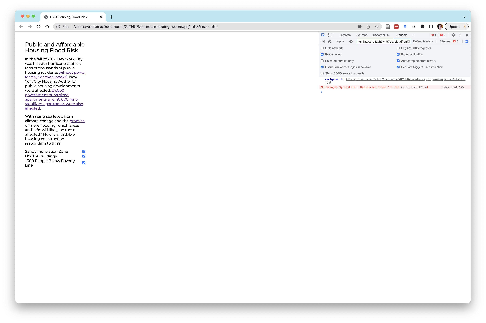

# Week 7 - Data-driven styling and interactivity in Mapbox

**Today we will cover**

- Data-driven styling
- CSS styling: sizing our elements
- Interactivity: Layer selection
- New topic
- New topic 2


# 0. READ ME: A note about web address nomenclature, case sensitivity, spaces, quotation marks, and indents

**Anatomy of a web address**

- I've been a little loose with the terminology of the various parts of a web address. Here's a handy guide on what each part your URL is called:
<p align='center'>

</p>

- For our github pages URL `https://youruserid.github.io/lab7`
  - `https://` is the internet protocol
  - `youruserid` is the subdomain
  - `github.io` is the domain name
  - `lab7` is the page path, sometimes it'll also be referred to as the "subfolder"


**Case sensitivity**

- Your subfolder/page path names are **case sensitive**. This means if you named your repo folder `Lab7` (upper case **L**) and you tried to access the page through `youruserid.github.io/lab7` (lower case **l**) you likely got a 404 error indicating the page doesn't exist.
- This extends to the different languages that we use. The confusing part is that not all languages are case sensitive. Here is a list for our purposes:
  - Javascript files (`.js`): Case sensitive 🟡
  - HTML files (`.html`): NOT case sensitive 🟢
  - CSS files (`.css`): Case sensitive 🟡

**Spaces**

- DO NOT use spaces in any name. This includes file names, variable names, folder names, URLs you may create.
- Also, don't use brackets, parentheses, or any special characters.
- These are generally difficult to handle.
- If you want to separate words, you can use `_` or `-`.


**Quotation Marks**

- In this world as well as most other coding languages, the single `''` is the same thing as the double `""`. What this means is that
```js
map.addSource('sandyLayer',{
        'type':'vector',
        'url': 'mapbox://iamwfx.bpjzmy2b'
      });
```
and
```js
map.addSource("sandyLayer",{
        "type":"vector",
        "url": "mapbox://iamwfx.bpjzmy2b"
      });
```
are the same.
- You **must** open and close with the same mark though!
- Also, you cannot use the back-apostrophe as a quote.

**Indents**

- In all the languages we use in the class (HTML/CSS/Javascript), indents do not matter for how your script is read.
- However, we typically have elements, functions, variables that are nested within other elements, functions, variables across these languages. But if something is contained in something else, like a div within a div, indents can help keep these organized.
- **Try to be tidy about indents!** It'll save you (and me 🥹 ) a lot of troubleshooting time.


# 1. Lab Tutorial

This week we will continue our web map tutorials using [Mapbox GL JS](https://docs.mapbox.com/mapbox-gl-js/guides/).


## 1.0 Start with maps from last time
Let's start off with what you were working on last week:
- Create a new folder called `Lab8` in your `countermapping-webmaps` repo
- In `Lab8` create a file called `index.html`

---
### A note: What is `index.html`?
<!-- **What is `index.html`?** -->
We didn't quite talk about this last week: but an `index.html` file is the default web pag shown for a URL if you don't specify another `.html` file.

Whenever you have any directory, it is best practice to have a corresponding `index.html` page, even if you don't plan to display any content on that page. So, aside from the index pages in each of your `LabXX` files you should also have an index page in your actual `countermapping-webmaps` folder (which you should if you followed along in the tutorial last week).

---

Let's all start off with the same starting `index.html` code below (I tweaked some things from last week). Make sure to add in your Mapbox API token!

```html
<!-- This is to indicate we have an HTML document -->
<!DOCTYPE html>

<!-- All our code goes within this tag-->
<html>

<!-- All the metadata and packages/tools we'll use go in here-->
<head>

<!-- The charset attribute specifies the character encoding for the HTML document.-->
<meta charset="utf-8" />

<!-- The title of your page, which will appear in the browser tab -->
<title>NYC Housing Flood Risk</title>

<!-- The size of the viewport vs the rendered page -->
<meta name="viewport" content="initial-scale=1,maximum-scale=1,user-scalable=no" />

<!-- We are going to call the Mapbox GL javascript library, which will allow us to use its functionality -->
<script src='https://api.mapbox.com/mapbox-gl-js/v2.9.2/mapbox-gl.js'></script>

<!-- Alongside this, we are going to bring in the Mapbox GL stylesheet -->
<link href='https://api.mapbox.com/mapbox-gl-js/v2.9.2/mapbox-gl.css' rel='stylesheet' />

<link href='style.css' rel='stylesheet' />

<!-- This allows us to bring in new fonts -->
<link href="https://fonts.googleapis.com/css2?family=Montserrat&display=swap" rel="stylesheet">
</head>

<!-- The body contains the actual content of a page -->
<body>

<!-- The "div" tag delineates a "division" or section of the HTML page.-->
  <div id="map"></div>
	<div class="map-overlay">
	<div class="map-overlay-inner">
	<h2>Public and Affordable Housing Flood Risk</h2>
  <p>In the fall of 2012, New York City was hit with hurricane that left tens of thousands of public housing residents <a href = "https://www1.nyc.gov/site/nycha/about/press/pr-2012/nycha-has-restored-power-to-buildings-affected-by-hurricane-sandy.page">without power for days or even weeks]</a>. New York City Housing Authority public housing developments were affected. <a href="https://furmancenter.org/files/publications/SandysEffectsOnHousingInNYC.pdf">24,000 government-subsidized apartments and 40,000 rent-stabilized apartments were also affected</a>.</p>

  <p>With rising sea levels from climate change and the <a href="https://www.nytimes.com/2017/04/18/magazine/when-rising-seas-transform-risk-into-certainty.html">promise</a> of more flooding, which areas and <i>who</i> will likely be most affected? How is affordable housing construction responding to this? </p>
	</div>

	</div>
  <script>
  // You'll be inserting your JS code to initialize your map here
  mapboxgl.accessToken = 'YOUR-MAPBOX-TOKEN';
  const map = new mapboxgl.Map({
    container: 'map', // container id
    style: 'mapbox://styles/iamwfx/cl9519asg003414pl56w7ov95', // replace this with your style URL
    center: [-73.935242, 40.730610], // The convention for coordinates is  typically [long, lat]
    zoom: 13,
    // maxZoom: 22,
    // minZoom: 12
  });

  map.on('load',function(){
    // Give your layer's source a nickname you'll remember easily.
    map.addSource('sandyLayer',{
      'type':'vector',
      'url': 'mapbox://iamwfx.bpjzmy2b'
    });

    map.addSource('nychaLayer',{
      'type':'vector',
      'url': 'mapbox://iamwfx.28ut4nij'
    });

    // add a new layer with your polygons

    map.addLayer({
      'id':'nychaBuildings',
      'type':'fill',
      'source':'nychaLayer',
      'source-layer':'Map_of_NYCHA_Developments-7i6vok',
      'paint':{
        'fill-color':'red',
        'fill-opacity': 0.5
      }
    })

    map.addLayer({
      'id':'floodZones',
      'type':'fill',
      'source':'sandyLayer',
      'source-layer':'Sandy_Inundation_Zone-4qcajo',
      'paint':{
        'fill-color':'#00158f',
        'fill-opacity': 0.5
      }
    });
  });
  // Within a script, you comment using two backslashes.
  </script>
</body>

</html>

```

And here's the `style.css` again:

```css
body {
  margin: 0;
  padding: 0;
}
#map {
  position: fixed;
  top: 0;
  bottom: 0;
  width: 100%; }
.map-overlay {
  font-family: 'Montserrat', sans-serif;
  position: fixed;
  width: 30%;
  top: 0;
  left: 0;
  background-color: #fff;
  border-radius: 3px;
  margin: 10px;
}

.map-overlay-inner {
  padding: 30px;
  margin-bottom: 10px;
}

.map-overlay h2 {
line-height: 24px;
display: block;
margin: 0 0 10px;
}
.mapboxgl-popup {
max-width: 400px;
font: 12px/20px 'Montserrat Neue',sans-serif;
}

```
Your page should look like this (I changed the map style from last week's lab):

<p align='center'>

</p>

### 1.1 Data-driven styling: Choropleth maps

From colors to opacities to line widths, almost every aspect of a tileset (read: shapefile/dataset for most cases) can be styled based on the row values in that dataset's attribute table.

One thing to keep in mind is that, because everything is so customizable, we often have to hard-code values and ranges of values to certain colors. It can be a little more work.

We are going to start off with something familiar, which is creating a choropleth map.

Let's say, for background/context purposes, we want to create a layer showing the **number of people in poverty in each block group**. To do this, we are going to use the 2020 Census Data at the Block Group level.

Lucky for you all, I've already grabbed the data we'll need from NHGIS and uploaded this as a public tileset that everyone can access:
- This is the **tileset ID** of our Census data: `iamwfx.6nowkujs`
- This is its **layer name**: `nyc_blck_grp_2020_wcensus_dro-4db43i`
- Explore what this looks like in Mapbox studio, use this link: [https://studio.mapbox.com/tilesets/iamwfx.6nowkujs](https://studio.mapbox.com/tilesets/iamwfx.6nowkujs). Note that for each column, it shows the data type (unless it's unknown) and, if it's a number, the range of the values in that column. This will come handy later on.
- I've also included the codebook in this week's lab folder so you know what each of the columns corresponds to.

For this exercise, we are going to use the following column from the `Poverty Status in the Past 12 Months by Household Type by Age of Householder` question in the Census (from the `nhgis0114_ds249_20205_blck_grp_codebook.txt` codebook):
<!-- - `AMR5E001`: the total number of people who responded to this question -->
- `AMR5E002`: the number of people who's income in the past 12 months is below the
poverty level. When we look at the range of values in this column, we can see that they go from **0 - 915**.


- First, add the tileset **source** using this code block:

```js
    map.addSource('censusLayer',{
      'type':'vector',
      'url': 'mapbox://iamwfx.6nowkujs'
    });
```

- Now, add the layer along with its style specifications to the map object **before the Sandy layer and the public housing layer in the code** so that it appears underneath:

```js
    map.addLayer({
      'id':'povertyLevel',
      'type':'fill',
      'source':'censusLayer',
      'source-layer':'nyc_blck_grp_2020_wcensus_dro-4db43i',
      'paint':{
        'fill-color':'green',
        'fill-opacity': 0.5
      }
    });
    map.addLayer({
      'id':'floodZones',
      ...
    })
```

Your new map should look like this: All green, because we have made all the block groups green.

<p align='center'>

</p>

---
#### A Note: Mapbox Expressions

We are going to define a new rule for the `fill-color` parameter so the color is going to depend `AMR5E002` .We are going to create an **expression**, which has a slightly weird syntax, so bear with me.

<!-- on the ratio of `AMR5E002` to `AMR5E001` -->


You can learn more about expressions in the [tutorials here](https://docs.mapbox.com/help/tutorials/mapbox-gl-js-expressions/) on the Mapbox [expressions documentation page](https://docs.mapbox.com/mapbox-gl-js/style-spec/expressions/). Expressions are very useful when you get a hang of them!

This a snippet from the documentation:
An expression takes the following format
```js
[expression_name, argument_0, argument_1, ...]
```

The `expression_name` is generally the "action" and the `argument_0` etc is the inputs that the action needs. They use the example here:
```js
["*", ["pi"], ["^", 3, 2]]
```
There are two expressions here:
- `["^", 3, 2]` which is a 3^2
- `["*", ["pi"], [argument_1]]`: In this case, `[argument_1]` is our 3^2. and `"*"` is multiply
- This expression is pi*(3^2)

**Expressions are always in brackets`[]`**.

You'll notice that sometimes expressions only take one argument, like the `'get'` function that retrieves a column in your attribute table:
```js
['get','you-column-name']
```
Other times, like the `'interpolate'` expression we're about to use, it'll take many arguments.

---

Rather than a single color, let's say that we want to ramp the colors from white to green based on the number of people in poverty (just `AMR5E002`). We're going to do a simple linear ramp for now.

Again, from the documentation, here's how to use the `'interpolate'` function:
```js
["interpolate",
    interpolation: ["linear"] | ["exponential", base] | ["cubic-bezier", x1, y1, x2, y2],
    input: number,
    stop_input_1: number, stop_output_1: OutputType,
    stop_input_n: number, stop_output_n: OutputType, ...
]: OutputType (number, array<number>, or Color)
```
So what does this mean? We need to define:
- `interpolation`: A method of how we interpolate. For now, we're just going to use `'linear'`
- `input`: What are we interpolating? It has to be a number. We're going to `'get'` these numbers from our attribute table.
- A pair consisting of `stop_input_1`, which is going to be defined by us, `stop_output_1`, which in our case is going to be a color.

What does this look like in practice?

- Let's go back to your `povertyLevel` layer and the `fill-color` parameter. Now replace  `'green'`, with the following expression (I broke the expression into several lines. Spaces and new lines don't matter in javascript.):  
```
['interpolate',
    ['linear'],
    ['get','AMR5E002'],
    1,'white',
    915,'#006125'
]
```

Now you should get something like this:
<p align='center'>

</p>

- It's not a great choropleth because the `fill-opacity` is only set at `0.5`. Go ahead at set the opacity higher, to `0.9`.

Now you should get something like this, where it looks closer to a choropleth, especially when we look at areas near East Harlem and the Bronx:
<p align='center'>

</p>

It's not a great map.

<!-- - First, instead of using the strict number of people in poverty, we want the percentage. We will change our expression so we're dividing two columns and using that number to style the map. Replace your `['get','AMR5E002']` expression with
  ```js
  ["/",['get','AMR5E002'],['get','AMR5E001']],
  ``` -->

I think one of the confusing aspects of this choropleth is that every value maps onto a slightly different color. Let's have values within a range map onto *one* color instead. Rather than using an interpolation, we are going to use a `'step'` expression.`"step"` uses the following syntax:
```
["step",
    input: number,
    stop_output_0: OutputType,
    stop_input_1: number, stop_output_1: OutputType,
    stop_input_n: number, stop_output_n: OutputType, ...
]: OutputType
```
  - Let's first go to the [Color Brewer](https://colorbrewer2.org/#type=sequential&scheme=Greens&n=5) and get a set of colors. I chose a 5 class, single-hue color green scheme:
  `
  #edf8e9
  #bae4b3
  #74c476
  #31a354
  #006d2c
  `
  - I'm going to break down my ranges into 200 and below, 200-400, 40-600, 600-800,and 800 and above. Based on the step syntax above and my color scheme, here is my new expression.
  ```js
  [
    'step',
    ['get','AMR5E002'],
    '#edf8e9',200,'#bae4b3',400,'#74c476',600,'#31a354',800,'#006d2c'
  ]
  ```

This reads as: All values 200 or smaller are `#edf8e9` color, values, 200-400 are `#bae4b3`, etc.

The map looks like this. It hasn't really improved much.
<p align='center'>

</p>


Part of the reason why I don't love this map is because I want to focus on the areas with more people in poverty, but most of the map has lower poverty. Let's try another strategy.

- First, I'm going to (here, somewhat arbitrarily) create cut-off where I will filter out blocks that are below **300** people in poverty. In other words, below 300 the `fill-opacity` should be 0. (Try the `'step'` expression)
- Second, I'm going to visualize the tracks with at least 300 people in poverty to be one color again (try this color: `#f5ef42`)

You should now have a map that looks like this:
<p align='center'>

</p>


Now, it may be getting to the point where there is too much information on my map. I want to build in a tool where I can turn layers on an off using a checked box. To do summarize what we'll need to do here:
1. Re-size our text box
2. Create checkbox elements on the HTML-side of my website.
3. Link those elements with functions on the Javascript-side of my website.

## 1.2 CSS styling: Re-sizing elements

Before we add our checked boxes, I'm first going to change the shape of our text box so it can accommodate more items. I'm going to make it more long and narrow so it looks more like a side-bar.

---

#### A Note: HTML elements
HTML elements are the pieces of the website that are typically defined by an opening tag, some attributes, generally some text, and a closing tag. Mozilla has a great [glossary](https://developer.mozilla.org/en-US/docs/Glossary/Element) for web-related terms.

<p align='center'>

</p>

Think of elements as specific types of containers that can, but *are not by definition*, filled with visible pieces of your website. The following are all HTML element types:

- Heading tags (`<h1>`,`<h2>`, etc)
- Paragraph tags (`<p>`)
- Bulleted/unordered list tags (`<ol>`, `<ul>`)
- Anchor tags (`<a>`): these allow you to create outside links
- Div tags (`<div>`): these are fluid, invisible containers that can take any shape and characteristic you give it.
  - Notice that, in our `index.html` file, we have this div: `<div id='map'></div>`
  - This is a div that has the ID `map`
  - In our `style.css` file, we defined `map` to have the following styling:  `#map { position: fixed; top: 0; bottom: 0; width: 100%; }`
   	- This means our map is positioned at 0,0 relative to the viewport on our browser and it takes up 100% of the width of our browser.
  - We also used the `map` ID to reference that div when we want to add our map into it.

---


Notice that in the HTML, after our `map` div, we have the following elements:

```HTML
<div class="map-overlay">
<div class="map-overlay-inner">
<h2>Public and Affordable Housing Flood Risk</h2>
<p>In the fall of 2012, New York City was hit with hurricane that left tens of thousands of public housing residents <a href = "https://www1.nyc.gov/site/nycha/about/press/pr-2012/nycha-has-restored-power-to-buildings-affected-by-hurricane-sandy.page">without power for days or even weeks]</a>. New York City Housing Authority public housing developments were affected. <a href="https://furmancenter.org/files/publications/SandysEffectsOnHousingInNYC.pdf">24,000 government-subsidized apartments and 40,000 rent-stabilized apartments were also affected</a>.</p>

<p>With rising sea levels from climate change and the <a href="https://www.nytimes.com/2017/04/18/magazine/when-rising-seas-transform-risk-into-certainty.html">promise</a> of more flooding, which areas and <i>who</i> will likely be most affected? How is affordable housing construction responding to this? </p>
</div>

</div>
````
This creates the text box and the text inside it. The text is basically an `h2` header and two paragraphs with some links.

Notice that it's wrapped in two divs with the classes `map-overlay` and `map-overlay-inner`. What are these two divs doing? Going to our `style.css` file we can see these following two style definitions for these two classes:
```css
.map-overlay {
  font-family: 'Montserrat', sans-serif;
  position: fixed;
  width: 30%;
  top: 0;
  left: 0;
  background-color: #fff;
  border-radius: 3px;
  margin: 10px;
}

.map-overlay-inner {
  padding: 30px;
  margin-bottom: 10px;
}

```
This is saying that for the `map-overlay ` class:
- Everything will use the Montserrat font (which we have brought in Google using this element `<link href='https://fonts.googleapis.com/css2?family=Montserrat&display=swap' rel='stylesheet'>`)
- The position of this div is "fixed" relative to the viewport of your browser
- Its width is 30% of the viewport. *Since we don't have a height specified, the height will automatically adjust based on how much text we have and the width we have defined. Notice that, when you change the shape of your browser, the height of this text box will change.
- Its position (defined by top and left) is at 0,0
- Our the background color of this div is `#fff` (white).
- The div has is *slightly* rounded borders with a 3 pixel radius
- Margin is **space outside the borders of a div** (unlike padding, which is space inside its borders), so we are giving our div a 10 pixel space outside its borders
  - Comment out that line of code so that `margin: 10px;` -> `/* margin: 10px; */`
  - What happens?

Note that for our `map-overlay-inner ` class, we have a margin **just for the bottom of our div**. After center parameters like margin and padding, we can specify which side, `-top`, `-left`, `-right`,`-bottom`.

- To make our text box longer and more narrow, we are just going to change the width from `30%` to `25%`.

---

#### Note: class vs ID in CSS
I've probably mentioned this, but we are mainly working with `class` and `id` types in CSS.
- `class` is a tag you give to multiple elements if you wanted all of those elements to be styled a certain way. It is denoted by `.CLASS-NAME{..style params here...}`
- `id` is a tag you give to a **unique** element to style it. It is denoted by `#ID-name{..style params here...}`

---

## 1.3 Interactivity: Toggling Layers
- Next we want to add the check boxes into our text box. Below last paragraph in the text, add the following:

```HTML
<div id='menu'>
  <label class='check-container'>
      Sandy Inundation Zone
      <input id='floodZones' type='checkbox' name='viz-toggle' checked='checked'>
    </label>
  <label class='check-container'>
      NYCHA Buildings
      <input id='nychaBuildings' type='checkbox' name='viz-toggle' checked='checked'>
  </label>
  <label class='check-container'>
      +300 People Below Poverty Line
      <input id='povertyLevel' type='checkbox' name='viz-toggle' checked='checked'>
  </label>
</div>
```

Once you save the code, if you refresh your page you should get these check boxes:
<p align='center'>

</p>

- Great! You can check/uncheck those boxes, you can see it doesn't do anything yet. A last formatting piece is that I want each layername-box pair to have its own line. We will create a label element and, inside it, we're going to add an [input element](https://developer.mozilla.org/en-US/docs/Web/HTML/Element/input) that uses HTML's built-in input type `checkbox`. (There a lot of different types of built-in inputs!)
- We have also named these labels `check-container` (it's a `class` and not an `id` because there are multiple elements under the same name)

- Add the following to your `style.css` file:
```css
.check-container {
  display: flex;
  flex-flow: row;
  justify-content: space-between;
}
```

- Here, we are going to give the `check-container` class some attributes - I won't go into too much detail here - so that each element with `check-container` class is getting a row and the content is justified.

Now your text box should look like this:
  <p align='center'>
  
  </p>

## 1.4 Interactivity: Turning Layers on and off
Finally, we need to make these boxes functional but coding what happens when we check and uncheck the boxes.

- After your last `map.addLayer({...})` object, but inside your `map.on('load',function(){...`, since we want these all to happen *after* the map is done loading. (In general, we write everything within this function.), we'll want to add the following code :
0. Explicitly set a `'visibility'` property on your three visible layers using this code snippet:
```js
map.setLayoutProperty('floodZones',"visibility", "visible");
map.setLayoutProperty('povertyLevel',"visibility", "visible");
map.setLayoutProperty('nychaBuildings',"visibility", "visible");
```

1. Get a list of all the check boxes: This gets all the elements by the `menu` ID and creates a list of elements and, from that list, gets all the elements that have the tag `input`
```js
var layerList = document.getElementById("menu");
var checkboxes = layerList.getElementsByTagName("input");
```
2. Create our "switchLayer" function. I have conveniently named each input `id` to be the same in my input elements and my layers (the `addLayer` object). So when I get the id of the input, I can use it directly to reference the layer. This function basically:
- Takes as an input your layer you select when you check/uncheck a box
- Checks whether the layer is visible, if it is, it turns it off, and vice versa if it's off.
```JS
function switchLayer(layer) {
    var clickedLayersLabel = layer.target.id; // get the label of the layer cluster
    var clickedLayers = eval(clickedLayersLabel); // create the variable from the label using the eval function
    var visibility = map.getLayoutProperty(clickedLayersLabel, "visibility"); // check whether the cluster of layers is visible by checking the first entry
    if (visibility === "visible") {
      map.setLayoutProperty(clickedLayersLabel, "visibility", "none")
    } else {
      map.setLayoutProperty(clickedLayersLabel, "visibility", "visible")
    }
}
```
3. We want to apply the above `switchLayer` function to all of our checked box layers:
```js
for (var i = 0; i < checkboxes.length; i++) {
  checkboxes[i].onclick = switchLayer;
}
```

If your code works you should get this, checking and unchecking the boxes should turn the layers on and off.

## 1.5 One weird trick to instantaneously change the feel of your map
All Mapbox GL maps, unless this function is explicitly turned off, can be made into a 3D map. If you try to move the map around while holding down the **ctrl** button (on a Mac, I'm not sure what the PC equivalent is), you'll be able to change the camera angle like so:
<p align='center'>

</p>

Yes, this can also be scripted and we'll learn how next week.

---
#### The Console
When troubleshooting, some of you may have seen me open the **Inspect** or **Page Inspect** function on your browsers. Internet browsers have a set of tools that developer use to understand what's happening with the sites they're working on.

In Chrome, under **View->Developer->Inspect Elements** a page open up on the side of my browser that looks like this:
<p align='center'>

</p>

SO many useful tools here, but I just want to point out the **Console** (to the right of Elements tab).

Go ahead and click on the Console tab. It is probably empty (which means, woohoo!, there are no errors on your page). The console is where any messages or errors from your code (any of HTML/CSS/JS) will be logged.

When do you have an error in your code or if something doesn't look right, the first I do is look at my console to see if my script is producing an error. If it does, it will look like this:

<p align='center'>

</p>

---

# 2. In-Class Exercise
Add the following floodplain layers and style them with a transparency so that we can see the areas where the floor layers might overlap.

#### 2020 predicted floodplains (1 in 100 year flood)
- Source Layer: `FutureFloodplains_2020_100yr-du18hr`
- url: `mapbox://iamwfx.bbchggzx`

#### 2020 predicted floodplains (once in 500 year flood)
- Source Layer: `FutureFloodplains_2020_500yr-0x77x0`
- url: `mapbox://iamwfx.05ogder8`

#### 2050 predicted floodplains (once in 100 year flood)
- Source Layer: `FutureFloodplains_2050_100yr-6nepei`
- url: `mapbox://iamwfx.crrx4301`

#### 2050 predicted floodplains (once in 500 year flood)
- Source Layer: `FutureFloodplains_2050_500yr-a4444h`
- url: `mapbox://iamwfx.4ydk0450`

#### 2100 predicted floodplains (once in 100 year flood)
- Source Layer: `FutureFloodplains_2100_100yr-cqwfrw`
- url: `mapbox://iamwfx.dxjuiivg`

#### 2100 predicted floodplains (once in 500 year flood)
- Source Layer: `FutureFloodplains_2100_500yr-27ghpw`
- url: `mapbox://iamwfx.8thgevrt`


#### DELIVERABLE
Website link with the following components
- A poverty map that only shows block groups with more than 300 people with incomes below the poverty level
- Working layer toggling tool, including the new layers in 2.
